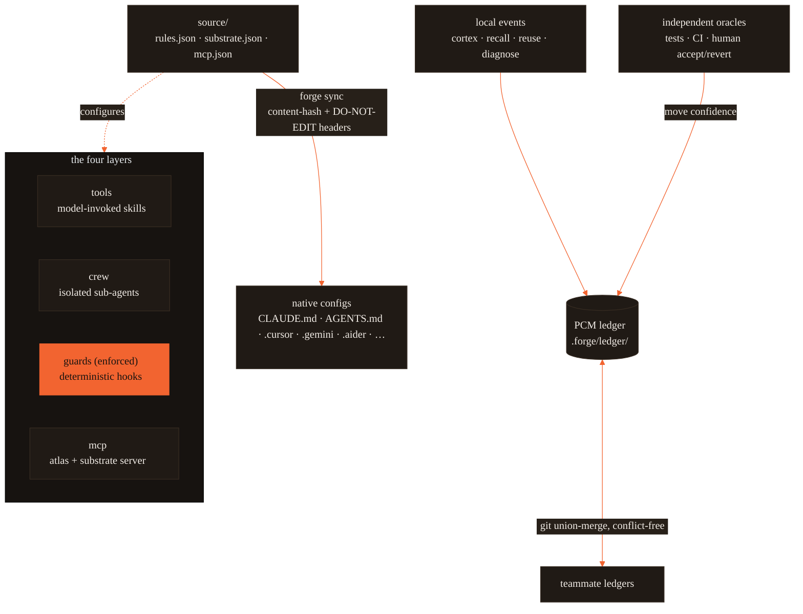
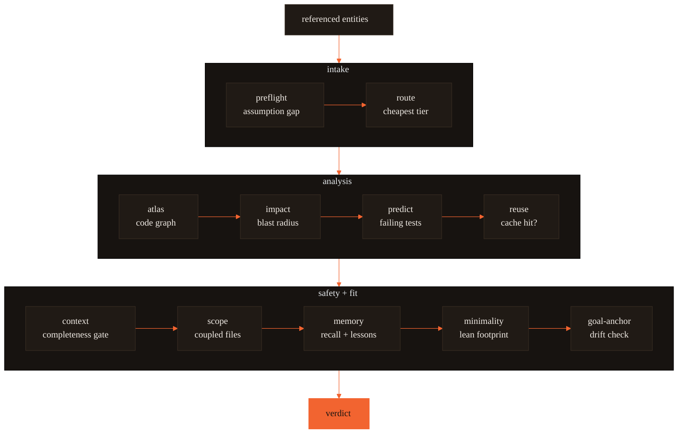
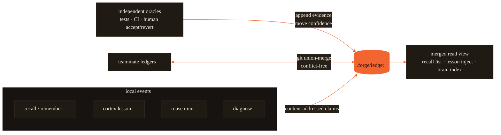
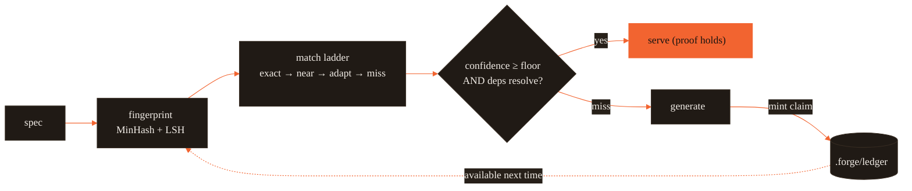

# forgekit — architecture

> **One brain for every AI coding agent.** A large language model is stateless: one
> context window, wiped every call. It has no memory of what your team learned, no
> foresight about what an edit will break, and no enforced guardrails. forgekit is the
> **cognitive substrate** — the layer that runs _before_ the model edits code, supplying
> proof-carrying memory, impact foresight, and enforced guardrails — and a **cross-tool
> config compiler** that delivers that brain as native config into every tool at once.

This document is the architecture reference. It is organized around four diagrams:

1. the four-layer config compiler (one source → native configs),
2. the pre-action gate pipeline (`forge substrate`),
3. the proof-carrying-memory ledger and team merge,
4. the reuse / context loop.

The runtime is **zero-dependency Node**. The code graph is `.forge/atlas.json` — plain
JSON, not a database. The ledger is a directory of content-addressed claims under
`.forge/ledger/`, committable to git. Optional tiers (`FORGE_EMBED` embeddings,
Playwright for `uicheck visual`) are opt-in and add no required dependencies.

Every command referenced below is real and wired in `src/cli.js`. Run `forge --help`
for the full list.

## Locked decisions

- **Brand = `Forge`** — CLI `forge`; layer names: skills→**tools**, agents→**crew**,
  hooks→**guards**, code-graph→**atlas**, minimalism→**lean**, memory→**recall**.
  Brand stored as **one token** (the `brand` key in `brand.json`); rebrand = 1 edit.
- **Distributable id = `forgekit`** (npm package + marketplace id) — fixed even if
  the brand token changes, so a rename never breaks install.
- **Scope = full multi-tool day 1** — nine tools plus MCP, from one canonical source.
- **Install = all three channels** (plugin + hardened installer + npm CLI), all
  three pointing at the _same_ tree ("one tree, three front doors").
- **Own `lean` + `atlas`** — as _thin layers over proven primitives_, not
  from-scratch reimplementations (reuse-first).

## 1. A four-layer config compiler with ONE source

You author the substrate once. `forge sync` compiles that source into each tool's
native config. The four layers are how the brain is expressed; the compiler is how it
is delivered.



The four layers, brand-named and emitted cross-tool:

- **tools** (`~/.forge/tools/` → `~/.claude/skills/`) — model-invoked capabilities.
- **crew** (`~/.forge/crew/` → `~/.claude/agents/`) — isolated sub-agents
  (scout / verifier / frontend-verifier).
- **guards** (`~/.forge/guards/` → `settings.json` hooks) — **the only layer that
  _enforces_ rather than suggests.** A guard is a deterministic hook the model cannot
  drift from. Prose rules in CLAUDE.md get acknowledged and then forgotten after
  compaction; a guard does not. Every enforceable invariant belongs here.
- **mcp** — the protocol layer. Forge ships one stdio server (`src/cortex_mcp.js`)
  exposing 19 MCP tools: the substrate checks (`substrate_check` / `predict_impact` /
  `assumption_gate` / …), memory reads AND writes (`forge_remember`, ledger
  ratify/retract), and ops/health — the full table is in docs/GUIDE.md.

Cross-cutting concerns thread through all four: **atlas** (the code graph), **lean**
(minimalism — shipped as _both_ a tool and a Stop-guard, so it applies whether or not
the model invokes it), and **recall** (memory).

## 2. The pre-action gate — `forge substrate`

**cognitive substrate** — the layer that runs _before_ the model edits code. `forge
substrate "<task>"` (and the MCP tool `substrate_check`) runs one ordered pass of
checks and returns a single verdict. It composes the individually-callable stages
(`preflight`, `route`, `atlas`, `impact`, `reuse`, `context`, `scope`, `lean`,
`anchor`, `verify`) into one pre-action contract.



**blast radius** — the set of files an edit is predicted to impact, read from the code
graph. `forge impact` computes it; the pipeline surfaces it before the model touches
anything.

The verdict is **advisory by default** — it reports, it does not block. Set
`FORGE_ENFORCE=1` to turn the strongest signals into a hard block:

- a **vacuous or underspecified** prompt (preflight finds no actionable intent),
- **un-assemblable required context** (the completeness gate cannot cover the edit set),
- a **blast radius over threshold** (default ~25 files).

Everything else stays a warning the human can override.

## 3. Proof-carrying memory — the ledger + team merge

**proof-carrying memory (PCM)** — every stored fact, lesson, or reuse artifact is a
_claim_ that carries its own evidence. It is trusted only once independent oracles
(tests, CI, a human accept/revert) raise its confidence above a floor. A wrong lesson
decays out instead of ossifying.

All memory subsystems converge on one store. `recall`, `remember`/`brain`, `cortex`
lessons, `reuse` artifacts, and doom-loop `diagnose` results all write content-addressed
claims into `.forge/ledger/`. Because a claim's bytes are a pure function of
`(kind, body, scope)`, every replica computes the same identity — so teammate ledgers
fold together over plain git with no conflicts.



Mechanically: evidence and tombstones are append-only, hash-deduped logs; confidence
(`val`) is a decayed Beta posterior moved only by oracles; merge is a join-semilattice
(property-tested: commutative, associative, idempotent), so ledgers converge in any
order. `forge init` emits the union-merge `.gitattributes` rule; `forge ledger merge`
folds in any other ledger tree. The legacy stores remain the read path — the ledger is
where their events converge. Surface: `forge ledger stats | verify | show | blame |
query | ratify | retract | merge | import` (`--personal` for the per-user ledger).
Decision recorded in
[`docs/adr/0006-proof-carrying-memory.md`](docs/adr/0006-proof-carrying-memory.md).

## 4. The reuse / context loop

`forge reuse` is a proof-carrying code cache. A generated artifact is only served again
when its evidence still holds — the confidence is above the floor _and_ its atlas
dependencies still resolve. Otherwise it falls through to generation and mints a fresh
claim on the way back.



The completeness gate on the retrieval side is `forge context "<task>"`: it assembles a
budgeted context via set-cover over the predicted edit set (`R(edit)`), applies a
compression ladder, and reports the _computed missing set_ — the inputs it could not
assemble. That missing set is exactly what the substrate pipeline's context stage reads
to decide whether an edit is safe to start. Surface: `forge reuse query | mint | stats`.

## 5. The end-to-end reliability layer

Two failure modes this layer exists to kill: **partial work** (code changes without the
artifacts that depend on it) and **session amnesia** (the next session re-assumes what
this one knew). Instructions raise the _probability_ of correct behavior; deterministic
hooks guarantee a _floor_ — with per-task miss rate `1−p` and gate catch rate `c`,
silent misses fall to `(1−p)(1−c)`, and every layer here is one more `c`.

**The completion gate (Stop, `src/gate.js`).** The only Stop-path guard that may answer:
`completion-gate.sh` runs synchronously (the lesson-mining `cortex.sh stop` stays
detached and can never block). The changed set is **session-scoped**: files from commits
whose committer time is ≥ session start, plus working-tree changes minus the dirt
snapshotted at SessionStart — so pre-existing edits, branch switches, and `git pull`s
are never pinned on the agent (adversarial review demonstrated all three false-block
classes). Paths are classified by ONE total function derived from the atlas registries
(`CODE_EXTS`/`DOC_EXTS`/config rules) plus the shared test-file predicate, parsed from
`-z` NUL-separated git output (C-quoted unicode paths classify correctly). Code moved
with no doc/state artifact → block once with the repair checklist as the reason; every
other row allows, every internal error allows (fail-open), the once-per-session marker
is written BEFORE the block (unwritable marker → stand down rather than nag every turn),
a missing `session_id` disables gating (no shared-state leaks between sessions), and
`FORGE_STOPGATE=0` kills it. `.forge/state.md` is gitignored, so its signal is
mtime-vs-baseline (the baseline file's mtime _is_ session start).

**Session anchoring (SessionStart, `src/session.js`).** Records `HEAD` once per session
(`.forge/sessions/<sid>.base`; resume keeps it), prunes week-old session artifacts, and
injects: learned lessons, the anchored goal, the handoff snapshot, recent commits, and
uncommitted changes — a fresh session orients on evidence, not priors.

**The state/decision stores (`src/handoff.js`, `src/decide.js`).** `state.md` is a
bounded REWRITE (snapshot semantics — loader cost stays O(bound) forever);
`decisions.md` is append-only ADR-lite with a machine-readable `decision` ledger twin
(log semantics — supersede, never edit). Both refuse secrets at write.

**The diff-driven docs sweep (`src/docs_sync.js`).** `docs check` reconciles registries;
`docs sync` answers the diff-shaped question: changed identifiers (paths + definitions +
called symbols, from added AND removed lines, via the same `RULES` grammars the atlas
parses) swept against every doc artifact → UPDATED / STALE (file:line hits) /
VERIFIED-UNAFFECTED with the reason recorded. Pure reporter; the gate provides the teeth.

**Docs-check now guards more than names (`src/docs_check.js`).** Beyond
commands/env/MCP-tools/CHANGELOG, six reconcilers close the blind spots behind recurring
"docs rot" complaints: `checkDiagrams` scans every `mermaid` block across all Markdown for
the branded `%%{init` theme and literal-`\n` node breaks; `checkModelTiers` reconciles doc
prose prices against `src/model_tiers.json`; `checkBenchmarks` reconciles bolded `N ms`
README claims against the measured table in `reports/benchmarks.md`; `checkLinks` resolves
every intra-repo Markdown anchor (`#x` and `path.md#x`) against the target's real headings
(GitHub-exact slugs — em-dashes yield `--`, never collapsed), killing the dead-anchor class;
`checkRoadmap` fails when the ROADMAP's "Now" marker trails the shipped `package.json`
version; and `checkCrosswalk` resolves every `.js`/`.sh` binding the research paper's
crosswalk (`research/formal-synthesis/crosswalk.json`) claims for this repo against the
files that actually exist in `src/`, `global/guards/`, and `hooks/` (kit-only names opt
out with a `kit:` prefix), so the paper's stated bindings can no longer trail the code. The two public pages
(`landing/index.html` + the `build-pages.mjs` status page) derive from ONE color source —
`brand.json.colors` (full dark + light palettes), emitted as CSS by `src/brand.js`
(`rootTokensCss()`). `test/pages.test.js` enforces full-palette parity: every hex in
`brand.json` must appear on both surfaces, so the palette can't fork into "two palettes
claiming to be one" again (plus non-empty changes list, no phantom webfont, present
social/favicon metadata). `checkDiagrams` extends the same single-source rule to Mermaid —
every `%%{init` theme must carry the brand's ember + warm-black hexes — so neither the docs'
numbers nor the site's look can silently drift.

**Auto-release (`.github/workflows/bump.yml` + `scripts/bump.mjs`).** A push to `master`
runs `bump.mjs auto`: it releases only when a `feat`/`fix`/`perf`/breaking commit landed
(or `[Unreleased]` was hand-written), synthesizing changelog notes from commit subjects
when none exist, and exits `3` (a clean skip, not a failure) otherwise — so releases cut
themselves without a chore/docs merge spamming the registry.

**Custom-gateway model remap (`src/gateway_model_map.js`).** The tier table (`model_tiers.json`)
pins public Anthropic IDs, but a self-hosted LiteLLM/proxy gateway serves its own model names, so a
stock ID sent verbatim 404s. When a non-default gateway base URL is configured, the module fetches
`GET /v1/models` **once per process** (a spawned-node child with the key in env, never argv — the
`llm.js` pattern) and scores each advertised id against every tier's family: the family word
(haiku/sonnet/opus/fable) is a hard gate, the `setOverlap` coefficient of the tier's name tokens
picks the best match, ties break toward the id closest to the canonical name. `resolveModel`
(providers) and `buildRunner` (adjudicate) consult it only when the resolved id is a _stock_ ID —
an explicit `.forge/providers.json` alias or `ANTHROPIC_MODEL` override is never touched — and it
fails safe to the stock ID on no gateway / unreachable `/v1/models` / no family match, so direct
`api.anthropic.com` users are byte-identical. `forge doctor`'s **gateway models** row prints the
resolved `tier→model` mapping for verification. The `MODELS` export shape is unchanged: this is a
resolution-time layer, not a table edit.

**Intent cards (`src/intent.js`).** Prompt → intent by the same exemplar k-NN math as
model routing — a labeled bank (English + Hinglish rows) under overlap similarity with a
confidence gate, NOT a keyword DFA. Note `intentGrams` ≠ `contentGrams`: route.js stops
generic task verbs (`fix`/`add`/`build`) as complexity noise, but they are exactly the
intent signal — same math, different stop-set data.

**Graded goal-drift & completeness (`src/anchor.js`, `src/preflight.js`).** Two decisions that
were the last hand-static holdouts are now formulas. Goal-drift no longer classifies a changed
file by a binary path-substring match; `onGoalScore` is a **noisy-OR** (`1 − (1 − p)^hits`, the
same estimator `lessons.js` uses) over how many distinct goal concepts the file exhibits in its
path **and** its atlas-defined identifiers, thresholded at the single-hit floor — so a file that
implements the goal without naming it in its path is still classed on-goal. `driftScore` stays the
off-goal fraction (the `cusum` operating point is unchanged; an on-goal checkpoint scores 0 and
drains the chart); the grading sharpens _which_ files count as drift, not the detector's tuning. The M2
completeness score `s(x)` is a **logistic** over its features (concreteness, named specifics,
vagueness, a smooth `tanh` length term) instead of an additive rubric with magic coefficients and
discontinuous word-count steps — the `sigmoid` bounds it to (0,1) with no clamp, every feature's
pull stays attributable, and a labeled bank could refine the weights via `predictor.js`'s
`trainLogistic`. The calibrated prior still lands the paper's own examples where they were
(a bare "make the auth better" ≈ 0.23 → ask; a concrete verifyToken edit ≈ 0.63 → proceed).

**The evidence trail (preflight).** Once a goal is anchored, every prompt appends its
graded `driftScore` to the session log; `cusum` (until now test-only math) accumulates
the series and a sustained alarm rides the gate's block reason. Proceeding under
assumptions appends a record the advisory names and the next handoff surfaces — a guess
can never silently become a fact.

**Deliberately not wired:** `checkpointCadence` (optimal-stopping check spacing) still
has no runtime step-loop to consume it — wiring it would mean inventing one. It stays
library math with tests until a real consumer exists.

## Component map — the reuse ledger (30 components)

**Reuse (rename + swap brand token, logic unchanged):**
`tech-selector · reuse-first · dev-radar · code-modernization · explore-plan-code ·
cost-guard · ui-workflow · design-md · self-improve` (tools) · `scout · verifier ·
frontend-verifier` (crew) · `protect-paths · format-on-edit · recall-load ·
session-learner` (guards) · `statusline` · `tech-currency · stack-notes ·
self-correction` (rules) · project-layer template.

**Own-branded replacements (thin layer over proven primitive):**

- **`lean`** — a model-invoked **tool** (YAGNI ladder, reuse-before-build,
  shortest-diff) **+** a deterministic **`lean-guard`** Stop-hook that nudges on
  oversized diffs. No plugin, no engine.
- **`atlas`** — a plain-JSON code graph built and read by Forge itself. No external
  graph engine, no language server, no database.

**Net-new (justified by a pain):**

- **`forge sync`** (the cross-tool emitter) · **`forge doctor`** (health check) ·
  **`forge init`** (one-command bootstrap) · **`cost-budget` guard** ·
  **Start-Here catalog** · **`recall`** unified memory subsystem.

## `atlas` — the code graph

`forge atlas build [path]` walks the tree and writes a **portable JSON artifact**,
`.forge/atlas.json`. It is plain JSON on purpose: any tool can read it.

- `forge atlas query "what calls Z"` reads the artifact directly — a few hundred tokens
  instead of reading five files.
- `forge atlas has <symbol>` is the hallucinated-symbol check: if the model calls a
  symbol that is not in the graph, the gate flags it.
- **Cross-tool by design:** Codex / Cursor / Gemini / Aider read `.forge/atlas.json`
  via the CLI or plain `jq` — **no MCP dependency to consume.** The MCP server is
  optional, lazy-started, for Claude convenience only.

`atlas.json` is the single source the impact, reuse-revalidation, and hallucination-flag
stages all read. There is no SQLite database and no `.forge/atlas.db`.

The `RULES` table (`src/atlas.js`) is the ONE language registry — JS/TS, Python, Go,
Rust, Java, Ruby, C#, PHP, Kotlin, Swift, C/C++ as regex grammars (zero-dep; a real
parser would need tree-sitter, which the no-runtime-deps rule forbids). `CODE_EXTS =
new Set(Object.keys(RULES))` means adding a language auto-extends the walk, the
completion gate's code-class, and the docs sweep — no other file changes.

**`forge stack` (`src/stack.js`)** answers the complementary question the parser can't:
_what is this repo actually built with?_ It reads the dependency manifests
(package.json, pyproject.toml, go.mod, Cargo.toml, Gemfile, composer.json, pom.xml/
build.gradle, *.csproj) and reports languages + frameworks + package managers + real
test commands. Detection is data (`SIGNATURES`-style tables), every reader is fail-safe,
and the detected test commands feed `substrate`'s verification checklist — so "run the
tests" means the repo's *actual\* runner, not an assumed `npm test`.

**`forge update` (`src/update.js`)** is the self-update path across all three install
modes. It detects a git checkout vs an npm/copy install, does a cached (hourly) best-
effort `git fetch`, and reports commits-behind-upstream; `doctor` surfaces that as a
non-nagging notice (`FORGE_NO_UPDATE_CHECK=1` to silence). Every path is fail-open —
offline, no upstream, or detached HEAD returns "unknown", never an error.

CLI output is **quiet by default**: the per-command `Forge <cmd> — …` title is branding
chrome behind `--verbose`/`FORGE_VERBOSE`, so a command emits its result first. The repo
also dogfoods its own plugin via a committed `.claude/settings.json` that wires the
guards through `${CLAUDE_PROJECT_DIR}`.

## Verified cross-tool emit matrix

_(All rows confirmed against vendor docs.)_ Forge emits config for **nine tools**, plus
an **MCP server** for Roo Code and VS Code.

| Tool               | Native target                                                            | How Forge emits                                                                                        |
| ------------------ | ------------------------------------------------------------------------ | ------------------------------------------------------------------------------------------------------ |
| **Claude Code**    | `CLAUDE.md` (+ `.claude/rules/*.md`, `settings.json`); **no** AGENTS.md  | Thin `CLAUDE.md` whose first line is `@AGENTS.md`; guards+permissions → `settings.json`                |
| **Codex**          | `AGENTS.md` native (32 KiB cap)                                          | Canonical `AGENTS.md` at root **is** the source; keep < 32 KiB or it silently truncates                |
| **Cursor**         | `AGENTS.md` + `.cursor/rules/*.mdc` (`.cursorrules` deprecated)          | `AGENTS.md` for flat rules; `.mdc` when scoping/precedence needed; never leave a legacy `.cursorrules` |
| **Gemini**         | `GEMINI.md` by default; **AGENTS.md only via `context.fileName` opt-in** | Write `.gemini/settings.json` `context.fileName:["AGENTS.md",…]` (avoids a 2nd copy)                   |
| **Aider**          | `CONVENTIONS.md` via `read:` in `.aider.conf.yml`                        | Emit `.aider.conf.yml` with `read: AGENTS.md`                                                          |
| **Copilot**        | root `AGENTS.md` + `.github/copilot-instructions.md`                     | Rely on root `AGENTS.md`; optional generated `.github` pointer                                         |
| **Windsurf/Devin** | `AGENTS.md` auto-discovered; caps 6k/12k chars                           | Root `AGENTS.md` under caps; detect `.windsurf` vs `.devin` at init                                    |
| **Zed**            | first match of a precedence list incl. `AGENTS.md`                       | Emit `AGENTS.md` + doctor flags any earlier-precedence legacy file shadowing it                        |
| **Continue**       | `.continue/rules/*.md` + `.continue/mcpServers/*.yaml`                   | Emit a rules file plus the Forge MCP server config                                                     |

Roo Code and VS Code receive the Forge MCP server via `forge init`
(`.roo/mcp.json`, `.vscode/mcp.json`) rather than a rules file.

## Repo layout — one tree, three front doors

```
forgekit/
  package.json            # npm CLI: bin `forge` → src/cli.js
  brand.json              # single brand token + layer-name map
  README.md               # Start-Here index + one bootstrap command
  src/
    cli.js                # init | sync | doctor | substrate | ledger | reuse | … (`forge --help` for all)
    sync.js               # emitter (source → per-tool targets); hash + DO-NOT-EDIT
    doctor.js             # health checks
    emit/                 # one module per tool (claude, codex, cursor, gemini, aider, copilot, windsurf, zed, continue) + mcp
    ledger.js             # PCM core: content-addressed claims, oracle taxonomy, decayed Beta val, Eq. 3 retrieval, semilattice merge (ADR-0006)
    ledger_store.js       # git-native on-disk ledger (.forge/ledger/): sharded claims, append-only evidence/tombstone logs, normal-form verify
    ledger_bridge.js      # legacy-store bridge: cortex/recall/brain shadow-writes + idempotent `ledger import`
    ledger_read.js        # merged legacy∪ledger read path: cortex lesson/fact injection, `recall list`, brain's AGENTS.md index all see teammate knowledge from `ledger merge`
    reuse.js              # proof-carrying artifact cache: fingerprint (MinHash+LSH), exact→near→adapt→miss ladder, atlas revalidation
    embed.js              # optional embeddings tier (ADR-0005): FORGE_EMBED=cmd:<cmd>|http:<url>, swaps MinHash/Jaccard for cosine in `reuse query`/`ledger query`, disk-cached at .forge/embed-cache.jsonl, silent fallback to MinHash
    context.js            # budgeted context assembly + completeness gate: R(edit) set cover, compression ladder, computed missing-set
    diagnose.js           # doom-loop diagnosis: normalized failure signatures; 3× = diagnosis claim + one-tier escalation
    imagine.js            # consequence simulation (Eq. 4): predicted breaks + minimal dry-run suite via greedy set cover
    uifingerprint.js      # deterministic design fingerprint + slop-distance / conformance gate (no LLM, no screenshots)
    taste.js              # taste-profile system: applies design-taste profiles (brutalist, corporate, editorial, minimalist, playful; JSON in global/taste/) to parameterize `uicheck design` gate thresholds via --taste
    dash.js               # localhost-only read-only dashboard over the ledger, metrics, and blast radius (node:http, one HTML page)
    metrics.js            # stage-tagged .forge/metrics.jsonl — the measured events every cost figure is computed from
    cost_report.js        # per-stage cost factors as pure arithmetic over metrics.jsonl; composes ONLY measured stages
  source/
    rules.json            # THE canonical rules source (git · testing · security · style)
    substrate.json        # cognitive-substrate defaults (thresholds, routing, llm knobs)
    mcp.json              # MCP server definitions emitted into each tool
  global/                 # installs into ~/.forge, symlinked into ~/.claude
    tools/ crew/ guards/ rules/ recall/ taste/ statusline.sh settings.template.json
  templates/project-layer/  # per-repo template
  .claude-plugin/ .codex-plugin/  # plugin manifests → point at global/ + skills/ (no dup beyond the codex skill mirror)
  install.sh              # hardened: idempotent, symlink, backup, no curl|sh
  bin/                    # back-compat shims → src/cli.js
  landing/                # hand-authored public landing page; design tokens shared with `forge dash`
  scripts/
    build-pages.mjs       # generates public/index.html, the live status page, from real repo data
```

Public site deploy (two independent Pages targets, both built from `landing/` +
`scripts/build-pages.mjs`): `.github/workflows/static.yml` (GitHub Pages — assembles
landing + status page into one `_site/`) · `.gitlab-ci.yml` (GitLab Pages — status
page only).

The plugin manifest, `install.sh`, and the npm bin **all reference `global/` +
`source/`** — no duplication; each channel just runs `forge sync` at the end. A test
asserts all three resolve to `global/`.

## Risks & honest boundaries

- **Enforcement ceiling** — guards enforce only what is expressible as a hook (paths,
  format, diff-size, budget). Semantic rules ("prefer functional") stay prose and
  _will_ sometimes be ignored. Forge **reduces, does not eliminate** rule drift. Say so.
- **Verification reduces, does not certify** — `crew` verifiers and the `atlas has`
  hallucination flag cut review burden; they do not prove the code correct.
- **No weight-level learning** — `recall` / `self-improve` are file-and-prompt memory
  only. No RL, no fine-tuning. Consolidation is a Haiku summarizer that can hallucinate
  → advisory, human-reviewable, secret-free.
- **Hook fragility is upstream** — Windows / worktree / long-session hook failures
  affect Forge guards too. Mitigated with defensive path resolution + `forge doctor`;
  the ceiling is inherited, not removed.
- **Char caps** — Codex 32 KiB, Windsurf 6k/12k, marketplace budget truncation →
  `forge sync` enforces a source size budget.
- **Own atlas + lean = new maintenance surface** previously outsourced. Atlas is scoped
  to the minimum graph that powers reuse + hallucination-flag, not a code-intel product.
- **Three channels triple drift surface** — mitigated by "one tree" + the resolve test.
- **Not shipped (exploring)** — deeper language-server / serena-style semantic
  resolution and an embeddings-backed atlas were prototyped but are **not in the
  runtime**. The shipped code graph is plain-JSON, tree-walk based, zero-dependency.
  `FORGE_EMBED` is the only embeddings path, and it is opt-in.

---

See [ROADMAP.md](ROADMAP.md) for direction and [`docs/adr/`](docs/adr/) for the recorded
architecture decisions (zero runtime deps, the SKILL.md standard, guard-over-prose).
