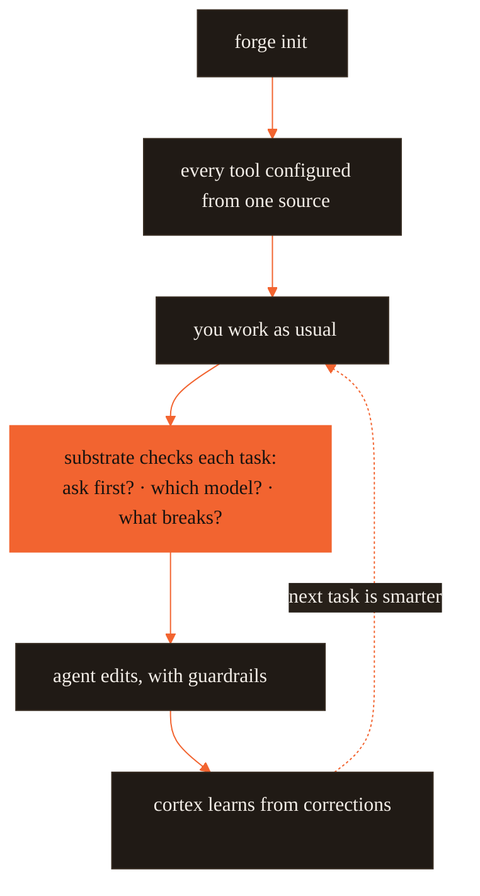

# Onboarding — five minutes to productive

**One brain for every AI coding agent.** A language model is _stateless_ — one
context window, wiped every call — so it has no memory of what your team learned, no
foresight about what an edit breaks, and no enforced guardrails. forgekit is the
**cognitive substrate** that supplies exactly those three things, and it delivers them
as native config to Claude Code, Codex, Cursor, Gemini, Aider, Copilot, Windsurf, Zed,
and Continue at once. Author the brain once; every tool reads it.

This page is the fast path: install, configure a repo, do a task, and watch the ledger
start paying off on day two.



## 1. Install (once)

The recommended paths need no token and no clone:

```bash
# Claude Code / Codex — the plugin (guards auto-wire, nothing to merge)
/plugin marketplace add CodeWithJuber/forgekit
/plugin install forgekit

# Any tool — the CLI, from public npm
npm install -g @codewithjuber/forgekit

forge doctor               # everything green?
```

Full matrix (no-registry `github:` install, symlink dev setup) →
[README → 60-second quickstart](README.md#60-second-quickstart).

## 2. Configure a repo (once per repo)

One config for every tool. Author your rules once; `forge init` emits each tool's
native file.

```bash
cd ~/your-project
forge init                 # emits AGENTS.md, CLAUDE.md, .gemini/settings.json, .aider.conf.yml …
```

Now Claude Code, Codex, Cursor, Gemini, Aider, Copilot, Windsurf, Zed, and Continue all
read the **same** rules — each from its own native file (plus MCP server config for Roo
Code and VS Code).

Change a rule later by editing `source/rules.json` (or dropping a per-repo
`.forge/rules.json`), then:

```bash
forge sync                 # recompiles into every tool; idempotent (only rewrites what changed)
```

## 3. Use the cognitive substrate

The substrate is the layer that runs _before_ the model edits code. One command runs
the whole pre-action gate:

```bash
forge substrate "<task>"      # ask/route/impact/scope/reuse/context/memory/verify in one pass
forge substrate "<task>" --json
forge impact <symbol-or-file> # the blast radius on its own
```

If `forge substrate` says `ASK FIRST`, ask the returned questions before editing. Read
the predicted impacted files — the **blast radius**, the set of files an edit is
predicted to touch — before any mutating change.

Paper and evidence package: [docs/cognitive-substrate/](docs/cognitive-substrate/).

## 4. Use the extras

```bash
forge atlas build          # index this repo's symbols → .forge/atlas.json
forge atlas query useAuth  # where is it defined? (cheaper than grep-and-read)
forge atlas has useAuth    # does it exist? "not found" = likely hallucinated
forge recall add "db port" "Postgres is on 5433 here, not 5432"
forge recall list          # facts the recall-load guard injects next session
forge catalog              # the Start-Here index of everything
```

## 5. Day two: the ledger is learning

Everything the substrate learned on day one — cortex lessons, remembered facts,
verified code — landed as claims in `.forge/ledger/`. This is **proof-carrying memory
(PCM)**: every stored fact carries its own evidence and is only trusted once independent
oracles (tests, CI, a human accept/revert) raise its confidence above a floor. A wrong
lesson decays out instead of ossifying. Now it starts paying off:

```bash
forge ledger stats                     # what the repo knows, by kind and trust level
forge ledger blame <id-prefix>         # who minted a claim, every oracle outcome, per-author trust
forge reuse query "<what you're about to build>"   # verified code you already have — with its proof
```

A `forge reuse query` hit points at working, test-confirmed code and the
`forge ledger blame` command that proves it — reuse it instead of regenerating. And
after `git pull`, `forge ledger merge <path>` folds a teammate's ledger in
conflict-free (union-merge), so their lessons arrive with their provenance intact. The
ledger is shared team memory.

---

## Forge principles

Forge is opinionated. These are the ideas every part of it is built on — the "why"
behind the mechanisms.

### 1. Guard over prose

Rules the model can drift from live in prose; rules it must **never** break live in
**guards** (deterministic shell hooks). A guard can't be forgotten after context
compaction. Move every enforceable invariant out of `CLAUDE.md` and into a guard; keep
the prose thin.

### 2. One source, many emitters

Author rules **once** (`source/rules.json`); a deterministic compiler (`forge sync`)
emits each tool's native format with a content-hash header, so drift is detectable and
re-running is a no-op. No rule is ever written twice.

### 3. Precompute, then serve

Answer "where is X / does X exist" from a **prebuilt artifact** (`.forge/atlas.json`),
not a live scan. Resolve the expensive part once; serve a few-hundred-token slice
instead of reading five files. The artifact is portable — any tool reads it, no MCP
required.

### 4. The Lean Path

The smallest change that works, chosen _after_ understanding the problem: need it at
all? → already here? → stdlib/native/existing dep? → one small change → root not
symptom. Deletion over addition. Boring over clever. (See the `lean` tool.)

### 5. Reuse over rebuild — thin layers over proven primitives

"Our own" never means "reimplement a mature tool." The smallest surface that delivers
the capability: `lean` is one rule file, not a plugin engine.

### 6. Verify, don't assert

Nothing is "done" without a check you can run — a test, a build exit code, a screenshot.
Show the command and its output. Fix root causes; never suppress an error to make a
check pass.

### 7. Re-entrancy safety

No guard may loop. Every guard is idempotent, holds an atomic lock while it runs, and
the one guard that calls a model (`session-learner`) is opt-in, gated, and single-shot.
The class of bug that once burned 1.67B tokens in five hours cannot originate here.

### 8. Name the ceiling

Every deliberate simplification states its limit and upgrade path, in code and in docs.
Forge would rather ship an honest subset with a clear boundary than a vague claim — see
[the honest limits](docs/GUIDE.md#honest-limits).

---

## Extend it

- **Add a rule** → a bullet in `source/rules.json`, then `forge sync`.
- **Add a tool (skill)** → `global/tools/<name>/SKILL.md` with `name` + `description` frontmatter.
- **Add a guard** → `global/guards/<name>.sh` (source `_guardlib.sh` for fields + the lock), then wire it in `global/settings.template.json` and `hooks/hooks.json`.
- **Rebrand** → edit `brand.json` (+ `package.json` bin, `.claude-plugin/plugin.json` name).

Every command with worked examples and the full extension guide live in
[docs/GUIDE.md](docs/GUIDE.md); the architecture, pain-point evidence, and cross-tool
matrix live in [ARCHITECTURE.md](ARCHITECTURE.md).
