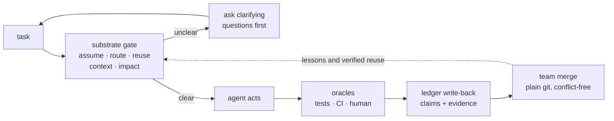

# Forge — one config for every AI coding agent

[](https://github.com/CodeWithJuber/forgekit/actions/workflows/ci.yml)
[](https://github.com/CodeWithJuber/forgekit/actions/workflows/codeql.yml)
[](https://scorecard.dev/viewer/?uri=github.com/CodeWithJuber/forgekit)
[](./LICENSE)
[](./package.json)
[](./package.json)

**Author your rules once — Forge emits every AI coding tool's native config
(`CLAUDE.md`, `AGENTS.md`, `.cursor/rules`, `GEMINI.md`, MCP…) and adds the one thing a
frozen model structurally lacks: a proof-carrying memory your whole team shares, plus a
pre-action check that predicts what an edit will break.**

Works with **Claude Code, Codex, Cursor, Gemini, Aider, Copilot, Windsurf, Zed, and
Continue** (plus MCP config for Roo and VS Code). Zero runtime dependencies — one
Node CLI, plain files in git, no server.

> **Status: beta.** The core (`init`, `sync`, `substrate`, `impact`, `ledger`, guards)
> is tested and in daily use; some flags may change before `1.0`.

## What you get (measured, not promised)

Every number below is a median from `npm run bench` on this repo, recorded with its
environment block in [`reports/benchmarks.md`](reports/benchmarks.md) — the project rule
is *a number is an assumption until measured*.

- **Blast-radius analysis before the edit** — "what does changing `verifyToken`
  break?" answers in **0.43 ms** (warm code-graph), including the coupled files you
  didn't name. On 6 hand-labeled cases from this repo's real import graph: recall
  **0.97** vs **0.33** for looking at the edited file alone.
- **A full pre-action gate in 118 ms** — assumption check, model routing, reuse lookup,
  context assembly, blast radius, scope, and goal anchor in one deterministic pass, no
  LLM call. On Claude Code it runs on **every prompt, automatically**.
- **Cheapest-capable model routing, visible before dispatch** — the white paper's live
  prototype measured **62.1% cost saved vs always-premium** on real models (paper §9;
  that's the paper's measurement, not this repo's — `forge cost --stages` reports only
  *your* measured stages).
- **A minimal dry-run test suite** — `forge imagine --run` selected 8 tests covering the
  predicted breaks and ran them in **1.3 s** where this repo's full suite takes ~60 s
  ([CHANGELOG 0.5.0](CHANGELOG.md)).
- **Conflict-free team memory** — merging two 500-claim ledger replicas takes
  **158 ms**; the merge is a property-tested join-semilattice, so teammate ledgers
  converge in any order over plain git.
- **Deterministic guards** for the rules a model must never break (protected paths, cost
  budget, doom loops) — hooks can't be "forgotten" after a context compaction the way
  `CLAUDE.md` prose can.

## 60-second quickstart

Install — pick one row (the recommended paths need no token and no clone):

| You use… | Run this |
| --- | --- |
| **Claude Code / Codex** *(recommended — full plugin, ambient guards)* | `/plugin marketplace add CodeWithJuber/forgekit` then `/plugin install forgekit` |
| **Any tool, from the CLI** | `npm install -g @codewithjuber/forgekit` |
| **No registry** | `npm install -g github:CodeWithJuber/forgekit` |
| **Contributors / local dev** | `git clone https://github.com/CodeWithJuber/forgekit.git && cd forgekit && npm link` — or `bash install.sh` for the symlink setup |

Then, in your project:

```bash
forge init      # emit every AI tool's native config from one shared source
forge doctor    # pass/fail health check: tools, guards, MCP, config drift

# pre-action check before you (or your agent) edit anything:
forge substrate "Change verifyToken in src/auth.js to require length > 20; update tests"
#   → assumption verdict · cheapest capable model · predicted blast radius
#     (including files you didn't name) · scope clusters · verification checklist

# team memory: fold in a teammate's ledger — conflict-free, any order
git pull && forge ledger merge <path-to-their-ledger>
```

On Claude Code the substrate then runs on **every prompt automatically** via a
`UserPromptSubmit` hook — advisory only, silent on clean tasks. Every other tool gets a
native config rule plus MCP tools (`substrate_check`, `predict_impact`,
`assumption_gate`, `route_task`, `scope_files`) it can call itself.

## How it works — the loop

Every task passes a fast deterministic gate; every outcome flows back into a shared,
proof-carrying memory:



Only independent oracles (tests, CI, a human accept/revert) move a memory's confidence —
so a wrong lesson decays out instead of ossifying. Full design:
[`ARCHITECTURE.md`](ARCHITECTURE.md).

## Commands

| Group | Command | Does |
| --- | --- | --- |
| **Config layer** (cross-tool `AGENTS.md` config) | `forge init` | emit this repo's config for every tool, one command |
| | `forge sync` | recompile `source/` → each tool's native files (idempotent) |
| | `forge doctor` | pass/fail health check (layers, install, drift, cortex) |
| | `forge catalog` | Start-Here index of every tool / crew / guard |
| **Pre-action gate** | `forge substrate` | the full pre-action check in one pass |
| | `forge preflight` | assumption gate — what a task names that the repo doesn't define |
| | `forge route` | cheapest capable model for a task (+ gateway config) |
| | `forge impact` | blast radius for a symbol or file |
| | `forge imagine` | predicted breaks + the minimal dry-run test suite (`--run` executes it sandboxed) |
| | `forge context` | budgeted context assembly + completeness gate |
| | `forge scope` | decompose files into independent clusters |
| | `forge anchor` | goal-drift check on your git changes |
| **Memory & team** | `forge ledger` | proof-carrying memory — stats / verify / show / blame / query / merge / import |
| | `forge cortex` | self-correcting lessons from *genuine* recurring mistakes |
| | `forge reuse` | proof-carrying code cache — served only while its proof holds |
| | `forge atlas` | build / query the code graph |
| | `forge recall` / `forge brain` | cross-session + portable project memory |
| **Quality gates** | `forge verify` | independent verification — real tests + hallucinated-symbol check |
| | `forge diagnose` | doom-loop check — 3× the same failure mints a diagnosis + escalation |
| | `forge uicheck` | deterministic UI checks — WCAG contrast · design fingerprint · slop gate |
| | `forge scan` / `forge harden` | vet a skill/MCP before install · wire secret-scan + sandbox |
| **Observability** | `forge dash` | local read-only dashboard over ledger, metrics, blast radius |
| | `forge cost` | real per-day spend · measured stage factors (`--stages`) |

**→ Every command with a worked example and real output:
[`docs/GUIDE.md`](docs/GUIDE.md).**

## Team memory for AI agents, in three commands

Everything the substrate learns — Cortex lessons, `forge remember` facts, verified reuse
artifacts — lands as content-addressed claims in a git-native ledger (`.forge/ledger/`)
built to merge without conflicts:

```bash
forge init                    # once — also emits the .gitattributes union-merge rule the ledger needs
# …work normally: cortex and `forge remember` shadow claims into the ledger as you go…
git pull && forge ledger merge <path-to-their-ledger>   # fold in a teammate's ledger — any order
```

Identical knowledge minted independently converges to **one** claim with every author
preserved in its provenance; `forge ledger blame <id>` shows who minted it, every oracle
outcome, and per-author trust. No server, no sync service — it's just files in git.

## How it compares — AI agent memory, LLM gateways, RAG

Structural differences only — each row is checkable against the named source, and the
full tables (including what each adjacent tool does *better*) are in
[`reports/benchmarks.md` → Uniqueness](reports/benchmarks.md#uniqueness--structural-contrasts-with-adjacent-tools):

| Property | Forge | Note stores / gateways / RAG |
| --- | --- | --- |
| Memory confidence moved **only by independent oracles** (tests, CI, human) | yes — closed `ORACLES` table; unverifiable evidence rejected (`src/ledger.js`) | note stores keep notes as written |
| Unreviewed knowledge decays toward *uncertainty*, not deletion | yes — time-decayed Beta posterior; dormant claims kept for audit | notes persist unchanged until deleted |
| Conflict-free team merge over plain git | yes — join-semilattice, property-tested | per-machine SQLite or a hosted store |
| Routing decision visible and diffable **before** dispatch | yes — deterministic rubric over `src/model_tiers.json` | gateways decide inside the proxy at request time |
| Cached code served **only with verification evidence**, revalidated against the current code graph | yes — `SERVE_FLOOR`, `revalidate()` in `src/reuse.js` | plain RAG serves on similarity alone |
| **What they do better** | — | hosted sync, web UIs, embedding search that catches paraphrase; gateways actually *move traffic* (failover, quotas). Forge is a transparency layer, not a replacement |

## Honest limits

Forge states its own ceiling everywhere. In short: **guards reduce, don't eliminate**
the "ignored my rules" problem; `recall`/`cortex` are file memory, **not** weight-level
learning; the `atlas`/`impact` graph is regex-approximate (conservative, not a sound
call graph — the impact numbers above are n = 6 hand-labeled cases on one JavaScript
repo); the substrate's rubrics are heuristic; the MinHash near-match is weak on very short
specs (an optional embeddings backend — `FORGE_EMBED` — lifts this; MinHash stays the
zero-dependency default); and `forge cost --stages` reports **measured stages only** — a stage with
no events says "no data", never a default. What's *asserted* is safe to gate on (repo
grounding, graph traversal, routing arithmetic, test commands); everything else is
*advisory*. **Tests and human corrections always win.** Full list:
[docs/GUIDE.md → Honest limits](docs/GUIDE.md#honest-limits).

## Why a "cognitive substrate"? The white paper

A language model at inference is a fixed function `y = f(x)` — frozen weights, a bounded
window, no state between calls. Memory, foresight, and self-checking can't be prompted
into that shape; they have to be supplied from outside. The full argument, with every
load-bearing statistic re-graded against primary sources, is the
[cognitive-substrate white paper](docs/cognitive-substrate/).

## Documentation

| Doc | What's in it |
| --- | --- |
| [`ONBOARDING.md`](ONBOARDING.md) | Five minutes to productive + the design principles. |
| [`docs/GUIDE.md`](docs/GUIDE.md) | Every command, worked examples, all cases, how to extend. |
| [`reports/benchmarks.md`](reports/benchmarks.md) | Every measured number, methodology, and `npm run bench` to reproduce. |
| [`docs/cognitive-substrate/`](docs/cognitive-substrate/) | The white paper, evidence map, ecosystem map, and prototype sources. |
| [`ARCHITECTURE.md`](ARCHITECTURE.md) | The four-layer compiler and the cross-tool emit matrix. |
| [`docs/RELEASING.md`](docs/RELEASING.md) | How releases are cut (tag → npm + GitHub Release). |
| [`CHANGELOG.md`](CHANGELOG.md) | What changed, per release. |

## Community & support

- **Get help** → [SUPPORT.md](./SUPPORT.md) · [Discussions](https://github.com/CodeWithJuber/forgekit/discussions)
- **Contribute** → [CONTRIBUTING.md](./CONTRIBUTING.md) · [Code of Conduct](./CODE_OF_CONDUCT.md)
- **Direction** → [ROADMAP.md](./ROADMAP.md) · [GOVERNANCE.md](./GOVERNANCE.md)
- **Security** → [SECURITY.md](./SECURITY.md) (report privately) · **Accessibility** → [ACCESSIBILITY.md](./ACCESSIBILITY.md)

---

MIT licensed. Built by [CodeWithJuber](https://github.com/CodeWithJuber).
