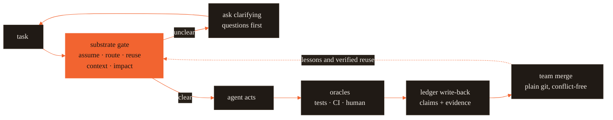

# Forge — one brain for every AI coding agent

[](https://github.com/CodeWithJuber/forgekit/actions/workflows/ci.yml)
[](https://github.com/CodeWithJuber/forgekit/actions/workflows/codeql.yml)
[](https://scorecard.dev/viewer/?uri=github.com/CodeWithJuber/forgekit)
[](./LICENSE)
[](./package.json)
[](./package.json)

<p align="center">
  <picture>
    <source media="(prefers-color-scheme: dark)" srcset="docs/assets/hero-dark.svg">
    
  </picture>
</p>

Forge is one shared brain for your AI coding agents. It gives a stateless model the
three things it structurally lacks — memory, foresight, and enforced guardrails — and
delivers them into every tool you use.

> The cognitive substrate every frozen model is missing — proof-carrying memory, impact
> foresight, and enforced guardrails — authored once and delivered as native config to
> Claude Code, Codex, Cursor, Gemini, Aider, Copilot, Windsurf, Zed, and Continue (plus
> MCP config for Roo and VS Code).

> **Status: beta.** The core (`init`, `sync`, `substrate`, `impact`, `ledger`, guards) is
> tested and in daily use; some flags may change before `1.0`.

## Contents

- [The problem](#the-problem)
- [How it works — the loop](#how-it-works--the-loop)
- [What you get](#what-you-get)
- [60-second quickstart](#60-second-quickstart)
- [Commands](#commands)
- [Team memory in three commands](#team-memory-in-three-commands)
- [How it compares](#how-it-compares)
- [Honest limits](#honest-limits)
- [Why a cognitive substrate? The white paper](#why-a-cognitive-substrate-the-white-paper)
- [Public site](#public-site) · [Documentation](#documentation) · [Community & support](#community--support)

## The problem

A large language model is stateless — one context window, wiped every call.

- It has **no memory** of what your team already learned.
- It has **no foresight** about what an edit will break.
- It has **no enforced guardrails** — prose rules get forgotten after a compaction.

And every tool wants its own config file (`CLAUDE.md`, `AGENTS.md`, `.cursor/rules`,
`GEMINI.md`, MCP…). Forge is the **cognitive substrate** — the layer that runs *before*
the model edits code, supplying memory, foresight, and guardrails — and the compiler that
delivers it into every tool from one source.

## How it works — the loop

Every task passes a fast, deterministic gate; every outcome flows back into a shared,
proof-carrying memory.



Only independent oracles (tests, CI, a human accept/revert) move a memory's confidence —
so a wrong lesson decays out instead of ossifying. Full design:
[`ARCHITECTURE.md`](ARCHITECTURE.md).

## What you get

The day-to-day value first — the substrate gives a frozen model what it can't hold itself:

- **Memory that persists across sessions and teammates.** Every lesson, fact, and verified
  reuse is *proof-carrying memory (PCM)* — a claim that carries its own evidence and is only
  trusted once independent oracles raise its confidence above a floor. Wrong lessons decay
  out instead of ossifying.
- **Foresight before you break things.** Ask "what does changing `verifyToken` break?" and
  get the *blast radius* — the set of files an edit is predicted to impact, read from the
  code graph, including coupled files you never named.
- **Guardrails that can't be forgotten.** Deterministic hooks enforce the rules a model must
  never break (protected paths, cost budget, doom loops) — they survive a context compaction
  the way `CLAUDE.md` prose does not.
- **One config for 9 tools.** Author your rules once; Forge emits each tool's native config,
  plus MCP for Roo and VS Code. Zero runtime dependencies — one Node CLI, plain files in git,
  no server.

### The measured evidence

Every number is a median from `npm run bench` on this repo, recorded with its environment
block in [`reports/benchmarks.md`](reports/benchmarks.md) — the project rule is *a number is
an assumption until measured*.

- **Blast radius in 0.43 ms** (warm code-graph). On 6 hand-labeled cases from this repo's
  real import graph: recall **0.97** vs **0.33** for looking at the edited file alone.
- **A full pre-action gate in 118 ms** — assumption check, routing, reuse lookup, context
  assembly, blast radius, scope, and goal anchor in one deterministic pass, no LLM call. On
  Claude Code it runs on **every prompt, automatically**.
- **62.1% cost saved vs always-premium** — from the white paper's live routing prototype on
  real models (paper §9; that's the paper's measurement, not this repo's — `forge cost
  --stages` reports only *your* measured stages).
- **Conflict-free team memory** — merging two 500-claim ledger replicas takes **158 ms**; the
  merge is a property-tested join-semilattice, so teammate ledgers converge in any order over
  plain git.

## 60-second quickstart

Install — pick one row (the recommended paths need no token and no clone):

| You use… | Run this |
| --- | --- |
| **Claude Code / Codex** *(recommended — full plugin, ambient guards)* | `/plugin marketplace add CodeWithJuber/forgekit` then `/plugin install forgekit` |
| **Any tool, from the CLI** | `npm install -g @codewithjuber/forgekit` |
| **No registry** | `npm install -g github:CodeWithJuber/forgekit` |
| **Contributors / local dev** | `git clone https://github.com/CodeWithJuber/forgekit.git && cd forgekit && npm link` — or `bash install.sh` for the symlink setup |

Then, in your project:

```bash
forge init      # emit every AI tool's native config from one shared source
forge doctor    # pass/fail health check: tools, guards, MCP, config drift

# pre-action check before you (or your agent) edit anything:
forge substrate "Change verifyToken in src/auth.js to require length > 20; update tests"
#   → assumption verdict · cheapest capable model · predicted blast radius
#     (including files you didn't name) · scope clusters · verification checklist

# team memory: fold in a teammate's ledger — conflict-free, any order
git pull && forge ledger merge <path-to-their-ledger>
```

On Claude Code the substrate then runs on **every prompt automatically** via a
`UserPromptSubmit` hook — advisory only, silent on clean tasks. Every other tool gets a
native config rule plus MCP tools (`substrate_check`, `predict_impact`, `assumption_gate`,
`route_task`, `scope_files`) it can call itself.

## Commands

Advisory by default. Set `FORGE_ENFORCE=1` to turn the substrate into a hard block on the
strongest signals (vacuous prompt, un-assemblable required context, blast radius over the
default 25-file threshold).

| Group | Command | Does |
| --- | --- | --- |
| **Config layer** | `forge init` | emit every tool's native config from one source |
| | `forge sync` | recompile canonical source → each tool's native files (idempotent) |
| | `forge doctor` | pass/fail health check: tools, guards, MCP, drift |
| | `forge harden` | wire gitleaks pre-commit + sandbox settings |
| | `forge catalog` | Start-Here index of every tool / crew / guard |
| | `forge brand` | print the brand token map |
| **Memory & team** | `forge ledger` | proof-carrying memory — stats / verify / show / blame / query / ratify / retract / merge / import |
| | `forge recall` | cross-session personal memory — list / add / consolidate |
| | `forge remember` | durable, repo-committable fact |
| | `forge brain` | portable project-memory index |
| | `forge cortex` | self-correcting lessons — `status` / `why` |
| | `forge reuse` | proof-carrying code cache — query / mint / stats |
| **Substrate (pre-action)** | `forge substrate` | the full pre-action gate in one pass |
| | `forge preflight` | assumption / info-gap check |
| | `forge route` | cheapest capable model tier (`route gateway` emits LiteLLM config) |
| | `forge impact` | predict blast radius for a symbol or file |
| | `forge scope` | cluster + surface coupled files |
| | `forge imagine` | consequence sim + minimal dry-run suite (`--run` executes it sandboxed) |
| | `forge context` | budgeted context assembly + completeness gate |
| | `forge atlas` | build / query / has (hallucinated-symbol check) the code graph |
| | `forge anchor` | goal-drift check (advisory) |
| | `forge diagnose` | doom-loop: same failure 3× → diagnosis + escalation |
| | `forge lean` | scope-minimality footprint (advisory) |
| | `forge cost` | real per-day spend · measured stage factors (`--stages`) |
| **Verification & safety** | `forge verify` | independent gate — tests + hallucinated-symbol flag + provenance |
| | `forge scan` | skill-gate: vet a SKILL.md / .mcp.json for injection / RCE / exfil |
| | `forge spec` | spec-as-contract drift — init / lock / check |
| **UI / design** | `forge taste` | pick one visual direction → DESIGN.md |
| | `forge uicheck` | contrast · fingerprint · design · visual (WCAG · slop+conformance · Playwright) |
| **Observability** | `forge dash` | localhost-only read-only dashboard over ledger, metrics, blast radius (default port 4242) |

**→ Every command with a worked example and real output:
[`docs/GUIDE.md`](docs/GUIDE.md).**

## Team memory in three commands

Everything the substrate learns — Cortex lessons, `forge remember` facts, verified reuse
artifacts — lands as content-addressed claims in a git-native ledger (`.forge/ledger/`)
built to merge without conflicts:

```bash
forge init                    # once — also emits the .gitattributes union-merge rule the ledger needs
# …work normally: cortex and `forge remember` shadow claims into the ledger as you go…
git pull && forge ledger merge <path-to-their-ledger>   # fold in a teammate's ledger — any order
```

Identical knowledge minted independently converges to **one** claim with every author
preserved in its provenance; `forge ledger blame <id>` shows who minted it, every oracle
outcome, and per-author trust. No server, no sync service — it's just files in git.

## How it compares

Structural differences only — each row is checkable against the named source, and the full
tables (including what each adjacent tool does *better*) are in
[`reports/benchmarks.md` → Uniqueness](reports/benchmarks.md#uniqueness--structural-contrasts-with-adjacent-tools):

| Property | Forge | Note stores / gateways / RAG |
| --- | --- | --- |
| Memory confidence moved **only by independent oracles** (tests, CI, human) | yes — closed `ORACLES` table; unverifiable evidence rejected (`src/ledger.js`) | note stores keep notes as written |
| Unreviewed knowledge decays toward *uncertainty*, not deletion | yes — time-decayed Beta posterior; dormant claims kept for audit | notes persist unchanged until deleted |
| Conflict-free team merge over plain git | yes — join-semilattice, property-tested | per-machine SQLite or a hosted store |
| Routing decision visible and diffable **before** dispatch | yes — deterministic rubric over `src/model_tiers.json` | gateways decide inside the proxy at request time |
| Cached code served **only with verification evidence**, revalidated against the current code graph | yes — `SERVE_FLOOR`, `revalidate()` in `src/reuse.js` | plain RAG serves on similarity alone |
| **What they do better** | — | hosted sync, web UIs, embedding search that catches paraphrase; gateways actually *move traffic* (failover, quotas). Forge is a transparency layer, not a replacement |

## Honest limits

Forge states its own ceiling everywhere. In short: **guards reduce, don't eliminate** the
"ignored my rules" problem; `recall`/`cortex` are file memory, **not** weight-level
learning; the `atlas`/`impact` graph is regex-approximate (conservative, not a sound call
graph — the impact numbers above are n = 6 hand-labeled cases on one JavaScript repo); the
substrate's rubrics are heuristic; the MinHash near-match is weak on very short specs (an
optional embeddings backend — `FORGE_EMBED` — lifts this; MinHash stays the zero-dependency
default); and `forge cost --stages` reports **measured stages only** — a stage with no
events says "no data", never a default. What's *asserted* is safe to gate on (repo
grounding, graph traversal, routing arithmetic, test commands); everything else is
*advisory*. **Tests and human corrections always win.** Full list:
[docs/GUIDE.md → Honest limits](docs/GUIDE.md#honest-limits).

## Why a cognitive substrate? The white paper

A language model at inference is a fixed function `y = f(x)` — frozen weights, a bounded
window, no state between calls. Memory, foresight, and self-checking can't be prompted into
that shape; they have to be supplied from outside. The full argument, with every
load-bearing statistic re-graded against primary sources, is the
[cognitive-substrate white paper](docs/cognitive-substrate/).

## Public site

Forgekit ships two static pages. [`landing/index.html`](landing/index.html) is a
hand-authored landing page — the project's front door. [`public/index.html`](public/index.html)
is a generated status page, intentionally static and auto-updated from real repository data
(`package.json`, `README.md`, `CHANGELOG.md`, and `reports/benchmarks.md`) by the generator
in [`scripts/build-pages.mjs`](scripts/build-pages.mjs).

```bash
npm run pages:build        # offline, deterministic repo-data build
BUILD_PAGES_LIVE=1 npm run pages:build  # also refresh public GitHub counters
```

The optional live mode uses the no-auth GitHub repository API with timeouts, retries,
jitter, and ETag/Last-Modified caching.

Both pages share one design system (the same tokens as `forge dash`) and are gated by
`forge uicheck design` and the rendered `forge uicheck visual` check.

GitHub Pages is the primary deployment, via [`.github/workflows/static.yml`](.github/workflows/static.yml):
the landing page is published at the site root and the status page at `/status/`. GitLab
Pages ([`.gitlab-ci.yml`](.gitlab-ci.yml)) is unchanged and only deploys the status page at
its root — it does not get the landing page.

## Documentation

| Doc | What's in it |
| --- | --- |
| [`ONBOARDING.md`](ONBOARDING.md) | Five minutes to productive + the design principles. |
| [`docs/GUIDE.md`](docs/GUIDE.md) | Every command, worked examples, all cases, how to extend. |
| [`reports/benchmarks.md`](reports/benchmarks.md) | Every measured number, methodology, and `npm run bench` to reproduce. |
| [`docs/cognitive-substrate/`](docs/cognitive-substrate/) | The white paper, evidence map, ecosystem map, and prototype sources. |
| [`ARCHITECTURE.md`](ARCHITECTURE.md) | The four-layer compiler and the cross-tool emit matrix. |
| [`docs/RELEASING.md`](docs/RELEASING.md) | How releases are cut (tag → npm + GitHub Release). |
| [`CHANGELOG.md`](CHANGELOG.md) | What changed, per release. |

## Community & support

- **Get help** → [SUPPORT.md](./SUPPORT.md) · [Discussions](https://github.com/CodeWithJuber/forgekit/discussions)
- **Contribute** → [CONTRIBUTING.md](./CONTRIBUTING.md) · [Code of Conduct](./CODE_OF_CONDUCT.md)
- **Direction** → [ROADMAP.md](./ROADMAP.md) · [GOVERNANCE.md](./GOVERNANCE.md)
- **Security** → [SECURITY.md](./SECURITY.md) (report privately) · **Accessibility** → [ACCESSIBILITY.md](./ACCESSIBILITY.md)

---

MIT licensed. Built by [CodeWithJuber](https://github.com/CodeWithJuber).
