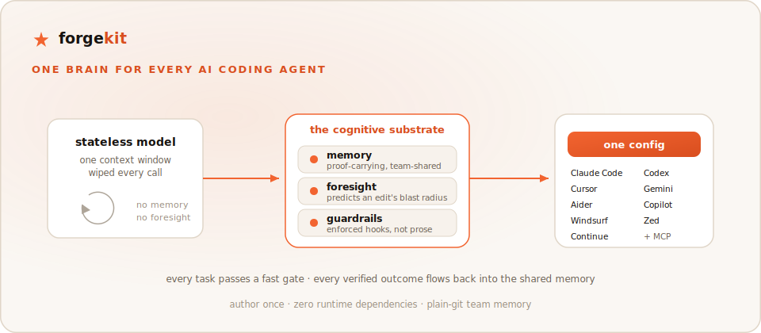
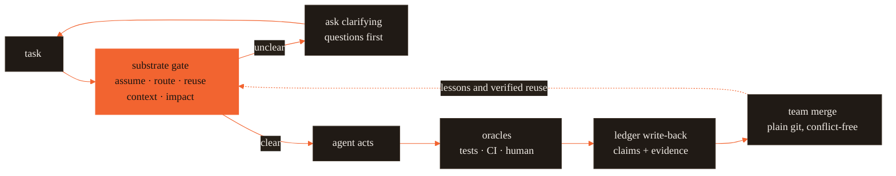

# Forge — one brain for every AI coding agent

[](https://github.com/CodeWithJuber/forgekit/actions/workflows/ci.yml)
[](https://github.com/CodeWithJuber/forgekit/actions/workflows/codeql.yml)
[](https://scorecard.dev/viewer/?uri=github.com/CodeWithJuber/forgekit)
[](./LICENSE)
[](./package.json)
[](./package.json)

<p align="center">
  <picture>
    <source media="(prefers-color-scheme: dark)" srcset="docs/assets/hero-dark.svg">
    
  </picture>
</p>

Forge is one shared brain for your AI coding agents. It gives a stateless model the
three things it structurally lacks — memory, foresight, and enforced guardrails — and
delivers them into every tool you use.

> The cognitive substrate every frozen model is missing — evidence-referenced,
> content-addressed memory (we call it "proof-carrying memory" / PCM — see the honesty note
> below), heuristic impact foresight, and enforced guardrails — authored once and delivered
> as native config to Claude Code, Codex, Cursor, Gemini, Aider, Copilot, Windsurf, Zed, and
> Continue (plus MCP config for Roo and VS Code).

> **Status: beta — read before you rely on it.**
>
> - The core (`init`, `sync`, `substrate`, `impact`, `ledger`, guards) is tested and in daily
>   use; some flags may change before `1.0`.
> - **Claude Code is the deepest-tested integration** (full plugin, ambient `UserPromptSubmit`
>   guards). The other eight tools receive native config plus MCP tools, but have had less
>   real-world exercise.
> - **Impact/blast-radius analysis is heuristic** — a regex-approximate, conservative code
>   graph, not a sound call graph. Treat its output as advisory.
> - **"Proof-carrying memory" is a name, not a formal proof.** Claims are content-addressed and
>   carry evidence references; confidence moves only when independent oracles (tests, CI, a
>   human) raise it. There is no theorem-prover in the loop.
> - Some integrations shell out — `forge harden`, `forge scan`, and the git-native ledger
>   assume **Bash, Git, and (for a few paths) `jq`** are available.

## Start in 60 seconds

```bash
npm install -g @codewithjuber/forgekit   # or: npm install -g github:CodeWithJuber/forgekit
forge init                               # emit every AI tool's native config from one source
forge doctor                             # verify providers, hooks, and MCP wiring
```

That's it — your agents now share one source of truth. The
[full quickstart](#60-second-quickstart) walks through the loop; [Commands](#commands)
lists everything `forge` can do.

## Contents

- [Start in 60 seconds](#start-in-60-seconds)
- [The problem](#the-problem)
- [How it works — the loop](#how-it-works--the-loop)
- [What you get](#what-you-get)
- [60-second quickstart](#60-second-quickstart)
- [Commands](#commands)
- [Team memory in three commands](#team-memory-in-three-commands)
- [How it compares](#how-it-compares)
- [Honest limits](#honest-limits)
- [Why a cognitive substrate? The white paper](#why-a-cognitive-substrate-the-white-paper)
- [Public site](#public-site) · [Documentation](#documentation) · [Community & support](#community--support)

## The problem

A large language model is stateless — one context window, wiped every call.

- It has **no memory** of what your team already learned.
- It has **no foresight** about what an edit will break.
- It has **no enforced guardrails** — prose rules get forgotten after a compaction.

And every tool wants its own config file (`CLAUDE.md`, `AGENTS.md`, `.cursor/rules`,
`GEMINI.md`, MCP…). Forge is the **cognitive substrate** — the layer that runs _before_
the model edits code, supplying memory, foresight, and guardrails — and the compiler that
delivers it into every tool from one source.

## How it works — the loop

Every task passes a fast, deterministic gate; every outcome flows back into a shared,
proof-carrying memory.



Only independent oracles (tests, CI, a human accept/revert) move a memory's confidence —
so a wrong lesson decays out instead of ossifying. Full design:
[`ARCHITECTURE.md`](ARCHITECTURE.md).

## What you get

The day-to-day value first — the substrate gives a frozen model what it can't hold itself:

- **Memory that persists across sessions and teammates.** _[Implemented]_ Every lesson, fact,
  and verified reuse is _proof-carrying memory (PCM)_ — our name for **evidence-referenced,
  content-addressed memory**: a claim that carries references to its own evidence and is only
  trusted once independent oracles raise its confidence above a floor (the "proof" is that
  evidence trail, not a formal proof). Wrong lessons decay out instead of ossifying.
- **Foresight before you break things.** _[Heuristic]_ Ask "what does changing `verifyToken`
  break?" and get the _blast radius_ — the set of files an edit is predicted to impact, read
  from a regex-approximate (conservative, not sound) code graph, including coupled files you
  never named.
- **Guardrails that can't be forgotten.** _[Implemented]_ Deterministic hooks enforce the rules a model must
  never break (protected paths, cost budget, doom loops) — they survive a context compaction
  the way `CLAUDE.md` prose does not.
- **Work that finishes end to end.** A completion gate blocks "done" once per session when
  code moved but no doc or state artifact followed — with the repair checklist as the answer
  (`forge docs sync` sweeps the diff for stale prose, `forge handoff` writes the bounded
  session snapshot the next session resumes from, `forge decide` records choices so no
  session re-decides them).
- **One config for 9 tools.** Author your rules once; Forge emits each tool's native config,
  plus MCP for Roo and VS Code. Zero runtime dependencies — one Node CLI, plain files in git,
  no server.

### The measured evidence

Every number is a median from `npm run bench` on this repo, recorded with its environment
block in [`reports/benchmarks.md`](reports/benchmarks.md) — the project rule is _a number is
an assumption until measured_.

- **Blast radius in 0.43 ms** (warm code-graph). On 6 hand-labeled cases from this repo's
  real import graph: recall **0.97** vs **0.33** for looking at the edited file alone.
- **A full pre-action gate in 118 ms** (median on this repo, warm) — assumption check, routing,
  reuse lookup, context assembly, blast radius, scope, and goal anchor in one deterministic
  pass, no LLM call. On Claude Code it runs on **every prompt, automatically**.
- **62.1% cost saved vs always-premium** — from the white paper's live routing prototype on
  real models (paper §9; that's the paper's measurement, not this repo's — `forge cost
--stages` reports only _your_ measured stages).
- **Conflict-free team memory** — merging two 500-claim ledger replicas takes **158 ms**; the
  merge is order-independent and property-tested, so teammate ledgers converge to the same state
  no matter who syncs first, over plain git.

## 60-second quickstart

Install — pick one row (the recommended paths need no token and no clone):

| You use…                                                              | Run this                                                                                                                          |
| --------------------------------------------------------------------- | --------------------------------------------------------------------------------------------------------------------------------- |
| **Claude Code / Codex** _(recommended — full plugin, ambient guards)_ | `/plugin marketplace add CodeWithJuber/forgekit` then `/plugin install forgekit`                                                  |
| **Any tool, from the CLI**                                            | `npm install -g @codewithjuber/forgekit`                                                                                          |
| **No registry**                                                       | `npm install -g github:CodeWithJuber/forgekit`                                                                                    |
| **Contributors / local dev**                                          | `git clone https://github.com/CodeWithJuber/forgekit.git && cd forgekit && npm link` — or `bash install.sh` for the symlink setup |

Then, in your project:

```bash
forge init         # emit every AI tool's native config from one shared source
forge doctor       # pass/fail health check: tools, guards, MCP, config drift
forge doctor --fix # auto-repair the safely fixable findings, then re-check
```

`forge init` also merges Forge's hooks + permissions into `~/.claude/settings.json` —
that file is **global** (it affects all your repos), so init says so before reporting the
merge. Opt out with `forge init --no-settings`; reverse a past merge any time with
`forge init --remove-settings` (your own entries are preserved, and a timestamped backup
is written first).

```bash

# pre-action check before you (or your agent) edit anything:
forge substrate "Change verifyToken in src/auth.js to require length > 20; update tests"
#   → assumption verdict · cheapest capable model · predicted blast radius
#     (including files you didn't name) · scope clusters · verification checklist

# team memory: fold in a teammate's ledger — conflict-free, any order
git pull && forge ledger merge <path-to-their-ledger>
```

On Claude Code the substrate then runs on **every prompt automatically** via a
`UserPromptSubmit` hook — advisory only, silent on clean tasks. Every other tool gets a
native config rule plus **19 MCP tools** it can call itself — pre-action checks
(`substrate_check`, `predict_impact`, `assumption_gate`, `route_task`, `scope_files`),
memory reads and writes, and ops/health — the full list with schemas is in
[`docs/GUIDE.md`](docs/GUIDE.md#mcp-tools).

## Commands

Advisory by default. Set `FORGE_ENFORCE=1` to turn the substrate into a hard block on the
strongest signals (vacuous prompt, un-assemblable required context, blast radius over the
default 25-file threshold).

Output is plain text when piped; on a TTY it adds brand-palette color and confidence
meters. `NO_COLOR` turns color off, `FORCE_COLOR=1` forces it on (e.g. in CI, `0`
forces off), and `TERM`/`COLORTERM` follow the usual terminal conventions.

The first time you run a real command before `~/.claude/settings.json` is forge-managed,
one tip line points at `forge init` (or `forge doctor --fix`) to wire hooks + permissions;
it self-silences once init runs and `FORGE_NO_HINT=1` mutes it entirely. `install.sh` does
this wiring for you via `forge init --settings-only` — an idempotent, marker-guarded merge
that never clobbers your existing settings (skip it with `install.sh --no-settings`;
`install.sh --uninstall` or `forge init --remove-settings` reverses it).

| Group                      | Command              | Does                                                                                                                                                                 |
| -------------------------- | -------------------- | -------------------------------------------------------------------------------------------------------------------------------------------------------------------- |
| **Config layer**           | `forge init`         | emit every tool's native config from one source                                                                                                                      |
|                            | `forge sync`         | recompile canonical source → each tool's native files (idempotent)                                                                                                   |
|                            | `forge tools`        | primary-tool config — gitignore secondary-tool artifacts (`.cursor/`, `.gemini/`, …) for tools this repo doesn't use; `forge tools <name>` sets it, `--reset` clears |
|                            | `forge doctor`       | pass/fail health check: tools, guards, MCP, drift, update                                                                                                            |
|                            | `forge update`       | self-update — `--check` reports if a newer version exists, bare applies it, `--to <version>` pins/downgrades                                                         |
|                            | `forge docs`         | docs↔code drift — `check` reconciles commands/env/MCP/CHANGELOG; `sync` sweeps the diff for stale doc mentions                                                       |
|                            | `forge config`       | provider setup — show / switch / add providers, set the default model                                                                                                |
|                            | `forge integrations` | opt-in third-party MCP servers (e.g. context7) — `add` records the managed set and writes only with `--yes` (`--adopt` claims a same-name entry you already had); `remove` reverses it |
|                            | `forge harden`       | wire the pre-commit gate (gitleaks + commit gate) + sandbox settings                                                                                                 |
|                            | `forge catalog`      | Start-Here index of every tool / crew / guard                                                                                                                        |
|                            | `forge brand`        | print the brand token map                                                                                                                                            |
| **Memory & team**          | `forge ledger`       | proof-carrying memory — stats / verify / show / blame / query / ratify / retract / merge / sync / import                                                             |
|                            | `forge recall`       | cross-session personal memory — list / add / consolidate                                                                                                             |
|                            | `forge remember`     | durable, repo-committable fact                                                                                                                                       |
|                            | `forge brain`        | portable project-memory index                                                                                                                                        |
|                            | `forge cortex`       | self-correcting lessons — `status` / `why`                                                                                                                           |
|                            | `forge deja`         | anti-repetition — ranks prior solved/verified sessions for a task you're about to start (`FORGE_DEJA=0` disables)                                                    |
|                            | `forge reuse`        | proof-carrying code cache — query / mint / stats                                                                                                                     |
|                            | `forge handoff`      | bounded session snapshot (`.forge/state.md`) — rewritten each handoff, re-injected every session start                                                               |
|                            | `forge decide`       | append-only decision log (`.forge/decisions.md`, D-#### ADR-lite) — future sessions read it instead of re-deciding                                                   |
|                            | `forge know`         | route any fact to its storage home (decision / ledger / recall / …) — total routing, an unsure fact still lands                                                      |
| **Substrate (pre-action)** | `forge substrate`    | the full pre-action gate in one pass                                                                                                                                 |
|                            | `forge preflight`    | assumption / info-gap check                                                                                                                                          |
|                            | `forge route`        | cheapest capable model tier (`route gateway` emits LiteLLM config)                                                                                                   |
|                            | `forge impact`       | predict blast radius for a symbol or file                                                                                                                            |
|                            | `forge scope`        | cluster + surface coupled files                                                                                                                                      |
|                            | `forge imagine`      | consequence sim + minimal dry-run suite (`--run` executes it sandboxed)                                                                                              |
|                            | `forge context`      | budgeted context assembly + completeness gate                                                                                                                        |
|                            | `forge atlas`        | build / query / has (hallucinated-symbol check) the code graph                                                                                                       |
|                            | `forge stack`        | detect this repo's real stack (languages, frameworks, test commands) from its manifests                                                                              |
|                            | `forge anchor`       | goal-drift check (advisory) — `set`/`show`/`clear` persists the goal across sessions                                                                                 |
|                            | `forge diagnose`     | doom-loop: same failure 3× → diagnosis + escalation                                                                                                                  |
|                            | `forge lean`         | scope-minimality footprint (advisory)                                                                                                                                |
|                            | `forge cost`         | real per-day spend · measured stage factors (`--stages`)                                                                                                             |
| **Verification & safety**  | `forge verify`       | independent gate — tests + hallucinated-symbol flag + provenance; `--deep` multi-lens consensus (`--llm` reviewer panel)                                             |
|                            | `forge precommit`    | commit-level gate rung — staged code w/o docs + secret scan (`FORGE_COMMIT_GATE=block\|warn\|0`)                                                                     |
|                            | `forge radar`        | dependency-currency rings (adopt/trial/assess/hold) from registry evidence — cached, offline-honest                                                                  |
|                            | `forge scan`         | skill-gate: vet a SKILL.md / .mcp.json for injection / RCE / exfil                                                                                                   |
|                            | `forge spec`         | spec-as-contract drift — init / lock / check                                                                                                                         |
| **UI / design**            | `forge taste`        | pick one visual direction → DESIGN.md                                                                                                                                |
|                            | `forge uicheck`      | contrast · fingerprint · design · visual (WCAG · slop+conformance · Playwright)                                                                                      |
| **Observability**          | `forge dash`         | localhost-only live dashboard: ledger, metrics trends, radar rings, memory browser, session timeline, blast radius (default port 4242)                               |
|                            | `forge report`       | static, self-contained HTML snapshot of `.forge/` (`.forge/report.html`) — opens offline, no server                                                                  |

**→ Every command with a worked example and real output:
[`docs/GUIDE.md`](docs/GUIDE.md).**

## Team memory in three commands

Everything the substrate learns — Cortex lessons, `forge remember` facts, verified reuse
artifacts — lands as content-addressed claims in a git-native ledger (`.forge/ledger/`)
built to merge without conflicts:

```bash
forge init                    # once — also emits the .gitattributes union-merge rule the ledger needs
# …work normally: cortex and `forge remember` shadow claims into the ledger as you go…
git pull && forge ledger merge <path-to-their-ledger>   # fold in a teammate's ledger — any order
forge ledger sync             # push-pull the ledger through a git ref (refs/forge/ledger) or a shared dir — CRDT, any order
```

Identical knowledge minted independently converges to **one** claim with every author
preserved in its provenance; `forge ledger blame <id>` shows who minted it, every oracle
outcome, and per-author trust. No server, no sync service — it's just files in git.

`forge ledger sync` moves that state between machines without a merge argument: with no
flags it uses the repo's git remote, serializing the ledger to a `state.json` blob under a
dedicated ref (`refs/forge/ledger`) — a raced non-fast-forward push re-merges and retries,
monotone by the CRDT join, so nothing is ever lost. Point it at a shared folder with
`--dir <path>` (or set **`FORGE_SYNC_DIR`** as the default dir target when there's no
remote), and add `--personal` to sync the per-user ledger beside the recall store — the
one `forge recall add` shadows facts into — so your personal facts follow you across
machines.

## How it compares

Structural differences only — each row is checkable against the named source, and the full
tables (including what each adjacent tool does _better_) are in
[`reports/benchmarks.md` → Uniqueness](reports/benchmarks.md#uniqueness--structural-contrasts-with-adjacent-tools):

| Property                                                                                           | Forge                                                                                                                                                                          | Note stores / gateways / RAG                                                                                                                                          |
| -------------------------------------------------------------------------------------------------- | ------------------------------------------------------------------------------------------------------------------------------------------------------------------------------ | --------------------------------------------------------------------------------------------------------------------------------------------------------------------- |
| Memory confidence moved **only by independent oracles** (tests, CI, human)                         | yes — closed `ORACLES` table; unverifiable evidence rejected at append, forged log lines fail their content-hash recheck at read and imports are quarantined (`src/ledger.js`) | note stores keep notes as written                                                                                                                                     |
| Unreviewed knowledge decays toward _uncertainty_, not deletion                                     | yes — confidence fades over time toward _unsure_; dormant claims kept for audit, never deleted                                                                                 | notes persist unchanged until deleted                                                                                                                                 |
| Conflict-free team merge over plain git                                                            | yes — two teammates' memories combine by set-union, so they never conflict (property-tested)                                                                                   | per-machine SQLite or a hosted store                                                                                                                                  |
| Routing decision visible and diffable **before** dispatch                                          | yes — a deterministic rubric you can read in the repo (`src/model_tiers.json`)                                                                                                 | gateways decide inside the proxy at request time                                                                                                                      |
| Cached code served **only with verification evidence**, revalidated against the current code graph | yes — a cache hit is served only if its evidence clears a confidence floor and still matches today's code                                                                      | plain RAG serves on similarity alone                                                                                                                                  |
| **What they do better**                                                                            | —                                                                                                                                                                              | hosted sync, web UIs, embedding search that catches paraphrase; gateways actually _move traffic_ (failover, quotas). Forge is a transparency layer, not a replacement |

## Honest limits

Forge states its own ceiling everywhere. In short: **guards reduce, don't eliminate** the
"ignored my rules" problem; `recall`/`cortex` are file memory, **not** weight-level
learning; the `atlas`/`impact` graph is regex-approximate (conservative, not a sound call
graph — the impact numbers above are n = 6 hand-labeled cases on one JavaScript repo); the
substrate's rubrics are heuristic; the MinHash near-match is weak on very short specs (an
optional embeddings backend — `FORGE_EMBED` — lifts this; MinHash stays the zero-dependency
default); and `forge cost --stages` reports **measured stages only** — a stage with no
events says "no data", never a default. What's _asserted_ is safe to gate on (repo
grounding, graph traversal, routing arithmetic, test commands); everything else is
_advisory_. **Tests and human corrections always win.** Full list:
[docs/GUIDE.md → Honest limits](docs/GUIDE.md#honest-limits).

## Why a cognitive substrate? The white paper

A model can't learn from your codebase between calls: its weights are frozen and its
working memory is wiped after every response. Memory, foresight, and self-checking can't
be prompted into it — they have to be supplied from outside, which is what the substrate
does. (Formally: inference is a fixed function `y = f(x)` with no state between calls.)
The full argument, with every load-bearing statistic re-graded against primary sources, is
the [cognitive-substrate white paper](docs/cognitive-substrate/).

## Public site

Forgekit ships two static pages. [`landing/index.html`](landing/index.html) is a
hand-authored landing page — the project's front door. [`public/index.html`](public/index.html)
is a generated status page, intentionally static and auto-updated from real repository data
(`package.json`, `README.md`, `CHANGELOG.md`, and `reports/benchmarks.md`) by the generator
in [`scripts/build-pages.mjs`](scripts/build-pages.mjs).

```bash
npm run pages:build        # offline, deterministic repo-data build
BUILD_PAGES_LIVE=1 npm run pages:build  # also refresh public GitHub counters
```

The optional live mode uses the no-auth GitHub repository API with timeouts, retries,
jitter, and ETag/Last-Modified caching.

Both pages share one design system (the same tokens as `forge dash`) and are gated by
`forge uicheck design` and the rendered `forge uicheck visual` check.

GitHub Pages is the primary deployment, via [`.github/workflows/static.yml`](.github/workflows/static.yml):
the landing page is published at the site root and the status page at `/status/`. GitLab
Pages ([`.gitlab-ci.yml`](.gitlab-ci.yml)) is unchanged and only deploys the status page at
its root — it does not get the landing page.

## Documentation

| Doc                                                      | What's in it                                                          |
| -------------------------------------------------------- | --------------------------------------------------------------------- |
| [`ONBOARDING.md`](ONBOARDING.md)                         | Five minutes to productive + the design principles.                   |
| [`docs/GUIDE.md`](docs/GUIDE.md)                         | Every command, worked examples, all cases, how to extend.             |
| [`reports/benchmarks.md`](reports/benchmarks.md)         | Every measured number, methodology, and `npm run bench` to reproduce. |
| [`docs/cognitive-substrate/`](docs/cognitive-substrate/) | The white paper, evidence map, ecosystem map, and prototype sources.  |
| [`ARCHITECTURE.md`](ARCHITECTURE.md)                     | The four-layer compiler and the cross-tool emit matrix.               |
| [`docs/RELEASING.md`](docs/RELEASING.md)                 | How releases are cut (tag → npm + GitHub Release).                    |
| [`CHANGELOG.md`](CHANGELOG.md)                           | What changed, per release.                                            |

## Community & support

- **Get help** → [SUPPORT.md](./SUPPORT.md) · [Discussions](https://github.com/CodeWithJuber/forgekit/discussions)
- **Contribute** → [CONTRIBUTING.md](./CONTRIBUTING.md) · [Code of Conduct](./CODE_OF_CONDUCT.md)
- **Direction** → [ROADMAP.md](./ROADMAP.md) · [GOVERNANCE.md](./GOVERNANCE.md)
- **Security** → [SECURITY.md](./SECURITY.md) (report privately) · **Accessibility** → [ACCESSIBILITY.md](./ACCESSIBILITY.md)

---

MIT licensed. Built by [CodeWithJuber](https://github.com/CodeWithJuber).
