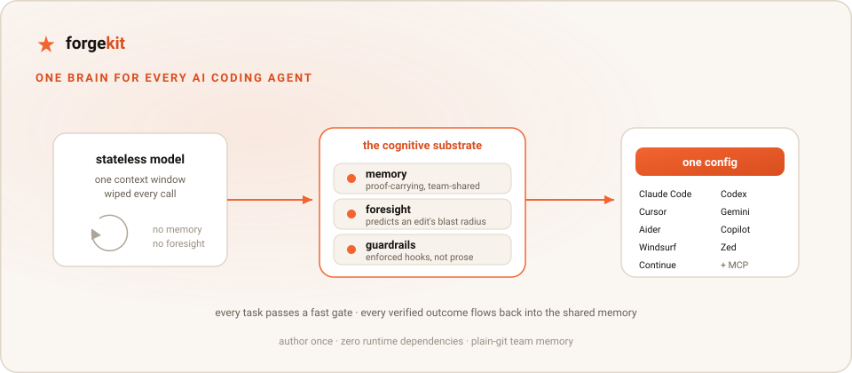
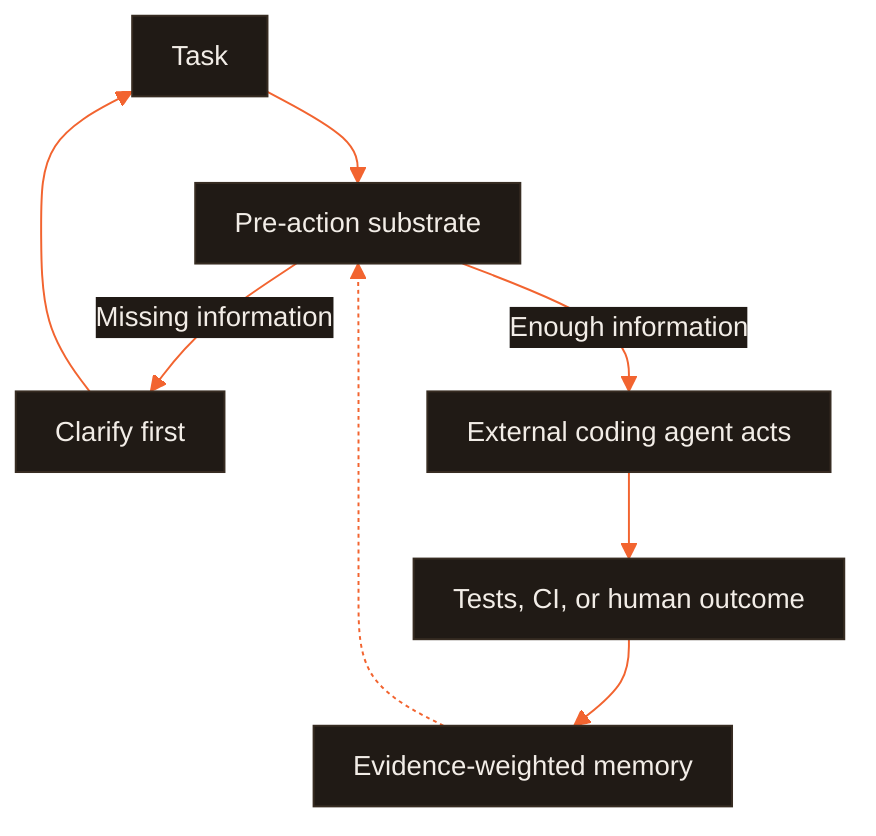

# Forgekit — reliability infrastructure for AI coding agents

[](https://github.com/CodeWithJuber/forgekit/actions/workflows/ci.yml)
[](https://github.com/CodeWithJuber/forgekit/actions/workflows/codeql.yml)
[](https://scorecard.dev/viewer/?uri=github.com/CodeWithJuber/forgekit)
[](./LICENSE)
[](./package.json)
[](./package.json)

<p align="center">
  <picture>
    <source media="(prefers-color-scheme: dark)" srcset="docs/assets/hero-dark.svg">
    
  </picture>
</p>

Forge is one shared brain for your AI coding agents. It gives a stateless model the
three things it structurally lacks — memory, foresight, and guardrail hooks — and
delivers them into every tool you use.

> An experimental reliability toolkit for AI-assisted coding — evidence-referenced,
> content-addressed memory (we call it "proof-carrying memory" / PCM — see the honesty note
> below), heuristic impact foresight, and guardrail hooks (automatic on Claude Code;
> instructions and MCP tools elsewhere) — authored once and delivered as native config to
> Claude Code, Codex, Cursor, Gemini, Aider, Copilot, Windsurf, Zed, Continue, and OpenClaw
> (plus MCP config for Roo and VS Code). Guardrails reduce risk; they are not a security
> sandbox.

> **Status: beta — read before you rely on it.**
>
> - The core (`init`, `sync`, `substrate`, `impact`, `ledger`, guards) is tested and in daily
>   use; some flags may change before `1.0`.
> - **Claude Code is the deepest-tested integration** (full plugin, ambient `UserPromptSubmit`
>   guards). The other nine tools receive native config plus MCP tools, but have had less
>   real-world exercise. On OpenClaw specifically, rules arrive via `AGENTS.md` project
>   context; the config-only path uses a one-command MCP registration, while installing the
>   package as a compatible Codex bundle loads its skills and bundle-scoped MCP server.
>   Neither path provides ambient hooks (see
>   [OpenClaw in ARCHITECTURE](ARCHITECTURE.md#openclaw-what-is-automatic-and-what-is-not)).
> - **Impact/blast-radius analysis is heuristic** — a regex-approximate code graph, not a sound
>   call graph. It is not conservative: it can miss affected files as well as flag unaffected
>   ones, so treat its output as advisory and an empty result as "unknown", not "safe".
> - **"Proof-carrying memory" is a name, not a formal proof.** Claims are content-addressed and
>   carry evidence references; confidence moves only when independent oracles (tests, CI, a
>   human) raise it. There is no theorem-prover in the loop.
> - Some integrations shell out — `forge harden`, `forge scan`, and the git-native ledger
>   assume **Bash and Git** are available (`jq` is not required — the guards read hook JSON
>   with node). Claude hooks on Windows do
>   not require `bash` on `PATH`: their Node launcher finds Git Bash and preserves guard exits.

## Start in 60 seconds
Forgekit is a beta Node.js CLI and MCP server for AI-assisted software development. It
externalizes project memory, predicts the likely impact of code changes, and adds
deterministic checks around coding-agent workflows. The same source can emit native
configuration for several AI coding tools; Claude Code is the most deeply exercised
integration.

The project is best read as **agent reliability and developer tooling**. It is not presented
as an enterprise multi-agent application, a general-purpose RAG platform, or an Azure AI
deployment.

## Portfolio evidence

For reviewers evaluating hands-on Agentic AI or GenAI work, each claim below links to the
implementation and its closest test or build proof. The evidence snapshot used for this
table is default-branch commit
[`3d9be37`](https://github.com/CodeWithJuber/forgekit/commit/3d9be37e26639c5c0a787d9196562b70444e2640).

| Area | Implementation evidence | Test or delivery evidence | Evidence-safe claim |
| --- | --- | --- | --- |
| MCP tools | [`src/mcp_tools.js`](src/mcp_tools.js) defines 21 tool schemas; [`src/cortex_mcp.js`](src/cortex_mcp.js) implements JSON-RPC `initialize`, `tools/list`, and `tools/call` handlers | [`test/mcp.test.js`](test/mcp.test.js), [`test/cortex_mcp.test.js`](test/cortex_mcp.test.js), [current audited CI run](https://github.com/CodeWithJuber/forgekit/actions/runs/33693393690) | Implemented an MCP server that exposes memory, preflight, routing, impact, verification, and health operations to compatible clients |
| Agent memory | [`src/ledger.js`](src/ledger.js) implements content-addressed claims, an oracle taxonomy, time-decayed validity, ranked retrieval, and a semilattice merge; [`src/ledger_store.js`](src/ledger_store.js) adds persistence, hash verification, and quarantine; [`src/ledger_sync.js`](src/ledger_sync.js) adds directory and git-ref sync | [`test/ledger.test.js`](test/ledger.test.js), [`test/ledger_store.test.js`](test/ledger_store.test.js), [`test/ledger_sync.test.js`](test/ledger_sync.test.js) | Implemented durable, evidence-weighted, mergeable memory for coding-agent workflows |
| LLM integration | [`src/llm.js`](src/llm.js) implements Anthropic Messages and OpenAI-compatible chat-completions calls; [`src/providers.js`](src/providers.js) configures Anthropic, OpenRouter, LiteLLM, OpenAI, Gemini, and custom endpoints | [`test/llm.test.js`](test/llm.test.js), [`test/providers.test.js`](test/providers.test.js) | Implemented direct, bounded single-prompt LLM adapters and provider configuration; this is not a streaming or autonomous tool-call client loop |
| Retrieval and embeddings | [`src/context.js`](src/context.js) assembles code definitions, dependants, tests, and trusted lessons under a token budget; [`src/embed.js`](src/embed.js) supports an optional command or OpenAI-compatible embedding endpoint, cosine similarity, and a disk cache; [`src/reuse.js`](src/reuse.js) falls back to MinHash and gates reuse on evidence | [`test/context.test.js`](test/context.test.js), [`test/embed.test.js`](test/embed.test.js), [`test/reuse.test.js`](test/reuse.test.js) | Implemented repository-local retrieval/context augmentation and an optional embedding adapter; no vector database or enterprise-document ingestion pipeline is claimed |
| Guardrails and verification | [`hooks/hooks.json`](hooks/hooks.json) wires lifecycle hooks; [`global/guards/protect-paths.sh`](global/guards/protect-paths.sh) and [`global/guards/secret-redact.sh`](global/guards/secret-redact.sh) add path and secret controls; [`src/skillgate.js`](src/skillgate.js), [`src/verify.js`](src/verify.js), and [`src/consensus.js`](src/consensus.js) implement scanning and multi-lens checks | [`test/secrets.test.js`](test/secrets.test.js), [`test/skillgate.test.js`](test/skillgate.test.js), [`test/verify.test.js`](test/verify.test.js), [`test/consensus.test.js`](test/consensus.test.js); [Security workflow](https://github.com/CodeWithJuber/forgekit/actions/workflows/security.yml) and [CodeQL](https://github.com/CodeWithJuber/forgekit/actions/workflows/codeql.yml) | Implemented deterministic defence-in-depth controls and evidence-producing verification; the regex guards are not a security sandbox |
| Human review affordances | [`src/ledger.js`](src/ledger.js) defines human accept/revert oracles; [`src/ledger_store.js`](src/ledger_store.js) implements ratify and retract records | [`test/ledger.test.js`](test/ledger.test.js), [`test/ledger_store.test.js`](test/ledger_store.test.js) | Implemented auditable human correction and ratification paths; no identity-enforced RBAC or enterprise approval workflow is claimed |
| Agent roles | [`.claude-plugin/plugin.json`](.claude-plugin/plugin.json) registers [`scout`](global/crew/scout.md), [`verifier`](global/crew/verifier.md), [`independent-reviewer`](global/crew/independent-reviewer.md), [`frontend-verifier`](global/crew/frontend-verifier.md), and [`doc-sync`](global/crew/doc-sync.md) | [`test/channels.test.js`](test/channels.test.js) checks plugin-channel wiring | Authored five concrete Claude Code role definitions; they are declarative roles, not a multi-agent orchestration runtime |
| Evaluation | [`src/eval.js`](src/eval.js) calculates precision, recall, and F1; [`bench/bench.mjs`](bench/bench.mjs) provides a seeded benchmark harness; [`reports/benchmarks.md`](reports/benchmarks.md) records methodology and limitations | [`test/eval.test.js`](test/eval.test.js), [`test/bench.test.js`](test/bench.test.js) | Implemented reproducible evaluation for the repository's impact predictor and local performance; the datasets are small and are not field benchmarks |
| Python research | [`research/python-prototypes/router_gate/`](research/python-prototypes/router_gate/) implements assumption gating, model routing, execution, verification, escalation, CLI, and MCP; [`research/python-prototypes/impact_oracle/`](research/python-prototypes/impact_oracle/) implements Python AST parsing and a persistent NetworkX dependency graph | [`router_gate` tests](research/python-prototypes/router_gate/tests/test_router_gate.py), [`router_gate` live demonstration results](research/python-prototypes/router_gate/eval_results.json), [`impact_oracle` tests](research/python-prototypes/impact_oracle/tests/test_demo_package.py) | Built working Python research prototypes; the shipped Forgekit runtime is Node and the Python packages are not presented as production services |
| Delivery engineering | [`package.json`](package.json) defines a Node 20+ CLI with no runtime dependencies; [`.github/workflows/release.yml`](.github/workflows/release.yml) gates releases and configures npm provenance; [`.github/workflows/smoke.yml`](.github/workflows/smoke.yml) exercises clean install and uninstall | [Release v0.32.1](https://github.com/CodeWithJuber/forgekit/releases/tag/v0.32.1); successful audited runs for [CI](https://github.com/CodeWithJuber/forgekit/actions/runs/33693393690), [Smoke](https://github.com/CodeWithJuber/forgekit/actions/runs/33693393550), [Security](https://github.com/CodeWithJuber/forgekit/actions/runs/33693393540), [CodeQL](https://github.com/CodeWithJuber/forgekit/actions/runs/33693393514), and [Scorecard](https://github.com/CodeWithJuber/forgekit/actions/runs/33693393496) | Demonstrates packaging, cross-platform CI, security checks, and repeatable OSS release engineering; it does not establish enterprise production operation |

### Maturity boundary

| Evidence level | What belongs here |
| --- | --- |
| **Implemented and tested in the Node runtime** | CLI and config emitters; 21 MCP tools; agent memory and sync; code-context assembly; optional embedding adapter; LLM provider adapters; heuristic impact analysis; lifecycle guardrails; verification; benchmark harness; release automation |
| **Research or integration demonstration** | Five declarative Claude Code agent roles; Python router/gate and impact-oracle packages; a 30-task live routing demonstration; support for external embedding providers; configuration emitted for integrations other than the deeply tested Claude Code path |
| **Not claimed by this repository** | A collaborating multi-agent runtime; LangGraph, LangChain, Semantic Kernel, AutoGen, CrewAI, or Copilot Studio; Azure OpenAI or Azure AI Foundry; a vector database; enterprise-document RAG; business-system or RPA connectors; production Python deployment; multi-tenant cloud operation, SLA/SLO, Kubernetes, or infrastructure as code |

Personal maintainer use is intentionally not used as proof of organizational adoption. No
customer count, enterprise deployment, production traffic, or service-level claim is made
without corresponding public evidence.

## 60-second quickstart

```bash
npm install -g @codewithjuber/forgekit   # or: npm install -g github:CodeWithJuber/forgekit
forge init                               # emit native config for the tools this repo uses
forge doctor                             # verify providers, hooks, and MCP wiring
```

Then run a pre-action check inside a repository:

```bash
forge substrate "Change verifyToken in src/auth.js to require length > 20; update tests"
```

The result includes an assumption verdict, a model-tier recommendation, predicted impact,
context completeness, scope clusters, and a verification checklist. On Claude Code, the
pre-action check can run automatically through a `UserPromptSubmit` hook. On other supported
tools, Forgekit emits instructions and MCP configuration that the tool can invoke.

## Contents

- [Portfolio evidence](#portfolio-evidence)
- [Maturity boundary](#maturity-boundary)
- [60-second quickstart](#60-second-quickstart)
- [Why Forgekit exists](#why-forgekit-exists)
- [How the loop works](#how-the-loop-works)
- [Core capabilities](#core-capabilities)
- [LLMs, retrieval, and embeddings](#llms-retrieval-and-embeddings)
- [Agent roles and MCP tools](#agent-roles-and-mcp-tools)
- [Measured evidence](#measured-evidence)
- [Setup details](#setup-details)
- [Commands](#commands)
- [Team memory](#team-memory)
- [Structural comparison](#structural-comparison)
- [Honest limits](#honest-limits)
- [Python research prototypes](#python-research-prototypes)
- [White paper](#white-paper)
- [Public site](#public-site)
- [Documentation](#documentation)
- [Community and support](#community-and-support)

## Why Forgekit exists

Individual model calls do not reliably retain what a team learned in earlier sessions, know
the dependency impact of a proposed edit, or enforce project rules after context is lost.
Coding tools also expect different instruction and configuration formats.

Forgekit supplies an external reliability layer:

- project knowledge is stored outside the model and retrieved with provenance;
- likely change impact is estimated from a repository graph;
- pre-action and post-action checks run as deterministic code;
- one canonical source is compiled into each supported tool's native format.

## How the loop works

Forgekit runs a deterministic substrate before work, lets the external coding agent act,
and records evidence from tests, CI, or explicit human correction afterwards.


```mermaid
%%{init: {'theme':'base','themeVariables':{'primaryColor':'#201a15','primaryTextColor':'#f2ede7','primaryBorderColor':'#372c22','lineColor':'#f26430','secondaryColor':'#272019','tertiaryColor':'#171310','edgeLabelBackground':'#201a15','clusterBkg':'#171310','clusterBorder':'#4a3b2e','fontFamily':'ui-sans-serif, system-ui, sans-serif','fontSize':'14px'},'flowchart':{'curve':'basis','padding':10,'nodeSpacing':36,'rankSpacing':44}}}%%
flowchart TD
    T["Task"] --> G["Pre-action substrate"]
    G -->|"Missing information"| Q["Clarify first"]
    Q --> T
    G -->|"Enough information"| A["External coding agent acts"]
    A --> V["Tests, CI, or human outcome"]
    V --> M["Evidence-weighted memory"]
    M -.-> G
```

Only independent oracles (tests, CI, a human accept/revert) move a memory's confidence —
so a wrong lesson decays out instead of ossifying. Full design:
[`ARCHITECTURE.md`](ARCHITECTURE.md).

## What you get

The day-to-day value first — the substrate gives a frozen model what it can't hold itself:

- **Memory that persists across sessions and teammates.** _[Implemented]_ Every lesson, fact,
  and verified reuse is _proof-carrying memory (PCM)_ — our name for **evidence-referenced,
  content-addressed memory**: a claim that carries references to its own evidence and is only
  trusted once independent oracles raise its confidence above a floor (the "proof" is that
  evidence trail, not a formal proof). Wrong lessons decay out instead of ossifying.
- **Foresight before you break things.** _[Heuristic]_ Ask "what does changing `verifyToken`
  break?" and get the _blast radius_ — the set of files an edit is predicted to impact, read
  from a regex-approximate code graph (not sound, and it can miss affected files), including
  coupled files you never named.
- **Guardrails that can't be forgotten.** _[Implemented on Claude Code]_ Deterministic hooks
  check the rules a model shouldn't break (protected paths, cost budget, doom loops) — they
  survive a context compaction the way `CLAUDE.md` prose does not. They reduce risk as
  defence in depth; they are not a sandbox, and a sufficiently creative shell command can
  still bypass a regex guard.
- **Work that finishes end to end.** A completion gate blocks "done" once per session when
  code moved but no doc or state artifact followed — with the repair checklist as the answer
  (`forge docs sync` sweeps the diff for stale prose, `forge handoff` writes the bounded
  session snapshot the next session resumes from, `forge decide` records choices so no
  session re-decides them).
- **One config for 10 tools.** Author your rules once; Forge emits each tool's native config,
  plus MCP for Roo and VS Code. Zero runtime dependencies — one Node CLI, plain files in git,
  no server.

### The measured evidence

Every number is a median from `npm run bench` on this repo, recorded with its environment
block in [`reports/benchmarks.md`](reports/benchmarks.md) — the project rule is _a number is
an assumption until measured_.

- **Blast radius in 0.40 ms** (warm code-graph). On 6 hand-labeled cases from this repo's
  real import graph, recall is 1.00 against 0.27 for looking at the edited file alone, and
  precision is 0.17 — `impact` walks reverse dependencies transitively by default, so it
  returns everything downstream while the labels name only the direct referencers (restricted
  to one hop the same cases return their labeled sets). The precision 0.90 this line used to
  quote does not reproduce. On nine real Python repositories the research prototype's impact
  oracle reached recall 0.022 ([refutation](research/empirical-refutation/)).
- **A full pre-action gate in 886 ms** (median on this repo, warm, on a 4-core Windows VM — this
  row is machine-bound; see the environment block) — assumption check, routing,
  reuse lookup, context assembly, blast radius, scope, and goal anchor in one deterministic
  pass, no LLM call. On Claude Code it runs on **every prompt, automatically**.
- **The white paper's 62.1% routing saving is refuted.** It was measured on the 30 tasks the
  prototype's thresholds were tuned on. On 80 held-out tasks from real issues, counting every
  escalation, the pipeline spent **20.2% more** than always using the premium tier; per output a
  judge accepted it cost $1.06 against $1.76, but only 6 and 3 of 64 outputs were accepted
  ([refutation](research/empirical-refutation/)). `forge cost --stages` reports only _your_
  measured stages.
- **Conflict-free team memory** — merging two 500-claim ledger replicas takes **4308 ms** on that
  same VM (I/O-bound, 4–6x a Linux host); the
  merge is order-independent and property-tested, so teammate ledgers converge to the same state
  no matter who syncs first, over plain git.
The substrate is advisory by default. Set `FORGE_ENFORCE=1` to block only its strongest
signals: a vacuous task, required context that cannot be assembled, or a large impact set
from a fresh repository graph.

## Core capabilities

- **Evidence-weighted memory.** Claims are content-addressed, keep provenance and outcome
  references, and earn or lose confidence through a closed set of oracles. Time decay moves
  unreviewed knowledge toward uncertainty rather than silently treating it as permanent fact.
- **Git-native team merge.** Claims and append-only logs merge by set union. The join is
  property-tested for commutativity, associativity, and idempotence.
- **Heuristic impact prediction.** Forgekit builds a regex-derived code graph and walks
  reverse dependencies to estimate affected files and tests; the pre-action check and the
  Stop gate's repair checklist also walk the empirical refutation's sibling and forward
  relations and tag each file with the relation that reached it. It is not conservative: it
  can miss affected files (including constructs its parser does not recognize) as well as
  produce false positives, and the sibling/forward files are lower-precision co-change
  candidates.
- **Budgeted context assembly.** Definitions, direct dependants, sibling tests, and trusted
  lessons are selected under a token budget. Missing required context becomes a question
  rather than invented context.
- **Model-tier recommendation.** A deterministic rubric combines task text and repository
  signals. An optional LLM proposal can only lower the tier, confidence-gated and bounded; a
  vote for a higher tier is never applied automatically — it is recorded as an advisory
  `escalateTo` recommendation, which names the tier only once an external check has actually
  failed (the doom-loop diagnosis at its thrash threshold). Forgekit advises which tier to
  request; it does not itself proxy or fail over model traffic.
- **Proof-gated reuse.** Cached code is served only after evidence clears a confidence floor
  and declared dependencies still resolve in the current repository graph.
- **Lifecycle guardrails.** Claude Code hooks cover prompt preflight, protected paths, cost
  budget, repeated failures, format-on-edit, secret redaction, completion checks, and session
  learning. These controls reduce risk; they do not create a secure execution boundary.
- **Independent verification.** `forge verify` runs the repository's detected test suites,
  reports `PASS`, `FAIL`, `INCOMPLETE`, or `NOT_CONFIGURED` honestly, checks unknown symbols,
  and binds provenance to the code state. `--deep` adds structural, security, spec-drift,
  impact, and optional model-review lenses.

## LLMs, retrieval, and embeddings

### Direct LLM adapters

`src/llm.js` supports two wire formats:

- Anthropic Messages API;
- OpenAI-compatible chat completions, used for OpenAI, Gemini, OpenRouter, and LiteLLM.

Credentials are read from environment variables and are not put in command-line arguments.
The implementation performs a bounded single-prompt request. It does not implement streaming,
conversation persistence, or a model-driven tool-call execution loop.

### Repository-local retrieval

Forgekit retrieves from its code graph and evidence ledger, then assembles a context bundle
for an external coding agent. This is retrieval and augmentation for source-code work, not a
general enterprise RAG pipeline. There is no document connector layer, chunking service,
citation generator, managed index, or vector database in this repository.

### Optional embeddings

MinHash remains the zero-dependency default. To opt into semantic similarity, configure an
external provider with one of the formats the current implementation accepts:

```bash
# OpenAI-compatible embedding endpoint
export FORGE_EMBED="https://api.example.com/v1/embeddings"
export FORGE_EMBED_MODEL="your-embedding-model"
export FORGE_EMBED_KEY="your-provider-key"

# Or a local/external command that implements Forgekit's stdin/stdout vector protocol
export FORGE_EMBED="cmd:./my-embedding-provider"
```

Vectors are cached in `.forge/embed-cache.jsonl`. Provider failure, timeout, malformed output,
or missing vectors falls back to MinHash. The repository test uses a deterministic fake
provider; it verifies adapter and fallback behavior, not live performance of a hosted model.

The performance snapshot in [`reports/benchmarks.md`](reports/benchmarks.md) was generated at
commit `eb68ea9` and does not measure the optional embedding path. Current
embedding behavior is defined by [`src/embed.js`](src/embed.js) and
[`test/embed.test.js`](test/embed.test.js).

## Agent roles and MCP tools

Forgekit registers five Claude Code role definitions:

- `scout` — read-only repository investigation;
- `verifier` — fresh-context correctness review;
- `independent-reviewer` — diff/spec/test-only merge gate;
- `frontend-verifier` — visual and accessibility review;
- `doc-sync` — documentation consistency after code changes.

These are concrete role prompts supplied to the host tool. Forgekit does not contain a runtime
that spawns these roles, exchanges inter-agent messages, or executes a LangGraph-style state
machine.

The built-in MCP server exposes 21 tools, including:

- pre-action checks: `substrate_check`, `preflight_check`, `assumption_gate`, `route_task`;
- repository analysis: `predict_impact`, `scope_files`, `rank_code`, `collide_check`;
- memory: `cortex_lessons`, `forge_remember`, `forge_ledger_query`,
  `forge_ledger_ratify`, `forge_ledger_retract`;
- operations: `forge_doctor`, `forge_provider_status`, `forge_cost`, dashboard data.

The MCP server is the tool-provider side of function calling. The compatible host remains
responsible for deciding when to call a tool and feeding the result back to its model.

## Measured evidence

Numbers below are reported only with their test boundary. See
[`reports/benchmarks.md`](reports/benchmarks.md) and the linked evaluation artifacts for full
methodology.

Parser-stable snapshot labels used by the generated project pages are:

- **A full pre-action gate in 886 ms median** — deterministic, warm repository graph, LLM disabled;
- **Blast radius in 0.40 ms median** — warm impact query; and
- **20.2% more cost than always-premium** — the held-out routing result. The 62.1% saving the
  white paper reported came from a 30-task demonstration with thresholds tuned on those same
  tasks; on 80 pre-registered held-out tasks the same router spent 20.2% *more* (table below).
  Per judged-correct output the pipeline cost $1.06 against always-premium's $1.76.

The boundaries in the table below are part of each result.

| Measurement | Recorded result | Boundary |
| --- | ---: | --- |
| Warm impact query | 0.40 ms median | 30 runs on one JavaScript repository with a memoized adjacency index; not model latency |
| Deterministic substrate check | 886 ms median | 3 runs on one repository, warm graph, LLM disabled, on a 4-core Windows VM — wall-clock rows are machine-bound and were ~150 ms on the Linux host that produced the pre-2026-09-22 snapshot; re-run `npm run bench` on your own hardware |
| Impact quality | precision 0.17, recall 1.00, F1 0.29 (the precision 0.90 / F1 0.92 reported before 2026-09-21 do not reproduce) | 6 hand-labelled symbols in this repository, scored by `evalImpact` against labels re-derived by `git grep`; `impact` walks reverse dependencies transitively by default, so precision measures the transitive closure against direct-only labels; edited-file-only baseline recall 0.27 |
| Ledger replica merge | 4308 ms median | 3 runs merging two synthetic 500-claim replicas with 250 claims shared, on the same 4-core Windows VM (I/O-bound: 4–6x the Linux host's figure) |
| Python router live demonstration | 62.1% calculated cost reduction versus always-premium | 30 hand-labelled tasks, thresholds tuned to the set, real measured LLM tokens, approximate public prices; demonstration, not field benchmark |
| Python router, held-out evaluation | total spend 20.2% **higher** than always-premium; gate F1 0.37 | 80 tasks from real GitHub issues and PRs, thresholds frozen, pre-registered; refutes the row above |
| Python impact oracle | precision 0.633, recall 1.000, F1 0.753 | 5 mutations in the bundled demo package; mutation-derived test failures as ground truth |
| Python impact oracle, real repositories | precision 0.398, recall 0.022, F1 0.042 (grep baseline F1 0.437) | 759 files in 9 open-source repositories, co-change ground truth, pre-registered; refutes the row above |

The current audited CI run at commit `3d9be37` completed successfully for Node 20, Node 22,
and Windows Git Bash, plus the reusable quality gate. The quality gate ran the Node unit suite,
Biome checks, TypeScript type checking, critical-level npm audit, ShellCheck, zero-runtime-dependency
assertion, version and documentation checks, and `npm pack --dry-run`. The Python prototype
pytest suites are present in the repository but are not part of that current CI workflow.

## Setup details

Install using one path:

| Use case | Command |
| --- | --- |
| Claude Code or another plugin-capable supported host | `/plugin marketplace add CodeWithJuber/forgekit` then `/plugin install forgekit` |
| Global CLI from npm | `npm install -g @codewithjuber/forgekit` |
| Directly from GitHub | `npm install -g github:CodeWithJuber/forgekit` |
| Contributor checkout | `git clone https://github.com/CodeWithJuber/forgekit.git && cd forgekit && npm link` |

Initialize inside a project:

```bash
forge init
forge doctor
forge doctor --fix
```

`forge init` can merge Forgekit hooks and permissions into
`~/.claude/settings.json`. That file is global and affects all repositories. Use
`forge init --no-settings` to skip the merge or `forge init --remove-settings` to reverse
Forgekit-managed entries. The implementation preserves unrelated entries and creates a
timestamped backup before changing the file.

`forge init` emits configuration only for the agent tools the repository already uses:
Claude Code plus any tool with a sign on disk (`.cursor/`, `.codex/`,
`.github/copilot-instructions.md`, and so on). Choose explicitly with
`forge init --tools claude,cursor` or `--tools all`; the choice is recorded in
`.forge/forge.config.json`, so later `forge sync` runs emit the same set. In `AGENTS.md`,
Forgekit owns only the block between `<!-- forge:begin -->` and `<!-- forge:end -->`. A
hand-written `AGENTS.md` keeps every line and gets the block appended; `forge sync` and the
Stop-hook auto-sync rewrite that block and nothing else.

For an explicit model provider, inspect or update configuration with `forge config`. API keys
remain environment variables; Forgekit's provider file stores the environment-variable name,
not the secret value.

## Commands

Commands are advisory unless their documented enforcement flag is enabled. Full worked examples
and output live in [`docs/GUIDE.md`](docs/GUIDE.md).

<!-- forge:render:commands-table:begin (generated by `forge docs render` — do not edit) -->
| Group                   | Command              | Does                                                                                                                                                                                                                        |
| ----------------------- | -------------------- | --------------------------------------------------------------------------------------------------------------------------------------------------------------------------------------------------------------------------- |
| **Core**                | `forge init`         | scaffold this repo's config — emits the tools it uses (Claude + detected, or --tools) from one shared source                                                                                                                |
|                         | `forge sync`         | recompile the canonical source into each tool's native config files                                                                                                                                                         |
|                         | `forge doctor`       | health-check installed tools, guards, MCP auth, and config drift                                                                                                                                                            |
|                         | `forge tools`        | primary-tool config — gitignore secondary-tool artifacts (.cursor/.gemini/…) for tools this repo doesn't use (`forge tools <name>` sets it, `--reset` clears)                                                               |
|                         | `forge catalog`      | Start Here — list every tool, crew, and guard with a one-line why                                                                                                                                                           |
|                         | `forge docs`         | docs↔code drift — check (registry reconcile) / render (regenerate machine-owned tables + diagrams) / sync (diff-driven stale-docs sweep) / impact (reusable doc-reference graph: which docs mention what THIS diff changed) |
|                         | `forge update`       | self-update — `--check` reports if a newer version is available, bare applies it, `--to <version>` pins/downgrades                                                                                                          |
|                         | `forge config`       | provider setup — show / switch / add providers, set default model                                                                                                                                                           |
| **Substrate**           | `forge substrate`    | one pre-action gate: assumptions, route, impact, scope, memory, verify                                                                                                                                                      |
|                         | `forge preflight`    | assumption check — what a task names that the repo doesn't define                                                                                                                                                           |
|                         | `forge impact`       | hazard-aware blast radius — SCC-aware propagation + data-driven threshold from PageRank centrality and ledger incident history                                                                                              |
|                         | `forge scope`        | decompose files into independent clusters (+ coupled files you didn't name)                                                                                                                                                 |
|                         | `forge context`      | budgeted context assembly + completeness gate — what an edit NEEDS known                                                                                                                                                    |
|                         | `forge route`        | recommend the cheapest capable model for a task (+ gateway config); `route universal`: any provider's models, lowest expected cost for the success asked for, learned from outcomes                                         |
|                         | `forge verify`       | independent verification gate — tests + hallucinated-symbol + provenance (--deep: multi-lens consensus)                                                                                                                     |
|                         | `forge precommit`    | commit-level gate — staged code w/o docs + secret scan (FORGE_COMMIT_GATE=block|warn|0)                                                                                                                                     |
| **Memory**              | `forge cortex`       | self-correcting project memory — status / why <symbol>                                                                                                                                                                      |
|                         | `forge recall`       | manage cross-session memory (list / add / consolidate)                                                                                                                                                                      |
|                         | `forge remember`     | add a durable fact to this repo's portable memory (forge brain)                                                                                                                                                             |
|                         | `forge brain`        | show / rebuild the portable project memory index                                                                                                                                                                            |
|                         | `forge ledger`       | evidence-referenced memory — stats / verify / show / blame / query / compact / at / diff / root / ratify / retract / merge / sync / import                                                                                  |
|                         | `forge handoff`      | bounded session snapshot — rewrite .forge/state.md, re-injected each session start                                                                                                                                          |
|                         | `forge decide`       | append-only decision log — D-#### ADR-lite entries in .forge/decisions.md                                                                                                                                                   |
|                         | `forge know`         | route any fact to its storage home (decision / ledger / recall / …) — total, never dropped                                                                                                                                  |
| **Quality**             | `forge scan`         | vet a skill/MCP for injection/RCE/exfil before install (skill-gate)                                                                                                                                                         |
|                         | `forge spec`         | spec-as-contract — init (OpenSpec) / lock / check drift                                                                                                                                                                     |
|                         | `forge harden`       | wire security controls — pre-commit gate (gitleaks + commit gate) + sandbox settings                                                                                                                                        |
|                         | `forge radar`        | dependency-currency rings — staleness/major-lag/advisories from live registry evidence, cached 24h                                                                                                                          |
| **Config**              | `forge brand`        | print the active brand token map                                                                                                                                                                                            |
|                         | `forge atlas`        | build / query the code-graph (where-is-Y, has-symbol)                                                                                                                                                                       |
|                         | `forge stack`        | detect this repo's real stack (languages, frameworks, test commands) from its manifests                                                                                                                                     |
|                         | `forge integrations` | opt-in third-party MCP servers (e.g. context7) — add records the managed set and writes only with --yes (--adopt claims a same-name entry); remove reverses it                                                              |
|                         | `forge cost`         | real per-day spend via ccusage + measured stage factors (--stages)                                                                                                                                                          |
|                         | `forge models`       | each tier's model family resolved to a concrete model — newest in the provider's live catalog (else the shipped snapshot), with its price and where both came from                                                          |
| **Labs (experimental)** | `forge taste`        | enable one UI-taste tool for this repo (no arg = list)                                                                                                                                                                      |
|                         | `forge uicheck`      | deterministic UI checks — contrast <fg> <bg> · fingerprint <file...> · design <file...> · visual <file-or-url>                                                                                                              |
|                         | `forge imagine`      | consequence simulation — predicted breaks + the minimal dry-run test suite for a task                                                                                                                                       |
|                         | `forge lean`         | scope-minimality (M5) — measure the diff's footprint vs what the task asked for                                                                                                                                             |
|                         | `forge anchor`       | goal-drift check — are your actual (git) changes still on the stated goal?                                                                                                                                                  |
|                         | `forge diagnose`     | doom-loop check — record a failure; 3× the same signature mints a diagnosis + escalation                                                                                                                                    |
|                         | `forge dash`         | live dashboard: ledger, metrics trends, radar, memory browser, timeline, blast radius                                                                                                                                       |
|                         | `forge report`       | emit a static, self-contained HTML snapshot of .forge/ — opens offline, no server                                                                                                                                           |
|                         | `forge deja`         | anti-repetition — have you done this task before? ranks prior solved/verified sessions                                                                                                                                      |
|                         | `forge reuse`        | proof-carrying code cache — query <spec> / mint <spec> --file <path> / stats                                                                                                                                                |
|                         | `forge rank`         | load-bearing code — PageRank centrality × past-incident history, circular-dependency clusters, chokepoint files                                                                                                             |
|                         | `forge collide`      | parallel-session conflict radar — who else recently touched the files (or their import neighbors) you are editing                                                                                                           |
<!-- forge:render:commands-table:end -->

Terminal output is plain when piped. On an interactive terminal it can use color and confidence
meters; `NO_COLOR` disables color and `FORCE_COLOR=1` enables it explicitly.

## Team memory

Lessons, durable facts, and verified reuse artifacts land as content-addressed claims under
`.forge/ledger/`:

```bash
forge init

# Work normally; hooks and explicit memory commands add claims and evidence.
git pull
forge ledger merge <path-to-another-ledger>
forge ledger sync
```

Identical claim content converges to one identifier while provenance records preserve authors.
`forge ledger blame <id>` shows the mint history, oracle outcomes, and derived trust. The default
storage is files in git, not a hosted database or synchronization service.

With no flags, `forge ledger sync` serializes ledger state under `refs/forge/ledger` on the
repository's git remote. A non-fast-forward race triggers a re-merge and bounded retry. A shared
directory can be selected with `--dir <path>` or `FORGE_SYNC_DIR`; `--personal` includes the
per-user ledger.

## Structural comparison

This table describes architecture, not a claim of superiority or equivalent product scope.

| Concern | Forgekit implements | Boundary |
| --- | --- | --- |
| Memory | Content-addressed claims, provenance, oracle-weighted validity, time decay, and git-native union merge | No hosted synchronization, managed database, enterprise tenancy, or RBAC |
| Retrieval | MinHash retrieval by default; optional external embeddings; proof-gated code reuse | No vector database or general enterprise corpus pipeline |
| Routing | A visible deterministic recommendation with optional bounded LLM input; LiteLLM alias config emission | Does not proxy traffic, manage quotas, perform failover, or hold provider keys |
| Tool use | A JSON-RPC MCP server with 21 executable tool handlers | Does not implement the model/client loop that chooses and executes tool calls autonomously |
| Agent roles | Five host-consumable Claude Code role definitions | No multi-agent graph, scheduler, inter-agent messaging layer, or named orchestration framework |
| Verification | Repository tests, provenance, structural and security lenses, limited benchmark suites | No managed GenAI evaluation service, production telemetry, online evaluation, or broad red-team certification |

## Honest limits

- **Beta software.** The CLI is released and CI-tested, but interfaces may still change before
  `1.0`. Support is maintainer-led and best-effort; there is no SLA.
- **Claude Code is the deepest-tested integration.** Other emitters and MCP configuration are
  implemented, but the repository does not provide equivalent real-world exercise evidence for
  every supported host.
- **The code graph is heuristic.** Regex extraction is not a sound call graph and can both
  over-predict and miss dependencies.
- **Routing is advisory.** Forgekit recommends a tier. LiteLLM or another gateway must be run
  separately to move traffic, handle failover, enforce quotas, or manage credentials.
- **Memory is external state, not model training.** Claims live in files and are retrieved into
  context; Forgekit does not update model weights.
- **Embeddings are an adapter, not an included model or vector store.** A user supplies the
  external command or HTTP service. MinHash remains the default and fallback.
- **Guardrails are defence in depth.** Shell-regex checks can be bypassed and post-tool redaction
  runs after the external tool has executed. Forgekit is not a sandbox.
- **Human ratification is a workflow convention.** Ratify and retract operations record the git
  author, but this repository does not authenticate a human or enforce enterprise approval roles.
- **Evaluations are deliberately scoped.** The JavaScript impact set has six hand-labelled cases;
  the Python router set has 30 hand-labelled tasks tuned to its rubric; the Python impact study has
  five mutations. None is a production field study.
- **No enterprise platform claim.** There is no Azure OpenAI/AI Foundry integration, vector DB,
  business-system/RPA connector layer, multi-tenant service, Kubernetes deployment, IaC stack,
  or public production-usage case study in this repository.

## Python research prototypes

The Python packages under [`research/python-prototypes/`](research/python-prototypes/) are the
original research baselines preserved for auditability and result reproduction. They are useful
evidence of Python implementation work, but they are not the shipped Forgekit runtime.

### Router Gate

[`router_gate`](research/python-prototypes/router_gate/) implements:

1. deterministic assumption assessment;
2. transparent cheap/mid/premium routing;
3. a pluggable executor;
4. caller-supplied verification;
5. bounded escalation after failure;
6. token and cost records;
7. CLI and MCP surfaces.

Its checked-in evaluation used live model calls for a 30-task hand-labelled demonstration. The
set was used to tune the rubric, so perfect separation is evidence that the mechanism works on
that set, not a general accuracy estimate. Despite legacy package metadata using the phrase
“production-ready,” the repository-level maturity classification is **research prototype**.

### Impact Oracle

[`impact_oracle`](research/python-prototypes/impact_oracle/) parses Python ASTs, stores a NetworkX
dependency graph as JSON, and predicts change impact through reverse-dependency traversal. The
bundled evaluation mutates five symbols and uses pytest failures as independent ground truth.

The production Forgekit equivalents are the Node implementations behind `forge preflight`,
`forge route`, `forge atlas`, `forge impact`, and the MCP substrate tools.

## White paper

The [cognitive-substrate white paper](docs/cognitive-substrate/) explains the motivation,
formal model, evidence map, adjacent work, and the relationship between the Python research
prototypes and the current Node implementation. Treat the paper's measurements according to
their stated methodology; do not blend results from different codebases or evaluation sets.

## Public site

Forgekit includes a hand-authored landing page at [`landing/index.html`](landing/index.html) and
generates a status page at `public/index.html`. The generator reads
repository data from `package.json`, `README.md`, `CHANGELOG.md`, and the benchmark report.

```bash
npm run pages:build
BUILD_PAGES_LIVE=1 npm run pages:build
```

The default build is offline and deterministic. Optional live mode reads public GitHub repository
metadata with bounded retries and caching. GitHub Pages deployment is defined in
[`.github/workflows/static.yml`](.github/workflows/static.yml); this static documentation site is
not an AI application deployment.

## Documentation

| Document | Contents |
| --- | --- |
| [`ONBOARDING.md`](ONBOARDING.md) | Five-minute setup and design principles |
| [`docs/GUIDE.md`](docs/GUIDE.md) | Full command reference, worked examples, MCP schemas, and honest limits |
| [`ARCHITECTURE.md`](ARCHITECTURE.md) | Runtime layers, emitters, state, and design decisions |
| [`reports/benchmarks.md`](reports/benchmarks.md) | Reproducible benchmark snapshot, methodology, environment, and limitations |
| [`research/python-prototypes/README.md`](research/python-prototypes/README.md) | Explicit maturity boundary for the Python research packages |
| [`docs/cognitive-substrate/`](docs/cognitive-substrate/) | White paper, evidence map, ecosystem map, and prototype sources |
| [`docs/RELEASING.md`](docs/RELEASING.md) | Tag, npm, provenance, and GitHub Release flow |
| [`CHANGELOG.md`](CHANGELOG.md) | Changes by release |

Current implementation truth for optional embeddings is `src/embed.js`: use an `http://` or
`https://` endpoint, or `cmd:<command>`. A bare `FORGE_EMBED=1` is not a valid provider
configuration. Benchmark comparison prose that describes MinHash-only behavior is historical and
does not supersede the current source and tests.

## Community and support

- **Get help:** [SUPPORT.md](./SUPPORT.md) and [Discussions](https://github.com/CodeWithJuber/forgekit/discussions)
- **Contribute:** [CONTRIBUTING.md](./CONTRIBUTING.md) and [Code of Conduct](./CODE_OF_CONDUCT.md)
- **Direction:** [ROADMAP.md](./ROADMAP.md) and [GOVERNANCE.md](./GOVERNANCE.md)
- **Security:** [SECURITY.md](./SECURITY.md) for private vulnerability reporting
- **Accessibility:** [ACCESSIBILITY.md](./ACCESSIBILITY.md)

---

MIT licensed. Built by [CodeWithJuber](https://github.com/CodeWithJuber).
