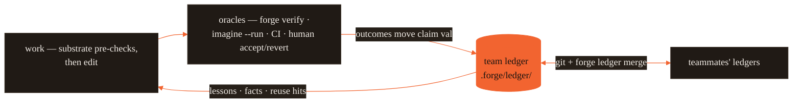

# Forge — the complete guide

**One brain for every AI coding agent.** A language model is _stateless_ — one context
window, wiped every call. It can't remember what your team learned, can't foresee what
an edit breaks, and has no enforced guardrails. Forge is the **cognitive substrate** —
the layer that runs _before_ the model edits code — that supplies exactly those three
things, and it ships them as native config to nine AI coding tools at once. The brain is
the point; one config for every tool is how the brain gets delivered.

This is the exhaustive reference: every command with a worked example and its **real**
output, the everyday workflow, how to make it run itself inside any agent, common
recipes, and how to extend each piece. If you just want to get going, the
[5-minute onboarding](../ONBOARDING.md) is shorter; this is the reference you come back to.

- [Mental model](#mental-model)
- [The everyday workflow](#the-everyday-workflow)
- [Command reference](#command-reference) — every command, with examples
- [Auto-use inside an agent](#auto-use-inside-an-agent)
- [Reading substrate output](#reading-substrate-output)
- [Recipes](#recipes) — common situations, start to finish
- [Extending Forge](#extending-forge)
- [Honest limits](#honest-limits)

### Command groups

Every command is real and wired. Grouped by what it does:

| Group                        | Commands                                                                                                                                                                   |
| ---------------------------- | -------------------------------------------------------------------------------------------------------------------------------------------------------------------------- |
| **Config / cross-tool sync** | `forge init` · `forge sync` · `forge tools` · `forge doctor` · `forge update` · `forge docs` · `forge config` · `forge harden` · `forge catalog` · `forge brand`           |
| **Memory & ledger (PCM)**    | `forge ledger` · `forge recall` · `forge remember` · `forge brain` · `forge cortex` · `forge reuse` · `forge handoff` · `forge decide` · `forge know`                      |
| **Code graph & retrieval**   | `forge atlas` · `forge stack` · `forge context`                                                                                                                            |
| **Substrate / pre-action**   | `forge substrate` · `forge preflight` · `forge route` · `forge impact` · `forge scope` · `forge imagine` · `forge anchor` · `forge diagnose` · `forge lean` · `forge cost` |
| **Verification & safety**    | `forge verify` · `forge precommit` · `forge radar` · `forge scan` · `forge spec`                                                                                           |
| **UI / design**              | `forge taste` · `forge uicheck`                                                                                                                                            |
| **Dashboard**                | `forge dash`                                                                                                                                                               |

Storage in one line: the code graph is `.forge/atlas.json` (plain JSON, not SQLite); the
ledger is content-addressed claims under `.forge/ledger/` (git-committable, union-merge).
The runtime is **zero-dependency Node** — optional tiers (`FORGE_EMBED` embeddings,
Playwright for `uicheck visual`) are opt-in and still add no required dependency.

---

## Mental model

A coding model starts every call from zero: its training is frozen and it forgets
everything the moment a session ends. Five gaps follow, and no prompt closes them — it
can't **remember** across sessions, can't **learn** from outcomes, can't **imagine** what
an edit breaks, can't reliably **check itself**, and can't see **what already exists**
beyond its current window. (Formally: inference is a fixed function `y = f(x)` with no
state between calls.)

Forge supplies those faculties from the _outside_, in three layers:

- **tools** — know-how the model loads on demand (`lean`, `atlas`, `recall`…).
- **crew** — isolated sub-agents for focused work (`scout`, `verifier`…).
- **guards** — deterministic shell hooks that _enforce_ what prose can't (the only
  layer the model can't drift from).

Two subsystems sit on top: **Cortex** (self-correcting memory) and the **cognitive
substrate** (`forge substrate` — the pre-action check). The full argument is the
[white paper](cognitive-substrate/).

---

## The everyday workflow

The daily loop — every outcome an oracle observes lands in the team ledger, and the
ledger informs the next task:



```bash
cd your-project
forge init                              # once per repo: emit every tool's config
forge atlas build                       # once: index symbols so impact/scope work well

# then, for any non-trivial change:
forge substrate "<what you want to do>" # is it clear? which model? what breaks? split?
# …make the edit…
forge anchor "<the goal>"               # still on track? flags changed files that drifted off-goal
forge verify                            # prove it — real tests + hallucinated-symbol check
```

On **Claude Code** the `forge substrate` step happens automatically on every prompt
(see [Auto-use](#auto-use-inside-an-agent)); on other tools you or the agent run it.

---

## Command reference

Outputs below are copied verbatim from a real run against a four-file demo repo where
`src/login.js` and `src/session.js` both `import { verifyToken } from "./auth.js"`.

### `forge substrate "<task>"` — the one pre-action check

Bundles assumption gate + route + impact + scope + memory + verify into one verdict.
This is the command you'll use most.

**A clear task — cleared to proceed, with the blast radius:**

```console
$ forge substrate "Change verifyToken in src/auth.js to require length > 20; update tests"

Forge substrate — pre-action check

  proceed: yes
  assumption: medium risk · completeness 0.63

  route: Haiku 4.5 (simple) · complexity 0.15
    driven by: base cost of any task

  context: complete — 4 required item(s), 1840/12000 tokens (`forge context` for the assembly)

  impact: 3 file(s) predicted
    - src/auth.js
    - src/login.js
    - src/session.js

  verify:
    - review impacted files before editing
    - run the narrowest affected test first, then the broader suite
```

It found `login.js` and `session.js` — the two files that import `verifyToken` but you
never named. That's the "forgot the coupled file" bug, caught _before_ the edit.

**A vague task — it tells you to ask first:**

```console
$ forge substrate "make the auth better"

Forge substrate — pre-action check

  proceed: ASK FIRST
  assumption: high risk · completeness 0.23

  clarify:
    - What exactly should this produce, and how will we know it is correct?

  route: Haiku 4.5 (simple) · complexity 0.15
  impact: 0 file(s) predicted
```

Add `--json` for machine-readable output (see [Use it in a script](#use-it-in-a-script)).

### `forge preflight "<task>"` — is this clear enough to start?

The assumption gate on its own. Flags names the repo doesn't define and vague wording.

```console
$ forge preflight "fix the thing in authManager so it works properly"

Forge preflight — assumption check

  info-gap: 1.00  · completeness 0.01  (referenced 1 symbol(s), 0 file(s))

## Before starting — clarify (Forge Preflight)
This task has unknowns that would otherwise become assumptions:

- `authManager` — not found in the code. Different name, or should it be created?
- Ambiguous: "properly" — state concrete acceptance criteria.
- Which specific file, module, component, or symbol should this change touch?
- How will we verify it: tests, acceptance criteria, benchmark, or reference behavior?

_Advisory: ask rather than assume._
```

### `forge route "<task>"` — the cheapest capable model

A transparent, deterministic rubric (never a second LLM call), and every score is
attributable. **The text side works by resemblance:** your task is compared to ~50
example tasks with known difficulty, and the closest matches — which the output names —
set the estimate (a similarity-weighted k-NN over the labeled `EXEMPLARS` bank in
`src/route.js`). The repo side scores real signals (files in scope, impact fan-out,
churn, past-mistake density, ambiguity). Whichever facet detects difficulty sets the tier.

```console
$ forge route "write an is_prime function"
  → Haiku 4.5  (simple, $1/$5 per M tok)
    lint, formatting, docs, stubs, trivial well-defined edits
    driven by: similar to "check if a number is prime" (sim 1.00, complexity 0.08)

$ forge route "design and implement a distributed rate limiter with sliding windows across 3 services"
  → Opus 4.8  (complex, $5/$25 per M tok)
    architecture, cross-module refactor, novel algorithms, multi-layer debugging
    complexity 0.73 · driven by: similar to "implement a rate limiter with a token bucket" (sim 0.43, complexity 0.78)
```

Unseen phrasings route by resemblance — "two threads deadlock when the queue is full"
lands in the concurrency neighborhood without any keyword list needing the literal
token "race condition". To tune routing, add labeled rows to `EXEMPLARS` (data, not
weights). `ANTHROPIC_MODEL` / `FORGE_MODEL` override the tier choice entirely.

Run `forge route gateway` to emit a LiteLLM config so the routing happens automatically.

**`forge route calibrate`** is the _advisory → gated promotion_ (overview §4): it fits an
affine correction of the rubric's score toward a held-out labeled fixture and reports
whether that calibration **measurably** beats the raw rubric (lower held-out MAE past a
margin) — the same kill-criteria discipline as the risk predictor (`src/predictor.js`),
generalized in `src/promote.js` so any advisory signal (routing weights here;
consolidation and hazard next) can only become active by measurement, never by assertion.
It is advisory: routing keeps the rubric until a promoted calibration is explicitly
adopted.

```console
$ forge route calibrate
Forge route calibrate — outcome-calibrated routing (measured gate)

  samples: 24 labeled task(s)
  held-out MAE: rubric 0.152 · calibrated 0.226
  → keep the rubric — baseline retained — candidate did not beat it by the margin

  advisory — routing stays on the rubric until a promoted calibration is adopted
```

Here the gate does exactly its job: the rubric already generalizes well, the affine
calibration would make held-out error _worse_, so it is **refused**. A promotion only
happens when the measurement earns it — an assertion never does.

### `forge config` — provider setup

Shows, switches, and registers model providers, and sets the default model. Forge
auto-detects the provider from the environment (guided, low-configuration onboarding — no
manual config file needed in the common case) — the priority order is
`LITELLM_BASE_URL` → `ANTHROPIC_BASE_URL` (a URL that answers `/health` or names a
gateway is classified as one) → `OPENROUTER_API_KEY` → `ANTHROPIC_API_KEY` →
`ANTHROPIC_AUTH_TOKEN` → `OPENAI_API_KEY` → `GEMINI_API_KEY` (or `GOOGLE_API_KEY`).
Anthropic credentials win when present (forge is Claude-native); OpenAI and Gemini are
picked up as the low-configuration auto-detect fallback when they are the only key set, and are reached
over their OpenAI-compatible chat/completions surface. An explicit
`.forge/providers.json` always wins over detection.

```console
$ forge config show          # active provider + how it was resolved
$ forge config providers     # everything detected + configured
$ forge config provider <name>            # switch
$ forge config provider add <name> --base-url <url> [--env-key VAR]
$ forge config model <tier-or-id>         # default model
$ forge config gateway       # emit litellm.config.yaml (same as forge route gateway)
$ forge config setup         # guided first-time setup
```

Corporate gateway environments work out of the box: with `ANTHROPIC_BASE_URL` +
`ANTHROPIC_AUTH_TOKEN` set (LiteLLM-style gateways), detection classifies the gateway,
auth uses the token as a Bearer credential, and `ANTHROPIC_MODEL` pins the model.

**Custom gateways that rename models.** The tier table ships public Anthropic IDs
(`claude-haiku-4-5-…`, `claude-sonnet-5`, …), but a self-hosted gateway often serves its
own names (`bedrock-claude-haiku`, `prod-sonnet-5`). When a non-default gateway base URL is
set, Forge asks it once per process (`GET /v1/models`) and scores each advertised model
against every tier's family — the family word (haiku/sonnet/opus/fable) gates the match, the
overlap score picks the best id — then remaps each tier onto a real gateway model. It is a
silent, low-configuration fallback: no gateway, an unreachable `/v1/models`, or no family match and
the stock IDs are used unchanged; direct `api.anthropic.com` sessions never probe. An explicit
model in `.forge/providers.json` (or `ANTHROPIC_MODEL`) always wins over the remap. `forge
doctor` prints the resolved `tier→model` mapping under **gateway models** so you can verify it
and pin explicit IDs if a family scored wrong.

### `forge impact <symbol|file>` — what will this edit break?

Reverse-dependency blast radius from the atlas graph. Run `forge atlas build` first.

```console
$ forge impact verifyToken
Forge impact — blast radius

  target: verifyToken  ✓ found
  impacted files: 3
    - src/auth.js
    - src/login.js
    - src/session.js
```

### `forge scope <file…>` — can this be split into sessions?

Groups the files you name into independent clusters and surfaces coupled files you
_didn't_ name — so you split cleanly instead of overloading one session.

```console
$ forge scope src/auth.js src/report.js
Forge scope — task decomposition

  2 independent groups → consider a separate session per group:

  [1] src/auth.js
      ! also coupled (you didn't name): src/session.js, src/login.js
  [2] src/report.js
```

### `forge anchor "<goal>"` — are your changes still on the stated goal?

Goal-anchoring (the paper's M4): it re-reads your original objective against the files
you've _actually_ changed (`git diff HEAD` + untracked, minus forge's own generated
config), and flags work that wandered off-goal. Quiet on a clean tree — it only speaks
once there's a diff to compare, so it's a mid-session "am I still on track?" check.

```console
$ forge anchor "harden verifyToken in src/auth.js"
Forge anchor — goal-drift check

  changed: 2 file(s) · on-goal 1 · off-goal 1

  off-goal (unrelated to the stated goal — intended, or drift?):
    - src/report.js
```

`src/auth.js` maps to the goal (named file + where `verifyToken` lives); `src/report.js`
doesn't — so it's surfaced as drift to confirm or undo. Advisory by design. The on-goal/off-goal
call is graded and identifier-aware: each file's on-goal confidence is a noisy-OR over how many
goal concepts it exhibits in its path **and** the identifiers it defines (via the atlas), so a
file that implements the goal but never spells it in its path is still classed on-goal. `forge
substrate` folds this in automatically. The result carries `driftScore` — the fraction of the
checkpoint's changes classed off-goal — the signal the `cusum` change-point detector accumulates
to catch _sustained_ small drift (an on-goal checkpoint scores 0 and drains the chart).

**The goal persists.** `forge anchor set "<goal>"` stores it in `.forge/goal.md`; every
new session re-injects it at SessionStart, a bare `forge anchor` checks against it, and
`forge anchor show` / `forge anchor clear` manage it. A goal set on Monday still anchors
Thursday's session — no more each-session re-assumption of what you're working toward.

### `forge handoff "<done>"` — the bounded session snapshot

Session memory is volatile; `.forge/state.md` is the checkpoint that survives. One
command rewrites it (never appends — it stays ≤150 lines forever) with what got done,
what comes next, the gotchas, and any assumptions this session proceeded under (gathered
automatically from the session log, along with in-progress git files):

```bash
forge handoff "built the export endpoint" \
  --next "wire pagination" --gotcha "sqlite locks on parallel writes" \
  --criteria "export completes under 5s on the fixture db"
```

Every new session re-injects the snapshot at SessionStart, so the next session — any
machine, any day — _resumes_ instead of re-assuming. Refuses secrets, like every forge
store. Updating it also satisfies the completion gate (below): the weakest way to stop
cleanly is to tell the future what happened.

### `forge decide "<decision — reason>"` — the append-only decision log

Sessions re-decide (or silently contradict) what a past session already settled, because
nothing durable recorded the choice. `forge decide` appends one ADR-lite line to
`.forge/decisions.md` (`- **D-0007** (2026-07-10): …`) and mints a machine-readable
`decision` claim in the ledger. Bare `forge decide` lists the last ten. Append-only by
design: a decision that stops being true gets a _new_ entry, never an edit — the log is
history, and `forge docs sync` exempts it for exactly that reason.

### `forge know "<fact>"` — route any fact to its storage home

The substrate has several memory shelves (decisions, ledger facts, personal recall,
handoff state, contributor rules…) and the routing discipline used to be prose — exactly
what sessions forget, so knowledge landed nowhere and was re-learned. `forge know` makes
the routing a function, and a **total** one (formal-synthesis Theorem T6): the same
exemplar k-NN as `forge route`/intent classification picks the home, and a fact that
resembles nothing in the bank falls back to the ledger (where unverified claims decay
toward _unsure_) — it is never dropped.

```console
$ forge know "we chose sqlite over postgres because zero ops"
  home:     decision (confidence 0.667) → .forge/decisions.md + ledger
  nearest:  "we chose sqlite over postgres because zero ops" (0.667)
  stored:   D-0008
```

Append-only homes (`decision`, `ledger-fact`, `recall`) are written directly; curated
files (`claude-md`, `rule`, `skill`, `state`) get advice naming the right command instead
of a blind write — routing to `state`, for example, points at `forge handoff`. `--dry-run`
routes without writing anything; `--json` for tooling. Secrets are refused before any
dispatch, like every forge store. With `ENABLE_CORTEX_DISTILL=1`, distilled Cortex lessons
that read like decisions or durable facts are auto-routed to those homes too (fail-open,
best-effort).

### `forge docs sync` — which prose did this diff make stale?

`forge docs check` reconciles the registries; `docs sync` answers the diff-shaped
question. It extracts the changed identifiers (paths, definitions, called symbols —
from added _and removed_ lines, so deletions count), scans every doc artifact (atlas doc
nodes + README/GUIDE/ARCHITECTURE), and gives each one a verdict:

```console
$ forge docs sync
docs sync — diff vs a1b2c3d: 2 changed file(s), 7 identifier(s)
  UPDATED     docs/GUIDE.md (changed in this diff)
  STALE       README.md — mentions changed identifiers:
                README.md:41  `validateOrder` — Use `validateOrder` from `src/val.js`…
  VERIFIED    ARCHITECTURE.md — mentions none of the 7 changed identifiers
```

**STALE** hits are cited `file:line` — update them or justify out loud. **VERIFIED**
means checked-not-assumed: the reason is recorded. Advisory by default (it runs
mid-repair); `--strict` exits 1 on stale docs for CI, `--base <ref>` widens the diff
(an unknown ref errors instead of silently mislabeling), `--json` for tooling. The base
defaults to this session's git baseline when the hooks recorded one, else `HEAD`.

Precision rules the sweep applies: symbols come only from non-test code files (prose
parentheses are not call sites); all-lowercase symbols like `cusum` count only inside
backtick code spans (in plain prose they're indistinguishable from English); a doc
touched in the same diff still answers for **removed** symbols (updated-for-one-reason
isn't updated-for-the-rename); and `.forge/state.md` is never scanned — handoff writes
the changed-file list into it by design, so the gate's mtime check covers it instead.

### `forge docs impact` — change X, which docs mention X?

`docs sync` sweeps a diff for raw identifiers; `docs impact` is the general, reusable
version of the same idea, built as a **documentation-reference graph** rather than a
per-file rule. It works in three data-driven stages:

1. **Entity extraction.** A pluggable extractor registry derives the _typed_ set of
   things the project documents — command names, CLI flags, `FORGE_*` env vars, MCP tool
   names, exported symbols, brand tokens, the version, and `package.json` fields — from
   their canonical sources (the same `COMMANDS`/`TOOLS` registries and `envVarsRead`
   scanner `docs check` already uses). Adding a new entity type is one record in the
   registry, not a new special case.
2. **Reference index.** A word-boundary- and code-fence-aware scan of every doc surface
   (all tracked `*.md`, `CITATION.cff`, the plugin manifests, the landing page,
   `package.json`) builds an inverted index: entity → every `file:line` that names it.
   English-word-shaped entities (bare symbols like `build`) only count inside backticks
   or fenced blocks, so prose doesn't false-positive.
3. **Impact query.** From a git diff of the canonical sources it computes which entities
   _changed_ (a command renamed, a flag added, an env var removed, an export touched, the
   version bumped) and returns every doc location that references them, ranked by
   confidence.

```console
$ forge docs impact --since main
docs impact — diff vs main: 2 changed entities, 1 doc file(s) potentially stale
  env `APP_CACHE_MODE` (REMOVED) — 2 reference(s):
      README.md:88  (code, 0.95)  [Environment]  Set `APP_CACHE_MODE` to tune the cache.
  version `0.23.0` (REMOVED) — 1 reference(s):
      README.md:3   (prose, 0.75)  install @scope/pkg@0.23.0
  → review each surface: update it, or confirm the mention is still correct.
```

Advisory by default (matching the fail-open ethos) — `--strict` exits non-zero when any
doc surface is impacted, for CI. `--since <ref>` sets the diff base (default: the session
baseline, then `HEAD`), `--staged` reads the index, `--min-confidence <n>` drops low-signal
hits, `--json` for tooling. `docs check` also prints a one-line advisory pointing here when
the working tree touched a documented entity. **Honest limits:** a token index catches a
doc that _names_ a changed entity; it cannot see a paraphrase that never uses the name, a
screenshot or diagram, or a design/wording choice with no textual anchor.

### `forge verify` — did it actually work?

The independent check: runs the real test suite and flags edited symbols that aren't in
the codebase (possible hallucinations). This is what turns "the model says it's done"
into "the tests say it's done."

```console
$ forge verify
Forge verify

  changed files:    2
  tests:            ✓ pass
  symbols checked:  7
  provenance:       .forge/provenance.json

  PASS
```

**`forge verify --deep` — multi-lens consensus.** The deep mode runs a table of
independent lenses over the same diff — the test suite, unknown symbols, atlas
dependents the diff never touched, code-without-docs drift, secret-shaped tokens in
the added lines, spec-lock drift, and (opt-in) a reviewer panel — and aggregates them
the way the lesson miner scores mistakes: a noisy-OR **defect risk score (heuristic)**,
`p = 1 − ∏(1 − wᵢsᵢ)` (shown as `P(defect)` in the CLI), with a **cross-family gate**, so
any number of correlated structural signals stays advisory while a failing test suite or a
leaked secret blocks on its own. `p` is a calibrated heuristic, not a measured probability
of defect. Every run reports the `residual` `∏(1 − cⱼ)` over the lenses that actually ran
— the **remaining unchecked weight**, i.e. how much silent-miss weight a PASS still leaves
uncovered — and extends `.forge/provenance.json` with the per-lens evidence plus one
`stage:"verify"` metrics record.

`--llm` (or `FORGE_LLM=1`) adds the reviewer lens: three independent model samples
over the added lines, strict-majority vote, abstaining honestly when fewer than half
the replies are usable. The panel is a proposer, never a judge — it can only block
together with a second evidence family.

```console
$ forge verify --deep
  tests      outcome     w=0.8   ✓ clean
  symbols    structural  w=0.4   ✓ clean
  impact     structural  w=0.35  ● finding
  docsdrift  structural  w=0.3   ✓ clean
  secrets    security    w=0.9   ✓ clean
  speclock   structural  w=0.4   — skipped
  reviewer   model       w=0.3   — skipped

  ! dependents of the changed code are not in this diff: src/route.js

  P(defect):  █░░░░░░░░░ 0.07  (families: structural)
  residual:   0.005 — Theorem-D silent-miss bound

  PASS
```

### `forge atlas build | query | has` — the code-graph

```console
$ forge atlas build
  indexed 5 symbols in 4 files → .forge/atlas.json

$ forge atlas query verifyToken
  src/auth.js:1  function verifyToken

$ forge atlas has doesNotExistSymbol
  ✗ not found (possible hallucinated symbol): doesNotExistSymbol
```

`query` costs a few hundred tokens instead of reading five files; `has` is a cheap
"is this symbol real?" check before an agent calls it.

The atlas parses **JS/TS, Python, Go, Rust, Java, Ruby, C#, PHP, Kotlin, Swift, and
C/C++** — adding a language is a regex grammar in `src/atlas.js RULES`, and everything
downstream (the walk, the completion gate's code-class, the docs sweep) picks it up from
that one table.

### `forge stack` — what is THIS repo actually built with?

The atlas lists the languages forge can _parse_; `forge stack` answers the other
question — the repo's _real_ stack — by reading its dependency manifests (not a hardcoded
menu). It reports languages, frameworks, package managers, and the actual test
command(s), which also feed the substrate's verification checklist:

```console
$ forge stack
  languages:  JavaScript/TypeScript, TypeScript
  frameworks: Next.js, React
  pkg mgrs:   pnpm
  test:       npx vitest
  evidence:   package.json
```

Detection reads `package.json` (deps → frameworks, lockfile → package manager),
`pyproject.toml`/`requirements.txt`, `go.mod`, `Cargo.toml`, `Gemfile`, `composer.json`,
`pom.xml`/`build.gradle`, and `*.csproj`. Widening it is adding a data row, not code.
`--json` for tooling. Nothing detected → an honest "no known stack".

### `forge radar` — is what this repo stands on still current?

`forge stack` says _what_ this repo is built on; `forge radar` says whether it's still
_current_. It reads the Node manifests, probes the registry for each dependency, and places
every one in a ring computed from evidence — no hardcoded package lists:

```console
$ forge radar
  hold   left-pad     1.3.0→1.3.0   ██████████  marked deprecated by its maintainer
  assess got          9.6.0→14.4.5  ███████░░░  high advisory: SSRF via redirect; 5 majors behind (v9→v14)
  trial  express      4.18.2→4.21.0 ████░░░░░░  latest published 210d ago (half-life 540d)
  adopt  zod          3.23.8→3.23.8 █░░░░░░░░░
  Go: currency probe is Node-first
```

Rings are a **formula over registry evidence** (_mizan_ — a philosophical/ethical framing of
weighed judgment, not a technical authority; every ring ships the evidence that earned it): `staleness = 1 − 0.5^(daysSincePublish/540)` (a 540-day half-life), major-version
lag, open security advisories (severity-weighted), and maintainer deprecation. Repo _usage_
(import-sites from the atlas) is **stakes, not risk** — it only sorts output, never the score.
Hard rules: **deprecated or a critical advisory → `hold`** regardless of freshness; fewer than
two verified evidence kinds → **`assess` (never `adopt` on absence)** — missing evidence never
upgrades a dep. Otherwise `score < .25 → adopt`, `< .5 → trial`, else `assess`.

The scan is cached at `.forge/radar.json` (TTL 24h, override with `FORGE_RADAR_TTL_H`).
`--offline` serves the stale cache (flagged with its age) or fails honestly rather than
guessing; `--refresh` re-probes; `--json` for tooling. The network probe is injectable and
never runs inside a hook or test. A network scan also records **I4 verified-currency evidence**
into the ledger — one `currency:<dep>` fact per dependency, superseding the prior verification
(latest stays live, history in tombstones) — and a `radar` metrics line.

Once a scan exists, the **pre-edit hook** surfaces a one-line advisory (cache-only — hooks
never fetch) when you open a file that imports a `hold` dep (or an `assess` dep with an open
advisory): _"radar — src/x.js imports left-pad (ring hold: marked deprecated…). Check `forge
radar` before building on it."_ Silence it with `FORGE_RADAR=0`.

The `dev-radar` skill is the LLM _wide scan_ across the ecosystem; `forge radar` is the
deterministic _repo instrument_ — it implements `global/rules/tech-currency.md` against THIS
repo's actual manifests.

### `forge update` — self-update

No more manual "am I on the latest?". `forge update --check` reports whether a newer
version is available (git checkout: commits behind upstream, from a cached hourly fetch);
bare `forge update` applies it (`git pull --ff-only` for a checkout — symlink/npm-link
installs go live immediately; npm-global installs get the `npm i -g` command). `forge
doctor` also surfaces a one-line notice when behind (cached, never nags; silence it with
`FORGE_NO_UPDATE_CHECK=1`). Fail-open: offline or a non-git install never errors.

`forge update --to <version>` pins or downgrades to an exact release: for a git
checkout it fetches tags, verifies the release tag exists (a version that was never
released is an honest miss, not an error dump), and does a detached checkout at that
tag — the printed note tells you how to get back to latest (`git checkout <branch>`,
then `forge update`). npm-global installs get the exact `npm i -g <pkg>@<version>`
command instead. Accepts `0.17.0` or `v0.17.0`.

### `forge tools` — one repo, one agent tool (gitignore the rest)

`forge sync` emits config for **every** supported agent tool from one source — great for
portability, noisy for a repo where only one tool is ever used: `.cursor/`, `.gemini/`,
`.codex/`, `.zed/`, `.aider.conf.yml`, and friends all show up as tracked clutter. `forge
tools` fixes that without changing what `sync` emits.

- `forge tools` — show the detected/primary tool (from `.forge/config.json`, else
  auto-detected from which agent folder exists — `CLAUDE.md`, `.cursor/`, `.gemini/`,
  `.codex/`, `.zed/`, `.vscode/`, `.aider.conf.yml`, `.continue/`, `.windsurf/`, `.roo/`)
  and which targets are currently gitignored.
- `forge tools <name>` — record `<name>` (`claude` · `cursor` · `gemini` · `codex` ·
  `zed` · `vscode` · `aider` · `continue` · `windsurf` · `roo`) as this repo's primary tool in
  `.forge/config.json`, then write a **marked, reversible** block into `.gitignore`
  (`# forge:gitignore:begin … # forge:gitignore:end`) that ignores every OTHER tool's
  emitted artifacts. Your own `.gitignore` lines are never touched, and the shared
  `AGENTS.md` plus the primary tool's own files always stay tracked.
- `forge tools --reset` — clear the config and strip the managed block (only the block).

This is **opt-in** — plain `forge sync` never writes `.gitignore`. The block lists the
exact target paths `sync` reports, so it always matches what Forge actually emits.

```console
$ forge tools claude
  primary tool   claude
  gitignored     .aider.conf.yml, .codex/config.toml, .cursor/mcp.json, .gemini/settings.json, .zed/settings.json  (block written)
```

### `forge recall add | list | consolidate` — cross-session memory

Durable facts, one per file, injected at the start of the next session by the
`recall-load` guard. Secrets are refused.

```console
$ forge recall add "db-port" "Postgres runs on 5433 here, not 5432"
  saved: db-port
$ forge recall list
  - db-port
```

### `forge cortex [status | why <symbol>]` — self-correcting memory

Status of the lessons Cortex has learned from _this repo's_ correction history.

```console
$ forge cortex
Forge cortex — self-correcting project memory

  lessons: 0  (active 0 · candidate 0 · quarantined 0 · retired 0)

  (no active lessons yet — Cortex learns from corrections as you work)

  stored in the .forge/ ledger (content-addressed, git-mergeable)
```

`forge cortex why <symbol>` shows the lessons that would be injected when you touch it.

### `forge deja "<task>"` — have you done this before?

Cortex only learns from _corrections_ — a first-try success mints no lesson, so its
trace is discarded when the session ends and the next session starts blind. That is the
root of the "why do I keep re-solving the same thing across sessions" complaint. So at
every session Stop the substrate mints one `summary` claim (an existing ledger kind) of
the solved task: a secret-redacted gist of the first prompt plus the files touched. If
the session's own tests passed, it attaches one `test.run` confirm outcome — so a
verified success outranks a mere attempt.

`forge deja` ranks those prior sessions (plus lessons and diagnoses) for a task you're
about to start, using the same Eq. 3 retrieval the ledger query uses:

```console
$ forge deja "add rate limiting to the export endpoint"
Forge déjà vu — have you done this before?

  ██████░░ 0.712  summary   verified   day 20641  add throttling to the export route — files: src/export.js
  ███░░░░░ 0.402  lesson    attempted  day 20630  forgot to update the OpenAPI spec after changing a route
```

The same top hit surfaces as a one-line advisory in the pre-action substrate when a
prompt closely matches prior solved work. Set `FORGE_DEJA=0` to disable both the Stop-hook
summary and the advisory. Because summaries are ordinary ledger claims, `forge ledger
merge` (and a future `forge ledger sync`) carry them between machines — so the
anti-repetition works across every surface you work on, not just one checkout.

### `forge ledger` — proof-carrying team memory

The convergent store behind cortex, `recall`, `brain`, and `reuse`: every stored unit is
a content-addressed claim whose confidence (`val`) only independent oracles can move.
Lives in `.forge/ledger/` — git-committable, conflict-free merge.

```console
$ forge ledger stats
Forge ledger — proof-carrying memory

  claims: 12  (tombstoned 1)
    lesson: 7
    fact: 4
    artifact: 1
  val: trusted 5 · uncertain 6 · dormant 1

  stored in .forge/ledger/ (git-committable, conflict-free merge)
```

`forge ledger blame <id-prefix>` is the accountability view — every mint, every oracle
outcome, every retraction, and per-author trust:

```console
$ forge ledger blame 3f2a
Forge ledger blame — lesson 3f2a91c04d7e

  val 0.82 (trust-weighted 0.84)
  minted  day 20640  by juber
  confirm   day 20641  test.run → npm-test#a41 by juber
  confirm   day 20643  human.accept → pr-118 by sam

  author trust (earned from oracle outcomes on their claims):
    0.93  juber
```

The rest of the surface, briefly: `forge ledger merge <path>` folds in any other ledger
tree (a teammate's checkout, a worktree, a backup) — `merged: 3 new claim(s), 5 new
record(s) — conflict-free`, in any order; `query "<text>"` ranks live claims by the
paper's Eq. 3; `show <id>` prints one claim with its computed `val`; `ratify <id>` and
`retract <id>` are the human oracle — a manual accept or revert that appends evidence and
moves confidence; `verify` recomputes every content hash (CI-friendly, exit 1 on
tampering); `import` back-fills legacy lessons/facts idempotently. Add `--personal` to
target the per-user ledger beside the global recall store, `--json` for scripts.

`forge ledger sync` is `merge` without a path argument — a transport that moves the CRDT
state between machines. Target precedence: `--dir <path>` (a shared folder, bidirectional
union-merge) beats `--remote <name>`/`--ref <ref>`, which beat the repo's own git remote,
which beats **`FORGE_SYNC_DIR`** (the default dir target when nothing else resolves); with
none of these it prints an honest "no sync target". Ref mode is pure git plumbing: one
commit per sync on `refs/forge/ledger` whose tree is a single `state.json` blob
(`hash-object` → `mktree` → `commit-tree` → `update-ref` → `push`); pull is `fetch` the
ref → read the blob → `importState`. A non-fast-forward push (a teammate synced first) is
never a conflict — it re-fetches, re-imports (monotone by the semilattice join), rebuilds
on the new parent and retries ≤3 times, so no claim is ever lost and re-running sync with
nothing new is a byte-level no-op (the remote tree already equals ours). Everything
fails open: offline, a missing remote, or a corrupt remote blob all return an honest
reason instead of throwing. With `--personal` the transport runs over the per-user ledger
the recall store shadows into, so recall facts become portable across machines.

**Retiring the legacy stores.** Since P1 the ledger has been the convergent WRITE store
(every lesson/fact dual-writes into it) and reads are the merged view (legacy ∪ ledger).
The ledger is now the **default and only store**: the legacy files (`.forge/lessons/*.md`,
recall/brain fact files) are no longer written, and every read — cortex injection, routing,
`recall`/`brain` — comes from the ledger alone (materialized from its content-addressed,
conflict-free claims). Upgrading from an older version? Run `forge ledger import` once
(idempotent) so any pre-ledger local history lands in the ledger. Set **`FORGE_LEDGER_ONLY=0`**
(the one-release escape hatch) to temporarily restore the legacy file store while external
tooling migrates.

### `forge reuse` — proof-carrying code cache

Verified code becomes an `artifact` claim keyed by a normalized task fingerprint; a
lookup walks exact → near → adapt → miss. An artifact serves **only while its proof
holds** — confidence above the 0.6 floor and every declared dependency still in the atlas.

```console
$ forge reuse query "debounce user input before firing search"
  sim: minhash
  NEAR hit (similarity 0.87) — module at src/lib/debounce.js
    claim 9c41d2ab77e0 — `forge ledger blame 9c41d2ab` for its proof

$ forge reuse query "quantum blockchain"
  sim: minhash
  miss — nothing verified matches; generate, then `forge reuse mint` it
```

Mint after verification — without an evidence ref it sits at the 0.5 prior and does
**not** serve:

```console
$ forge reuse mint "debounce helper for search input" --file src/lib/debounce.js --ref npm-test#green
  minted: 9c41d2ab77e0 (1 export(s), 0 dep(s))
  serving: yes — verification evidence attached
```

`forge reuse stats` shows lookups by outcome + estimated tokens saved (from
`.forge/metrics.jsonl`). Honest limit: the MinHash near-match is weak on very short
specs — a few words hash to too few shingles to rank reliably. The optional embeddings
tier below lifts exactly this.

### `FORGE_EMBED` — the optional embeddings tier (ADR-0005)

MinHash is the always-working, zero-dependency default. Set `FORGE_EMBED` and
`forge reuse query` + `forge ledger query` swap the lexical similarity for embedding
cosine — no new flags, the env var is the switch, and every query prints which backend
served it (`sim: minhash` / `sim: embed(cmd)` / `sim: embed(http)`):

- `FORGE_EMBED=cmd:<shell-command>` — the universal escape hatch (any local model, any
  script): forge writes `{"texts":[...]}` to its stdin and reads
  `{"vectors":[[...]]}` from its stdout.
- `FORGE_EMBED=http:<url>` (or a bare `https://` URL) — OpenAI-compatible
  `POST {input, model: $FORGE_EMBED_MODEL}` with
  `Authorization: Bearer $FORGE_EMBED_KEY` (the key is passed via environment only —
  never logged, never in argv).

Thresholds move with the scale: near/adapt are cosine ≥ 0.85/0.7 instead of Jaccard's
0.8/0.6, because dense cosines have a much higher noise floor (unrelated sentences
commonly score 0.4–0.6) while unrelated shingle sets sit near 0. Vectors are cached in
`.forge/embed-cache.jsonl` (content-hash keyed, corrupt-tolerant, size-capped
truncate-oldest) so repeated queries never re-pay the provider. Any provider failure —
crash, timeout, garbage output — silently degrades to the MinHash path
(`FORGE_EMBED_TIMEOUT_MS` caps the wait, default 15000). Per ADR-0005:
`dependencies` stays empty; this tier is configuration, not a package.

### `forge context "<task>"` — budgeted assembly + completeness gate

Derives the required-knowledge set for an edit (the target's definitions, hop-1
dependents, sibling tests, trusted lessons), covers it under a token budget with a
compression ladder (full → head → pointer), and computes what's _missing_ as a set
difference — not a feeling.

```console
$ forge context "change verifyToken in src/auth.js to reject short tokens"
Forge context — budgeted assembly + completeness gate

  budget: 1840/12000 tokens · required 4 · COMPLETE
    + def:src/auth.js [full] 620t
    + deps:verifyToken [head] 410t
    + tests:test/auth.test.js [full] 480t
    + fact:c1d2e3f4 [full] 330t
```

On an incomplete assembly it lists the missing items and derived clarifying questions
("the task names `X` but the repo doesn't define it — which file implements it?") and
exits 1. `--budget <tokens>` tightens the window; a tight budget downgrades granularity
instead of silently dropping coverage.

### `forge diagnose "<error>"` — doom-loop check

Hashes a failure into a normalized signature (line numbers, addresses, timestamps,
paths stripped) and counts recurrences. The 3rd identical hit is thrash: it mints a
`diagnosis` claim into the team ledger and tells the agent to stop retrying.

```console
$ forge diagnose "TypeError: Cannot read properties of undefined (reading 'user')" --file src/session.js
Forge diagnose — doom-loop check

  signature: a41f7c20be91 · seen 3× in the recent failure window
  diagnosis claim: 5d0e88c21f3a  (`forge ledger show 5d0e88c2`)

  STOP retrying this fix. State the diagnosis out loud (claim 5d0e88c2 — `forge ledger show 5d0e88c2`, add what you already tried to its triedFixes), then escalate ONE model tier with the diagnosis as the head of the new prompt. The escalation must carry the diagnosis — never just "try again, but more expensive".
```

Below the threshold it just records and says keep going. Advisory — halting the retry
loop is the agent's move, not an exit code. Because the claim rides the team ledger, the
same loop becomes a one-per-team event, not one-per-session.

### `forge imagine "<task>"` — consequence simulation

The static half of the paper's Eq. 4: entities → blast radius → predicted breaks with
confidence, plus the minimal test suite that covers them (weighted greedy set cover).

```console
$ forge imagine "change verifyToken in src/auth.js to reject short tokens"
Forge imagine — consequence simulation (pre-action)

  targets: verifyToken, src/auth.js
  risk score: 2.30  (Σ confidence over predicted breaks)

  predicted breaks (3):
    0.90  src/auth.js
    0.70  src/login.js
    0.70  src/session.js

  minimal dry-run suite (1) — run these, in this order:
    - test/auth.test.js

  (measure it: re-run with --run — sandboxed worktree dry-run of HEAD)
```

Add **`--run`** to actually execute that suite in a sandboxed worktree of HEAD — the
dry-run result lands as oracle evidence on the prediction. It refuses a dirty working
tree (your uncommitted changes wouldn't be in the run); commit/stash first or pass
`--allow-dirty` to knowingly measure the last commit. It also flags predicted breaks
**no test covers** — the risk you can't dry-run away.

### `forge uicheck` — deterministic UI checks

Five subcommands: three are static parsing — no LLM, no screenshots — and `visual`
and `interact` optionally drive a real browser.

**`contrast <fg> <bg>`** — exact WCAG math, asserted, never guessed (bare
`forge uicheck <fg> <bg>` still works):

```console
$ forge uicheck contrast "#777" "#fff"
  contrast #777 on #fff: 4.48:1  →  fail (FAILS AA)
```

**`fingerprint <file...> [--mint]`** — the design feature vector of your UI files:
palette (hue histogram), spacing base + on-scale fraction, fonts, radius/shadow levels.
`--mint` stores it as a shared `fingerprint` ledger claim — the design gate's "home":

```console
$ forge uicheck fingerprint src/components/*.jsx --mint
Forge uicheck fingerprint — the design feature vector

  palette:  9 color(s), hue bins [2 0 0 1 3 0 0 0 0 2 1 0]
  spacing:  4, 8, 16, 24 px — base 4, 96% on-scale
  type:     Inter, ui-monospace
  shape:    radii 6, 12 (2 level(s)) · 1 shadow level(s)

  minted fingerprint claim e7a90b12cd34 — the gate's "home"
```

**`design <file...>`** — the two-sided gate for generated UI (exit 1 on fail): slop
distance to known generic templates must stay HIGH, conformance to your minted project
fingerprint must stay LOW, plus scale-conformance checks (spacing on base, level caps).
Failures are actionable per-feature edits, never a bare score. Honest limit: the
fingerprint doesn't resolve CSS `var()` indirection yet — fully tokenized palettes are
partially invisible to it.

**`visual <file-or-url> [--taste <name>] [--json] [--remote]`** — the Playwright
visual loop: renders the page headless at two viewports (1280×800, 390×844),
fingerprints the **computed** styles of every visible element — what the cascade,
`var()` resolution, and runtime theming actually produced — and runs the exact same
design gate as `design` (exit 1 on fail). Screenshots land in `.forge/ui/` for human
review. Playwright is an _optional tier_ (ADR-0005): `package.json` stays
dependency-free; without a browser runtime the command prints a "skipped (no browser
runtime)" note and exits 0 — enable it with `npm i -D playwright-core` or point
`FORGE_PLAYWRIGHT` at an existing install (e.g.
`FORGE_PLAYWRIGHT=/path/to/node_modules/playwright-core`). Security default: http(s)
targets must be loopback (`localhost`, `127.*`, `[::1]`) — fetching arbitrary URLs is
an exfiltration hazard, so non-local URLs are refused unless you pass `--remote`.

```console
$ forge uicheck visual src/dash.html
Forge uicheck visual — rendered fingerprint + design gate

  rendered:      file:///…/src/dash.html (80 visible element style(s))
  screenshots:   .forge/ui/dash-1280x800.png, .forge/ui/dash-390x844.png
  slop distance: 0.516  (need ≥ 0.25 — farther from generic is better)
  ...
  ✓ spacing-scale: 100% of 6 spacing value(s) on the 4px base (ε 0.5px)

  ✓ PASS
```

**`interact <file-or-url> [--record] [--enforce] [--json] [--remote]`** — the Playwright
_interaction_ loop: where `visual` fingerprints what the page **paints**, `interact`
checks what it **does**, headless under `prefers-reduced-motion`. Four checks:
`console-clean` (no console errors on load), `keyboard-reachable` (Tab lands on an
interactive control), `focus-visible` (the focused control shows a visible focus ring —
WCAG 2.4.7), and `reduced-motion` (nothing animates when reduced motion is requested).
The verdict is **advisory** by default — it is recorded through the ledger's weakest,
cross-family-gated `behavioral` oracle, so a lone interaction run can never move a claim
on its own (overview §4 honesty register). `--record` appends the verdict as evidence on
your minted project `fingerprint` claim; `--enforce` (or `FORGE_ENFORCE=1`) turns a fail
into a non-zero exit. Playwright and the loopback-only target guard are shared with
`visual` (same _optional tier_, same `--remote` rule).

```console
$ forge uicheck interact src/dash.html --record
Forge uicheck interact — browser interaction checks

  driven:        file:///…/src/dash.html (headless, prefers-reduced-motion)
  ✓ console-clean: no console errors on load
  ✓ keyboard-reachable: Tab reached <button>
  ✓ focus-visible: the focused control shows a visible focus indicator
  ✓ reduced-motion: no animations run under prefers-reduced-motion

  ✓ PASS  (advisory)
  recorded as behavioral evidence on design claim e7a90b12cd34
```

### `forge dash [--port N]` — the local dashboard

A read-only lens over `.forge/` — stdlib `node:http`, localhost-only, one
self-contained HTML page (no CDN, no build step). Panels: Ledger (claims with val bars,
contested claims, per-author trust), Cost/Cache (measured stage counters), Impact
(blast-radius explorer), Radar (dependency-currency rings read from the `.forge/radar.json`
cache), Trends (per-stage metrics history as inline-SVG sparklines), Memory browser
(ranked recall search over the ledger with confidence + freshness bars), and Session
timeline (durable mint/tombstone events across sessions). The page live-refreshes every 5s,
paused while the tab is hidden. Every claim row shows its `forge ledger blame` command.
The only two writes are the human-driven `POST /api/ratify` and `POST /api/retract`; both
are guarded against CSRF and DNS-rebinding — a request whose `Host` isn't the loopback
interface, or whose browser `Origin` isn't the loopback origin, is refused with `403` (a
non-loopback `--host` bind is the documented opt-out).

```console
$ forge dash
Forge dash — read-only lens on .forge/

  http://127.0.0.1:4242  (localhost-only · Ctrl-C to stop)
```

### `forge report [--out <path>]` — the static HTML report

The offline twin of `forge dash`: instead of serving a live localhost lens, it renders
ONE self-contained HTML file — no server, no fetch, no CDN, no JavaScript needed to read
it — that you can open offline, email, or attach to a PR. It reuses the same `dashData`
payload, buckets `.forge/metrics.jsonl` into a 90-day activity sparkline (server-side
inline SVG), and folds in the tech-radar cache (`.forge/radar.json`) when present. The
palette is the brand's own token block (`rootTokensCss`), so the report matches the
dashboard exactly. Default output is `.forge/report.html`; `--out` overrides it.

```console
$ forge report
  wrote /repo/.forge/report.html
  open it in a browser — fully offline, no server needed.
```

### `forge cost --stages` — the measured cost report

Per-stage cost factors as pure arithmetic over `.forge/metrics.jsonl`. A stage with no
events says **no data** — never a default; the composed figure is a lower bound over
measured stages only.

```console
$ forge cost --stages
Forge cost — measured stage factors (.forge/metrics.jsonl)

  stage     factor     events
  gate      6.2%       16
  cache     no data    0
  route     no data    0
  context   no data    0

  composed measured reduction: 6.2% (from: gate) — lower bound, measured stages only
  totals: 16 metric event(s) · ~0 tokens saved (stage self-estimates)

  context (not a local measurement): the paper measured a 62% routing saving on live tokens (paper §9)
  target (unmet until measured): the plan's composed target is ~90% (docs/plans/substrate-v2/05-cost-model.md)
```

Plain `forge cost` remains the per-day spend view via `ccusage`.

### The rest

| Command                          | Answers                                                                                                                                                                                                                                                                                                                                                                                                                                                                                                                                                                                                 |
| -------------------------------- | ------------------------------------------------------------------------------------------------------------------------------------------------------------------------------------------------------------------------------------------------------------------------------------------------------------------------------------------------------------------------------------------------------------------------------------------------------------------------------------------------------------------------------------------------------------------------------------------------------- |
| `forge init`                     | Emit every tool's native config from one source.                                                                                                                                                                                                                                                                                                                                                                                                                                                                                                                                                        |
| `forge sync`                     | Recompile `source/` → each tool's files (idempotent).                                                                                                                                                                                                                                                                                                                                                                                                                                                                                                                                                   |
| `forge doctor`                   | Health check: layers, install, drift, cortex. `forge doctor --fix` auto-repairs the safely fixable findings (missing settings hooks/permissions, ledger union-merge rule, stale `AGENTS.md`, non-executable guards) by reusing the same idempotent functions `forge init`/`forge sync` use, then re-checks.                                                                                                                                                                                                                                                                                             |
| `forge docs check`               | Docs↔code drift: commands, env vars, MCP tools, CHANGELOG, and the Mintlify site (`mintlify/`) reconciled against the code (CI-gated on the forge repo itself).                                                                                                                                                                                                                                                                                                                                                                                                                                         |
| `forge docs sync`                | Diff-driven stale-docs sweep: UPDATED / STALE (file:line hits) / VERIFIED-UNAFFECTED per artifact (see the full section above).                                                                                                                                                                                                                                                                                                                                                                                                                                                                         |
| `forge docs impact`              | Documentation-reference graph: extract typed entities (commands/flags/env/MCP/symbols/version), index every doc surface, and report which docs reference the entities THIS diff changed — ranked by confidence (see the full section above).                                                                                                                                                                                                                                                                                                                                                            |
| `forge catalog`                  | Start-Here index of every tool / crew / guard.                                                                                                                                                                                                                                                                                                                                                                                                                                                                                                                                                          |
| `forge integrations`             | Opt-in third-party MCP servers (e.g. `context7`, no longer installed by default). `integrations add <name>` prints the package, its network behaviour, and the files it touches, then writes only with `--yes`; the install is recorded in `.forge/forge.config.json` (`mcp.integrations`), so every later sync keeps emitting it. A same-name server you configured yourself is never overwritten unless you pass `--adopt` (recorded under `mcp.adopted`). `integrations remove <name>` reverses the add — it deletes only forge-owned entries/blocks/files and is a no-op when nothing is installed. |
| `forge brain` / `forge remember` | Portable project memory inlined into `AGENTS.md`.                                                                                                                                                                                                                                                                                                                                                                                                                                                                                                                                                       |
| `forge cost`                     | Real per-day spend (via `ccusage`) + the cost ceiling; `--stages` for the measured report.                                                                                                                                                                                                                                                                                                                                                                                                                                                                                                              |
| `forge scan <target>`            | Vet a skill/MCP (SKILL.md/.mcp.json) for injection/RCE/exfil before install.                                                                                                                                                                                                                                                                                                                                                                                                                                                                                                                            |
| `forge harden`                   | Wire the pre-commit gate (gitleaks-if-present + `forge precommit`) + sandbox settings; never clobbers a user-authored hook.                                                                                                                                                                                                                                                                                                                                                                                                                                                                             |
| `forge precommit`                | Commit-level gate rung: staged code with no doc/state artifact → finding (same classifier as the Stop gate) + built-in secret scan over staged added lines. `FORGE_COMMIT_GATE=block` refuses the commit, `warn` (default) prints and allows, `0` disables; a detected secret blocks in every mode.                                                                                                                                                                                                                                                                                                     |
| `forge spec [init\|lock\|check]` | Spec-as-contract drift check.                                                                                                                                                                                                                                                                                                                                                                                                                                                                                                                                                                           |
| `forge brand`                    | Print the active brand token map.                                                                                                                                                                                                                                                                                                                                                                                                                                                                                                                                                                       |
| `forge lean "<task>"`            | Scope-minimality footprint for a task — advisory (the Lean Path as a command).                                                                                                                                                                                                                                                                                                                                                                                                                                                                                                                          |
| `forge taste [<style>]`          | Pick one visual direction → writes `DESIGN.md` (the anti-slop reference `uicheck design --taste` reads).                                                                                                                                                                                                                                                                                                                                                                                                                                                                                                |

### Use it in a script

```bash
forge substrate "update verifyToken in src/auth.js" --json
```

```jsonc
{
  "okToProceed": false,
  "assumption": { "risk": "high", "shouldAsk": true, "questions": ["…"] },
  "route": { "tier": "simple", "model": { "name": "Haiku 4.5" } },
  "impact": { "impactedFiles": ["src/auth.js", "src/login.js"] },
  "verification": { "checklist": ["npm test", "npm run typecheck"] },
}
```

Gate your agent's next step on `okToProceed`; feed `route.tier` to your model picker;
read `impact.impactedFiles` before editing. `forge impact <target> --json` is available
too.

---

## Auto-use inside an agent

The point of Forge is that you don't have to _remember_ to run these checks.

### Claude Code — fully ambient

Install the plugin and the substrate runs on **every prompt** via a `UserPromptSubmit`
hook. It adds a short advisory only when something needs attention and never blocks:

```text
Forge substrate — pre-action advisory (advisory, never blocks):
- Under-specified (high risk). Ask before editing:
    • What constraints must be respected: performance, dependencies, style, compatibility?
- Suggested model: Haiku 4.5 (simple); escalate only on a verifier failure.
- Predicted blast radius (2): login.js, auth.js. Review these before editing.
- Verify with: review impacted files before editing · run the narrowest affected test first
```

Nothing to wire — the plugin's [`hooks/hooks.json`](../hooks/hooks.json) installs the
`SessionStart`, `UserPromptSubmit`, `PreToolUse`, `PostToolUse`, and `Stop` guards for you.

Three more ambient layers ride the same hooks:

**Session rehydration (SessionStart).** Besides lessons and the anchored goal, every
session start injects the handoff snapshot (`.forge/state.md`), the last 10 commits, and
any uncommitted changes — and records the session's git baseline (`HEAD`) that the
completion gate and `forge docs sync` diff against. A `--resume` never moves the baseline.

**Intent protocol cards (UserPromptSubmit).** The prompt is classified by the same
exemplar k-NN math as model routing (labeled examples + overlap similarity — extended by
adding rows, including Hinglish ones, never by editing regexes). A work intent
(bugfix / feature / refactor / release) injects a ~6-line protocol card once per run of
that intent; questions get no ceremony, and below-confidence prompts get nothing.
`FORGE_INTENT=0` disables.

**The completion gate (Stop).** The deterministic floor under "done": when the session
tries to finish, everything changed since the baseline (committed ∪ working tree) is
classified against the same registries the atlas is built from — and if **code moved but
no doc or state artifact moved with it**, the stop is blocked _once_, with the repair
checklist as the reason (`forge docs sync` → update stale docs, `forge handoff`,
`forge decide`; plus a CUSUM goal-drift alarm when the session's recorded drift series
sustained). The decision table, first match wins:

| #   | Condition                                                                      | Decision                   |
| --- | ------------------------------------------------------------------------------ | -------------------------- |
| 1   | `stop_hook_active` (already continuing from a block)                           | allow                      |
| 2   | no `session_id` in the hook payload (per-session promises impossible)          | allow                      |
| 3   | not a git repo / git unusable                                                  | allow (fail-open)          |
| 4   | this session already blocked once — or the marker can't be persisted           | allow                      |
| 5   | `FORGE_STOPGATE=0`                                                             | allow (kill switch)        |
| 6   | nothing changed (or only `.forge/` internals / generated files)                | allow                      |
| 7   | docs changed — or `.forge/state.md`/`decisions.md` touched since session start | allow                      |
| 8   | **code changed ∧ no doc/state artifact moved**                                 | **block once + checklist** |
| 9   | only tests / configs / other files changed                                     | allow                      |
| 10  | any internal error in the gate itself                                          | allow (fail-open)          |

"Changed" is **session-scoped**, not repo-scoped: files from commits made _during_ the
session (committer time ≥ session start) plus working-tree changes _minus_ whatever was
already dirty when the session began (snapshotted at SessionStart). Pre-existing dirt,
commits reached by a branch switch or `git pull`, and vendor trees (`node_modules/`…)
are never attributed to the agent — near-zero false blocks is the gate's credibility.
Test-only sessions pass on purpose (a regression test owes no prose), and the state
snapshot counts via its mtime against the baseline because `.forge/` is gitignored. The
gate can never loop (rows 1+4) and never brick a session (rows 3+10) — it costs at most
one extra turn, exactly when that turn was owed.

### Every other tool — a rule + MCP tools

`forge init` writes a rule into each tool's native config (`AGENTS.md`, `.cursor/rules`,
`GEMINI.md`, …) telling the agent to run the check itself:

> Before ambiguous, expensive, multi-file, or mutating work, run
> `forge substrate "<task>" --json` (or the MCP tool `substrate_check`). If
> `okToProceed` is false, ask the questions first; read `impact.impactedFiles` before editing.

…and exposes the substrate as **19 MCP tools** any MCP-capable agent can call directly
(the stdio server is launched with `forge cortex-mcp`, wired automatically via the
emitted `.mcp.json`):

<a id="mcp-tools"></a>

| MCP tool                                 | Does                                                   |
| ---------------------------------------- | ------------------------------------------------------ |
| `substrate_check`                        | full pre-action check                                  |
| `preflight_check`                        | assumption / info-gap check                            |
| `assumption_gate`                        | ask/proceed + questions                                |
| `predict_impact`                         | blast radius (code **and** the docs that reference it) |
| `route_task`                             | model recommendation                                   |
| `scope_files`                            | independent vs. coupled                                |
| `cortex_lessons`                         | learned lessons for given files/symbols                |
| `cortex_status`                          | memory lifecycle summary                               |
| `forge_brain`                            | durable project facts                                  |
| `forge_ledger_query`                     | ranked retrieval over the PCM ledger                   |
| `forge_remember`                         | **write**: add a durable project fact                  |
| `forge_ledger_ratify`                    | **write**: human-ratify a claim into a decision        |
| `forge_ledger_retract`                   | **write**: tombstone a claim                           |
| `forge_diagnose`                         | doom-loop failure check                                |
| `forge_doctor`                           | health check                                           |
| `forge_provider_status`                  | provider detection + gateway reachability              |
| `forge_cost`                             | spend + stage factors                                  |
| `forge_dash_data` / `forge_dash_summary` | dashboard data feeds                                   |

Forge never pretends it can force a hook into a tool that has none — **ambient on Claude
Code, agent-invoked everywhere else.**

---

## Reading substrate output

| Field                                       | What it means                     | Do this                                         |
| ------------------------------------------- | --------------------------------- | ----------------------------------------------- |
| `proceed: ASK FIRST` / `okToProceed: false` | task is under-specified           | ask the `clarify` questions, don't guess        |
| `route`                                     | cheapest capable model            | start there; escalate only if a verifier fails  |
| `impact`                                    | predicted blast radius            | read these files before editing                 |
| `scope`                                     | independent vs. coupled work      | split independent groups into separate sessions |
| `memory`                                    | past Cortex lessons for this area | context, not law — tests override it            |
| `verify`                                    | how to prove it works             | run it, show the output, then say "done"        |

---

## Recipes

**Before a risky refactor.** `forge impact <symbol>` (or `forge substrate "<task>"`) to
see every dependent, including the ones the ticket didn't name; read them; edit the
shared function once at the root, not each caller.

**Splitting a big change.** `forge scope <files…>` → if it reports more than one
independent group, do a session per group; keep coupled files together.

**Controlling cost.** `forge route "<task>"` before you pick a model; `forge cost` for
real spend; the `cost-budget` guard warns when a day exceeds `FORGE_COST_CEILING`.

**Teaching the repo a fact.** `forge recall add "<name>" "<fact>"` — it's injected next
session. For learned-from-mistakes memory, just work: Cortex captures recurring
corrections on its own.

**UI work.** `forge uicheck contrast <fg> <bg>` for exact contrast; `forge uicheck
design <files> --taste <style>` as the anti-slop gate (mint the project fingerprint
first: `forge uicheck fingerprint <files> --mint`); the `ui-workflow` and `taste`
tools for the rest.

---

## Extending Forge

Everything is small, single-sourced, and testable. Change one piece, run `npm test`.

### Add or change a rule

Edit [`source/rules.json`](../source/rules.json), then `forge sync`. The rule is
re-emitted into every tool's native file with a content-hash header.

### Add a tool (skill)

Create `global/tools/<name>/SKILL.md` with `name` + `description` frontmatter. It's
picked up by the plugin and by `forge catalog`.

### Add a guard (enforced hook)

Create `global/guards/<name>.sh` (source `_guardlib.sh` for the shared fields + the
re-entrancy lock), then wire it in `global/settings.template.json` **and**
[`hooks/hooks.json`](../hooks/hooks.json). Guards must be idempotent and fail-safe —
worst case they do nothing.

### Add a crew member (sub-agent)

Create `global/crew/<name>.md` with frontmatter. It installs into `~/.claude/agents/`.

### Tune the cognitive substrate

| To change…                                      | Edit                                                                                                                                  |
| ----------------------------------------------- | ------------------------------------------------------------------------------------------------------------------------------------- |
| how often it asks                               | `source/substrate.json` → `defaults.askThreshold` (0.6)                                                                               |
| blast-radius sensitivity                        | `source/substrate.json` → `defaults.impactThreshold` (0.1)                                                                            |
| a routing outcome                               | `src/route.js` → add a labeled row to `EXEMPLARS` (data, not weights); constants in `RUBRIC`                                          |
| model tiers / prices                            | `src/model_tiers.js`                                                                                                                  |
| an assumption question                          | `src/preflight.js` → `DIMENSIONS[]`                                                                                                   |
| the verify checklist                            | `src/substrate.js` → `verificationChecklist()`                                                                                        |
| when the ambient hook speaks                    | `src/substrate.js` → `substrateContext()`                                                                                             |
| the cross-tool rule wording                     | `source/rules.json` → `substrate` section (then `forge init`)                                                                         |
| opt-in LLM adjudication                         | `FORGE_LLM=1` (+ `FORGE_LLM_AMBIENT=1` for the hook); config in `source/substrate.json` → `llm`                                       |
| opt-in enforcing gate (halt, don't just advise) | `FORGE_ENFORCE=1` — blocks a no-anchor prompt or a very-large-blast action; `src/substrate.js` → `enforceDecision()`. Off by default. |
| verify test timeout                             | `FORGE_VERIFY_TIMEOUT_MS` (default 600000)                                                                                            |

### Opt into LLM-assisted judgments

By default every judgment is a deterministic rubric. `FORGE_LLM=1` adds a thin **proposer**
layer (`src/adjudicate.js`) — one shared `claude -p` primitive used by M2/M1/impact/M4. The
model never decides: each proposal is verified against the rubric, the code graph, or a grep
before it can move a verdict. The reconcile is **bidirectional but rail-guarded** by default —
a verified reading can _clear_ a false ask or route a task _down_ a tier, not only add caution,
but never past a hard floor (no concrete anchor, unresolved repo entities, or a strong-signal
routing floor). Impact edges must be real + grep-confirmed; goal-drift moves off→on only. Any
failure falls back to the deterministic path, so the flag is safe to leave off or on. `--json`
exposes `llm.provenance` per faculty (`llm-cleared` / `llm-tightened` / `llm-raised` /
`llm-lowered` / …). Set `llm.bidirectional: false` in `source/substrate.json` for the
conservative tighten-/raise-only mode. Each faculty pairs a pure `*LLM` proposer with a
`reconcile` step — extend by adding both, never by trusting the model's answer directly.

### Support a new tool

Add an emitter module in `src/emit/<tool>.js` (mirror an existing one like
`src/emit/cursor.js`), then register it in `src/sync.js`. A golden-file test in
`test/sync.test.js` keeps it honest.

### Rebrand

Edit the brand token in `brand.json`, the `bin` key in `package.json`, and `name` in
`.claude-plugin/plugin.json`. The whole CLI, banner, and emitted headers follow.

### Environment variables

The complete env contract (`forge docs check` keeps this table honest — a variable the
code reads but this table misses fails CI on the forge repo):

| Variable                                                       | Does                                                                                                                                                                                                                                    |
| -------------------------------------------------------------- | --------------------------------------------------------------------------------------------------------------------------------------------------------------------------------------------------------------------------------------- |
| `ANTHROPIC_API_KEY`                                            | direct Anthropic auth (also used by gateways when set)                                                                                                                                                                                  |
| `ANTHROPIC_AUTH_TOKEN`                                         | gateway/proxy Bearer credential — recognized everywhere the API key is                                                                                                                                                                  |
| `ANTHROPIC_BASE_URL`                                           | custom API endpoint; gateway-looking URLs auto-classify as LiteLLM                                                                                                                                                                      |
| `ANTHROPIC_MODEL` / `FORGE_MODEL`                              | pin one model — bypasses tier routing entirely                                                                                                                                                                                          |
| `LITELLM_BASE_URL` / `LITELLM_API_KEY`                         | hosted LiteLLM gateway endpoint + key (highest detection priority)                                                                                                                                                                      |
| `OPENROUTER_API_KEY`                                           | OpenRouter provider                                                                                                                                                                                                                     |
| `OPENAI_API_KEY`                                               | OpenAI provider (OpenAI-compatible chat/completions); low-configuration auto-detect fallback after Anthropic                                                                                                                            |
| `GEMINI_API_KEY` / `GOOGLE_API_KEY`                            | Google Gemini provider via its OpenAI-compatible endpoint; low-configuration auto-detect fallback after Anthropic                                                                                                                       |
| `FORGE_LLM`                                                    | `1` enables the LLM proposer layer (off = fully deterministic)                                                                                                                                                                          |
| `FORGE_LLM_AMBIENT`                                            | `1` lets the ambient hook use the proposer too                                                                                                                                                                                          |
| `FORGE_LLM_HTTP`                                               | `1` forces direct HTTP (Anthropic Messages or OpenAI-compatible, per the resolved provider) instead of the `claude` CLI; automatic when the CLI is absent                                                                               |
| `FORGE_ENFORCE`                                                | `1` turns the substrate advisory into a hard block on the strongest signals                                                                                                                                                             |
| `FORGE_AUTOSYNC`                                               | `0` disables the Stop-hook AGENTS.md auto-repair                                                                                                                                                                                        |
| `FORGE_LEDGER_ONLY`                                            | Ledger-only is the DEFAULT (the ledger is the sole store). `0` is the escape hatch — restores the legacy `lessons/*.md` + recall/brain file store while external tooling migrates                                                       |
| `FORGE_EMBED` / `FORGE_EMBED_MODEL` / `FORGE_EMBED_TIMEOUT_MS` | optional embeddings tier (ADR-0005)                                                                                                                                                                                                     |
| `FORGE_HOME`                                                   | override `~/.forge` (recall store location)                                                                                                                                                                                             |
| `FORGE_ROOT`                                                   | repo root override for the MCP server                                                                                                                                                                                                   |
| `FORGE_AUTHOR`                                                 | identity stamped on ledger provenance (defaults to git identity)                                                                                                                                                                        |
| `FORGE_COST_CEILING`                                           | daily spend (USD) the cost-budget guard warns at (default 10)                                                                                                                                                                           |
| `FORGE_GUARD_STRICT`                                           | `1` escalates secret-redaction failure to exit 2, surfacing the `DEGRADED` warning to Claude as hook feedback. Note: PostToolUse fires after the tool ran, so this is visibility, not blocking — blocking lives in the PreToolUse guard |
| `FORGE_LOOP_THRESHOLD`                                         | identical tool calls before the doom-loop guard speaks (default 4)                                                                                                                                                                      |
| `FORGE_LEAN_THRESHOLD`                                         | lines-per-task-word ratio the lean guard nudges at                                                                                                                                                                                      |
| `FORGE_VERIFY_TIMEOUT_MS`                                      | verify test-run timeout (default 600000)                                                                                                                                                                                                |
| `FORGE_RADAR`                                                  | `0` disables the pre-edit dependency-currency advisory                                                                                                                                                                                  |
| `FORGE_RADAR_TTL_H`                                            | `forge radar` cache TTL in hours (default 24)                                                                                                                                                                                           |
| `FORGE_SKILLGATE_NOEXTERNAL`                                   | `1` skips the external scanner in `forge scan` (heuristic only)                                                                                                                                                                         |
| `ENABLE_CORTEX_DISTILL`                                        | `1` distills new lessons into prose via a cheap model call                                                                                                                                                                              |
| `FORGE_STOPGATE`                                               | `0` disables the Stop completion gate (code-without-docs block)                                                                                                                                                                         |
| `FORGE_COMMIT_GATE`                                            | commit-gate mode: `warn` (default — print findings, allow), `block` (refuse the commit), `0` (off); a detected secret blocks in every mode                                                                                              |
| `FORGE_INTENT`                                                 | `0` disables intent protocol cards on prompts                                                                                                                                                                                           |
| `FORGE_VERBOSE`                                                | `1` restores the `Forge <cmd>` title line on command output (also `--verbose`)                                                                                                                                                          |

| `FORGE_NO_HINT` | `1` silences the first-run onboarding tip (`forge init` / `forge doctor --fix`) printed once when `~/.claude/settings.json` isn't yet forge-managed |
| `NO_COLOR` | set (non-empty) disables ANSI color in CLI output — the [no-color.org](https://no-color.org) convention |
| `FORCE_COLOR` | forces CLI color on even when piped, e.g. in CI (`0` forces off) — takes precedence over `NO_COLOR` |
| `TERM` / `COLORTERM` | `TERM=dumb` disables color; `COLORTERM=truecolor`/`24bit` upgrades to the brand palette's 24-bit hues |
| `FORGE_NO_UPDATE_CHECK` | `1` silences the `forge doctor` update notice |
| `FORGE_DEBUG` | `1` writes fail-safe error details to stderr instead of swallowing them |

---

## Honest limits

- **Guards reduce, don't eliminate** the "ignored my rules" problem — semantic rules
  still live in prose.
- **`recall` / `cortex` are file + prompt memory**, not weight-level learning.
- **The atlas graph is regex-approximate** — conservative, not a sound call graph;
  dynamic dispatch and generated code can be missed.
- **`forge reuse`'s MinHash near-match is weak on very short specs** — a few words hash
  to too few shingles to rank reliably; write a sentence, not a keyword — or configure
  the optional `FORGE_EMBED` embeddings tier, which replaces exactly this term.
- **The UI fingerprint doesn't resolve CSS `var()` indirection yet** — a fully
  tokenized palette is partially invisible to the design gate.
- **`forge cost --stages` reports measured stages only** — a stage with no events says
  "no data", never a default; the composed figure is a lower bound and ~90 % is a
  labeled _target_, not a claim.
- **The substrate's rubrics are heuristic, not benchmarked** — judge them after real
  use. What's _asserted_ (safe to gate on): repo grounding, graph traversal, scope
  decomposition, routing arithmetic, and the test/build commands. Everything else is
  _advisory_. **Tests and human corrections always win.**
