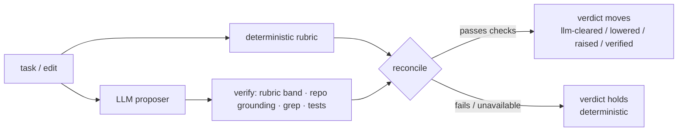

# The Forge Cognitive Substrate

**Coding agents forget what they learned, assume what they don't know, and break code they
can't see.** The substrate is a fast, mostly-deterministic check that runs *before* an agent
edits your code: it flags an unclear task, picks the cheapest capable model, and shows what
an edit will break — all from the repo you already have, with no extra LLM call.

In Claude Code it runs **automatically**. In other tools you (or the agent) run one command.

> Why this exists, in one line: a frozen model is a stateless function `y = f(x)` — no memory,
> no foresight, a fixed window. Those faculties can't be prompted in; they have to be supplied
> from the outside. This is that outside layer. Full argument: the white paper
> ([PDF](./cognitive_substrate_whitepaper.pdf) · [HTML](./cognitive_substrate_whitepaper.html)).

---

## Install

Install Forge (plugin · npm · `github:`) per [README → Install](../../README.md#install),
then inside any project:

```bash
forge init      # writes each AI tool's native config from one source
forge atlas     # build the code graph (needed for blast-radius checks)
```

`forge init` configures Claude Code, Codex, Cursor, Gemini, Aider, Copilot, Windsurf, Zed,
and Continue (plus MCP config for Roo and VS Code). On Claude Code the check then runs on
every prompt automatically.

---

## It runs itself (the main benefit)

You don't have to remember to use it.

**In Claude Code** — a hook runs the substrate on **every prompt** and adds a short note *only
when something needs attention* (unclear task, big blast radius, pricey model). It never blocks
and never nags on a clean, simple task. Real example — you type *"refactor computeTax in
math.js"* and the agent silently receives:

```text
Forge substrate — pre-action advisory (advisory, never blocks):
- Under-specified (high risk). Ask before editing:
    • What constraints must be respected: performance, dependencies, style, or compatibility?
- Suggested model: Haiku 4.5 (simple); escalate only on a verifier failure.
- Predicted blast radius (2): invoice.js, math.js. Review these before editing.
- Verify with: review impacted files before editing · run the narrowest affected test first
```

**In other AI tools** (Codex, Cursor, Gemini, Aider…) — `forge init` writes a rule into their
config file telling the agent to run the check itself, and exposes it as MCP tools it can call.
See [In other AI tools](#in-other-ai-tools).

---

## The one command

```bash
forge substrate "<what you want to do>"
```

It runs the whole check and gives a plain verdict. Two real examples:

**Vague task → it tells you to ask first:**

```console
$ forge substrate "make the auth better"

  proceed: ASK FIRST
  assumption: high risk · completeness 0.23
  clarify:
    - What exactly should this produce, and how will we know it is correct?
  impact: 0 file(s) predicted
```

**Clear task → it clears you and shows the blast radius:**

```console
$ forge substrate "Change verifyToken in src/auth.js to require length > 20; update tests"

  proceed: yes
  assumption: medium risk · completeness 0.63
  route: Haiku 4.5 (simple)
  impact: 3 file(s) predicted
    - src/auth.js
    - src/login.js        (imports verifyToken — you didn't mention it)
    - src/session.js      (imports verifyToken — you didn't mention it)
  verify:
    - run the narrowest affected test first, then the broader suite
```

The second run found the two files that import `verifyToken` but you never named — the
"forgot the coupled file" bug, caught *before* the edit. Add `--json` for machine-readable
output (see [Use it in a script](#use-it-in-a-script)).

---

## The checks (each is also its own command)

`forge substrate` bundles these. Run any one on its own when that's all you need.

| Command | Answers | One-line example |
| --- | --- | --- |
| `forge preflight "<task>"` | Is this task clear enough to start? | flags names not in the repo + vague words |
| `forge route "<task>"` | Which model is cheapest-but-capable? | trivial → Haiku · hard → Opus/Fable |
| `forge impact <symbol\|file>` | What will this edit break? | reverse-dependency blast radius |
| `forge scope <file…>` | Can this be split into sessions? | independent vs. coupled files |
| `forge anchor "<goal>"` | Are my changes still on the stated goal? | flags changed files that drifted off-goal |
| `forge verify` | Did it actually work? | runs the real tests/build, not the model's word |

The wider v0.5 surface — `forge context` (budgeted assembly + completeness gate),
`forge imagine [--run]` (predicted breaks + minimal dry-run suite), `forge diagnose`
(doom-loop), `forge ledger` / `forge reuse` (proof-carrying memory + code cache), and
`forge uicheck` (the design gate) — is documented with real outputs in
[docs/GUIDE.md → Command reference](../GUIDE.md#command-reference).

Real output for the two most-used:

```console
$ forge preflight "fix the thing in authManager so it works properly"

- `authManager` — not found in the code. Different name, or should it be created?
- Ambiguous: "properly" — state concrete acceptance criteria.
- Which specific file, module, component, or symbol should this change touch?
```

```console
$ forge impact verifyToken
  target: verifyToken  ✓ found
  impacted files: 3
    - src/auth.js
    - src/login.js
    - src/session.js
```

---

## Read the result (what to do)

Field-by-field: what each verdict means and the action to take —
[docs/GUIDE.md → Reading substrate output](../GUIDE.md#reading-substrate-output).
The short version: `ASK FIRST` means ask, `route` means start cheap, `impact` means
read those files first, and `verify` means show the output before saying "done".

---

## In other AI tools

Tools without a hook surface get the substrate two ways, both written by `forge init`:
a rule in their native config telling the agent to run `forge substrate "<task>" --json`
before ambiguous/expensive/mutating work, and MCP tools (`substrate_check`,
`assumption_gate`, `predict_impact`, `route_task`, `scope_files`) any MCP-capable agent
can call directly. Details + the exact rule wording:
[docs/GUIDE.md → Auto-use inside an agent](../GUIDE.md#auto-use-inside-an-agent).

Forge never pretends it can force a hook into a tool that has none — it's ambient on Claude
Code, and agent-invoked everywhere else.

---

## Use it in a script & extend it

Add `--json` to any command for machine-readable output — gate your agent's next step on
`okToProceed`, feed `route.tier` to your model picker, read `impact.impactedFiles` before
editing. Every knob (ask threshold, blast-radius sensitivity, routing signals, assumption
questions, the verify checklist, the ambient hook wording) is a small pure function or a
JSON default. Full JSON shape and the extension table:
[docs/GUIDE.md → Use it in a script](../GUIDE.md#use-it-in-a-script) ·
[Extending Forge](../GUIDE.md#extending-forge).

---

## Optional: LLM-assisted judgments (`FORGE_LLM=1`)

The substrate's default judgments are deterministic rubrics — no model call, no dependency.
Set **`FORGE_LLM=1`** to add a **thin, opt-in semantic layer** on top: a cheap `claude -p`
call proposes a completeness reading (M2), a complexity band (M1), the coupled edges the
regex graph misses (impact), and whether an off-goal file actually serves the goal (M4).



The model **proposes**; the deterministic rubric, the code graph, and the tests **verify**.
The verdict only moves when the proposal survives that check — otherwise it falls back, unchanged.

The model is **never the judge — only a proposer.** Every proposal is *verified* before it can
move a verdict, in the direction of the paper's *tabayyun* gate (49:6). By default the reconcile
is **bidirectional but rail-guarded** — a verified reading can lower caution as well as raise it,
but never past a hard floor:

- **routing** — a *raise* is free (spotting hidden complexity costs at most a bigger model); a
  *lower* is bounded to one band and never drops below a strong-signal (algorithmic/architectural)
  floor, so a "distributed rate-limiter" can't be talked down to the cheap tier;
- **the assumption gate** — can *clear* a false ask **or** *add* one, but never clears a task
  with no concrete anchor, or one naming symbols/files the repo doesn't define;
- **impact edges** — kept only if the file is real *and* a grep confirms the reference;
- **goal-drift** — rescues an off-goal file only with a goal-referencing reason (off→on only).

> **Note** — set `llm.bidirectional: false` in
> [`source/substrate.json`](../../source/substrate.json) for the conservative tighten-/raise-only
> mode (caution can only ever increase).

It is **fail-safe**: any error, timeout, or unparseable reply falls back to the deterministic
path (behaviour is byte-identical with the flag off), and it **never blocks**. `--json` output
carries an `llm.provenance` map (`deterministic` / `llm-cleared` / `llm-tightened` /
`llm-raised` / `llm-lowered` / `llm-verified`) per faculty so every model-touched decision is
auditable. Off by default; the ambient Claude Code hook stays deterministic unless you also set
`FORGE_LLM_AMBIENT=1`. Config lives in
[`source/substrate.json`](../../source/substrate.json) → `llm`.

---

## Honest limits

Heuristic, not benchmarked; the graph is regex-approximate; assumption detection is
lexical by default (`FORGE_LLM=1` adds the verified refinement above — proposals are
checked against the repo/graph/tests before they count, never trusted blind); auto-run
needs a hook surface. Tests and human corrections always win. The full, canonical list:
[docs/GUIDE.md → Honest limits](../GUIDE.md#honest-limits).

---

## Learn more

- **White paper** — the full argument: [PDF](./cognitive_substrate_whitepaper.pdf) ·
  [HTML](./cognitive_substrate_whitepaper.html)
- **[Package overview](./deliverable-package.md)** — headline results and prototypes
- **[Evidence map](./evidence_map.md)** — every load-bearing statistic re-graded against
  primary sources (5 confirmed, 5 vendor-reported, 2 dropped)
- **[Ecosystem map](./ecosystem_map.md)** — each capability vs. the real 2026 tool stack
- **[Prototype source](../../research/python-prototypes/)** — the auditable Python originals

**How the paper maps to what ships (all 11):** memory → `recall`/`cortex`/`ledger` ·
learning → `cortex` + ledger oracles · imagination → `imagine [--run]`/`impact` ·
self-correction → `verify`/`diagnose` · impact-awareness → `atlas`/`impact` · M1 routing →
`route` · M2 assumption gate → `preflight`/`context` · M3 decomposition → `scope` ·
M4 goal-anchoring → `anchor` · M5 minimality → `lean`/`uicheck design` · M6 verification →
`verify`/`substrate`.
