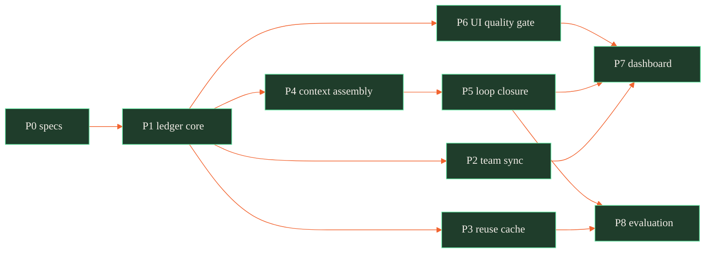

# Substrate v2 — completing the whitepaper, and the Proof-Carrying Memory protocol

> Status: **shipped — all phases P0–P8 landed in v0.5.0** · Owner: forgekit core · Companion to
> [docs/cognitive-substrate/](../../cognitive-substrate/) (the paper this plan completes).
> What remains (deferred, tracked in [ROADMAP.md](../../../ROADMAP.md)): the ledger
> read-path flip (legacy stores still serve reads), the optional embeddings tier
> (ADR-0005), and a Playwright-driven browser loop for the UI gate.

ForgeKit v0.4 implements roughly half of the committed whitepaper — the two prototyped
mechanisms (M1 routing, M2 assumption gate), an approximate impact atlas, and an advisory
memory (cortex + recall). This plan closes the rest, and it closes the pains the paper's
build-opportunity map (§10) ranks highest: validity-anchored memory, outcome-validated
learning, team/shared memory, code reuse, context completeness, doom-loop diagnosis — plus
two pains named by the project owner that the paper only gestures at: **generated-UI
template convergence** and a **~90 % cost-reduction target**.

One idea unifies all of it: the **Proof-Carrying Memory (PCM) protocol**
([01-pcm-protocol.md](./01-pcm-protocol.md)). Every unit of knowledge the system holds —
a lesson, a cached code artifact, a dependency edge, a design fingerprint, a diagnosis —
becomes a _claim_ that carries its own evidence, earns confidence only from independent
oracles (tests, typecheck, CI, human accept/revert), decays without review, and merges
across teammates without conflicts. This takes the paper's sharpest novelty — the `val`
term of Eq. 3, "validity-anchored memory" (§11) — and turns it from one scoring term into
the storage, trust, and wire protocol for the whole substrate.

## 1. Gap analysis — paper vs. `src/`

| Paper capability (§10 map)                              | ForgeKit v0.4                                                           | Gap                                                          | Closed by                                                                |
| ------------------------------------------------------- | ----------------------------------------------------------------------- | ------------------------------------------------------------ | ------------------------------------------------------------------------ |
| M1 routing + M2 assumption gate (opp. #1)               | `src/route.js`, `src/preflight.js` — 62 % measured saving               | ✅ shipped; residue: outcome-calibrated weights              | [06](./06-faculties-and-mechanisms.md) §7                                |
| Impact oracle, mandatory gate (opp. #3)                 | `src/atlas.js` regex graph; gate opt-in (`FORGE_ENFORCE=1`)             | precision; gate not mandatory                                | [06](./06-faculties-and-mechanisms.md) §1                                |
| Validity-anchored memory (opp. #2, Eq. 3)               | cortex confidence exists (`src/lessons.js` already keeps α/β evidence)  | no Eq. 3 retrieval, no forget/consolidate policy, flat store | [01](./01-pcm-protocol.md)                                               |
| Outcome-validated learning (opp. #4, Eq. 2)             | outcomes update lessons, but not _the memories that informed an action_ | write-back band incomplete                                   | [01](./01-pcm-protocol.md) §6, [06](./06-faculties-and-mechanisms.md) §6 |
| Team / shared memory                                    | single-repo file recall (`src/recall.js`, `src/brain.js`)               | no merge semantics, no attribution                           | [02](./02-team-memory.md)                                                |
| Code reuse / generation cache                           | `reuse-first` skill is prose only                                       | no artifact cache                                            | [03](./03-reuse-cache.md)                                                |
| Context compression / completeness                      | none — "incomplete context" is unaddressed                              | whole module missing                                         | [04](./04-context-assembly.md)                                           |
| Doom-loop root cause (opp. #5)                          | `doom-loop.sh` detects; no diagnosis, no escalation                     | diagnosis + escalation                                       | [06](./06-faculties-and-mechanisms.md) §5                                |
| Imagination (faculty, §3)                               | atlas traversal only — no dry-run of consequences                       | test selection + sandbox                                     | [06](./06-faculties-and-mechanisms.md) §2                                |
| M3/M4/M5/M6 (decomposition, drift, lean, inline verify) | `scope.js`/`anchor.js`/`lean.js`/`verify.js` heuristics                 | each gets its algorithm                                      | [06](./06-faculties-and-mechanisms.md) §3–§6                             |
| Generated-UI quality (owner pain; M5-shaped)            | `src/uicheck.js` WCAG contrast only; taste is prose                     | anti-template gate                                           | [07](./07-ui-quality-gate.md)                                            |
| Cost to ~90 % (owner target)                            | routing alone: 62 % measured                                            | cache + context + gate stages unmeasured                     | [05](./05-cost-model.md)                                                 |
| ForgeKit's own UX                                       | CLI only                                                                | `forge dash` dashboard                                       | [08](./08-dashboard-ux.md)                                               |

## 2. The 11-capability master table

Every faculty (paper §3) and mechanism (paper §6) with the math, algorithm, or data
structure this plan assigns it. Nothing is left as prose-only discipline.

| #   | Capability                 | Mechanism                                                                                                | Math / algorithm / data structure                                                                                                                                                                                  | Spec                                                                             |
| --- | -------------------------- | -------------------------------------------------------------------------------------------------------- | ------------------------------------------------------------------------------------------------------------------------------------------------------------------------------------------------------------------ | -------------------------------------------------------------------------------- |
| 1   | Memory (faculty)           | PCM claim ledger; Eq. 3 retrieval; ʿilm→fahm→ḥikma layers                                                | Content-addressed (Merkle-keyed) claim store; Beta(α,β) posterior with exponential decay; MinHash sketches; consolidation = union-find clustering over Jaccard ≥ τ, promoting episodes → patterns → decision rules | [01](./01-pcm-protocol.md)                                                       |
| 2   | Learning (faculty)         | Outcome write-back band (Eq. 2): oracle results update the `val` of every claim that informed the action | Bayesian evidence update; rubric-weight calibration by logistic regression over outcome claims (the paper's own "learn the rubric weights" note, §9.3)                                                             | [01](./01-pcm-protocol.md) §6                                                    |
| 3   | Imagination (faculty)      | Consequence simulator `g` (paper Eq. 4): blast radius → impacted-test selection → sandboxed dry-run      | Reverse-dependency traversal with hop-decay; test selection as bipartite set cover (greedy ln n-approx); dry-run result becomes evidence on the prediction claim                                                   | [06](./06-faculties-and-mechanisms.md) §2                                        |
| 4   | Self-correction (faculty)  | External-oracle cascade, never self-prompting (paper §3 honest negative, C12)                            | Cost-ordered oracle chain (types → impacted tests → independent reviewer); verdict requires ≥ 2 signals external to fθ                                                                                             | [06](./06-faculties-and-mechanisms.md) §4                                        |
| 5   | Impact-awareness (faculty) | Atlas hardened; pre-edit gate becomes **mandatory** (hook-enforced)                                      | Incremental dep graph keyed by file content hash; reverse-edge index → O(deg) "who depends on X"                                                                                                                   | [06](./06-faculties-and-mechanisms.md) §1                                        |
| 6   | M1 routing                 | Shipped; add auditable per-task rubric surface + outcome-calibrated weights                              | Additive transparent rubric; escalation only on verified failure; online weight calibration from ledger                                                                                                            | [06](./06-faculties-and-mechanisms.md) §7                                        |
| 7   | M2 assumption gate         | Shipped; questions become **computed missing-sets**, not pattern matches                                 | `s(x) < τ` halt rule + set difference `R(edit) \ covered(selection)` as the question generator                                                                                                                     | [04](./04-context-assembly.md) §4                                                |
| 8   | M3 decomposition           | Automatic partition-boundary detection (the paper's flagged residue, §5.3)                               | Constrained graph partition on the task-dependency graph: greedy modularity / min-cut, each part's working set ≤ window budget                                                                                     | [06](./06-faculties-and-mechanisms.md) §3                                        |
| 9   | M4 goal-anchoring          | Continuous drift control, not a static anchor (§5.4)                                                     | Drift `D(y_t,g) = 1 − sim(goal, rolling summary)`; **CUSUM control chart** triggers mandatory re-anchor                                                                                                            | [06](./06-faculties-and-mechanisms.md) §5                                        |
| 10  | M5 anti-over-engineering   | `src/lean.js` footprint made a defined metric (§5.5)                                                     | `φ(y) − φ*(x)` over files/abstractions/LOC; MDL tie-break: smallest description that passes the oracle                                                                                                             | [06](./06-faculties-and-mechanisms.md) §6 · [07](./07-ui-quality-gate.md) for UI |
| 11  | M6 inline verification     | Checkpoint scheduling during generation (§5.6)                                                           | Optimal-stopping threshold: check when hazard × tokens-at-risk > check cost → deterministic cadence per tier                                                                                                       | [06](./06-faculties-and-mechanisms.md) §6                                        |

## 3. Phase roadmap

Phases are dependency-ordered; each has an acceptance gate. P1 is the keystone — every
later phase stores its state as PCM claims. **All phases have shipped** (v0.5.0):

All nodes below are shipped (green); the color is the legend.

| Phase                      | Delivers                                                                                                                                                                              | Depends on                 | Acceptance                                                                                                           |
| -------------------------- | ------------------------------------------------------------------------------------------------------------------------------------------------------------------------------------- | -------------------------- | -------------------------------------------------------------------------------------------------------------------- |
| **P0** ✅ (this PR)        | Specs 00–08, ADR-0005, ADR-0006, ROADMAP update                                                                                                                                       | —                          | Docs merged; referenced paths resolve; no source changes                                                             |
| **P1 Ledger core** ✅      | `src/ledger.js` (claim store, canonical hashing, Beta confidence, Eq. 3 retrieval, decay/prune); migrate `src/lessons.js` + `src/lessons_store.js` + `src/recall.js` onto claim kinds | P0                         | All existing cortex/recall tests green on the new store; property tests: id stability, decay monotonicity            |
| **P2 Team sync** ✅        | `.forge/ledger/` git layout, union-merge driver, `forge ledger merge\|verify\|blame`                                                                                                  | P1                         | Three-way merge fuzz: any interleaving of two ledgers converges byte-identically (semilattice test)                  |
| **P3 Reuse cache** ✅      | `forge reuse` — fingerprint, exact/near lookup, atlas revalidation, eviction                                                                                                          | P1                         | Cache hit returns artifact + evidence; stale-interface artifact refused; hit/miss metrics emitted                    |
| **P4 Context assembly** ✅ | `forge context` — candidate scoring, knapsack selection, required-set completeness gate; wired into `src/substrate.js` + hooks                                                        | P1                         | Gate emits computed missing-set on incomplete context; token budget never exceeded                                   |
| **P5 Loop closure** ✅     | Outcome write-back band; doom-loop diagnosis + escalation; imagination dry-run; M3/M4/M5/M6 extensions                                                                                | P1, P4                     | Revert/test outcomes visibly move `val` of informing claims; repeated failure signature halts with a diagnosis claim |
| **P6 UI quality gate** ✅  | `forge uicheck` v2: design fingerprints, slop distance, scale conformance; machine-readable taste constraints                                                                         | P1                         | Known-template fixture flagged; project-conformant fixture passes; zero LLM calls in the gate                        |
| **P7 Dashboard** ✅        | `forge dash` — local server + self-contained HTML over `.forge/` stores                                                                                                               | P1–P6 (reads their stores) | Renders ledger, cost meter, cache rate, blast radius offline                                                         |
| **P8 Evaluation** ✅       | Extend `src/eval.js`: cost-stage measurement, cache-hit-rate harness, honest report                                                                                                   | P3–P5                      | A measured (not asserted) end-to-end cost figure per stage, published in reports/                                    |

## 4. Honesty register (the paper's own discipline, applied to this plan)

- **Measured:** 62 % routing saving (paper §9, live tokens); atlas recall/precision method
  (paper §8). Everything else in [05-cost-model.md](./05-cost-model.md) is a **target** until
  P8 measures it — the ~90 % figure is a composition argument, not a result.
- **Solved-elsewhere, not rebuilt:** subagent orchestration (M3's mechanics), model
  gateways (M1's plumbing) — per paper §10 "do not rebuild".
- **Research-edge, shipped as advisory first:** consolidation quality (ʿilm→fahm promotion),
  M4 drift similarity, M6 hazard estimates. They enter as advisory signals and only become
  blocking gates once P8 gives them fixtures — the same guard-over-prose discipline as
  ADR-0003.
