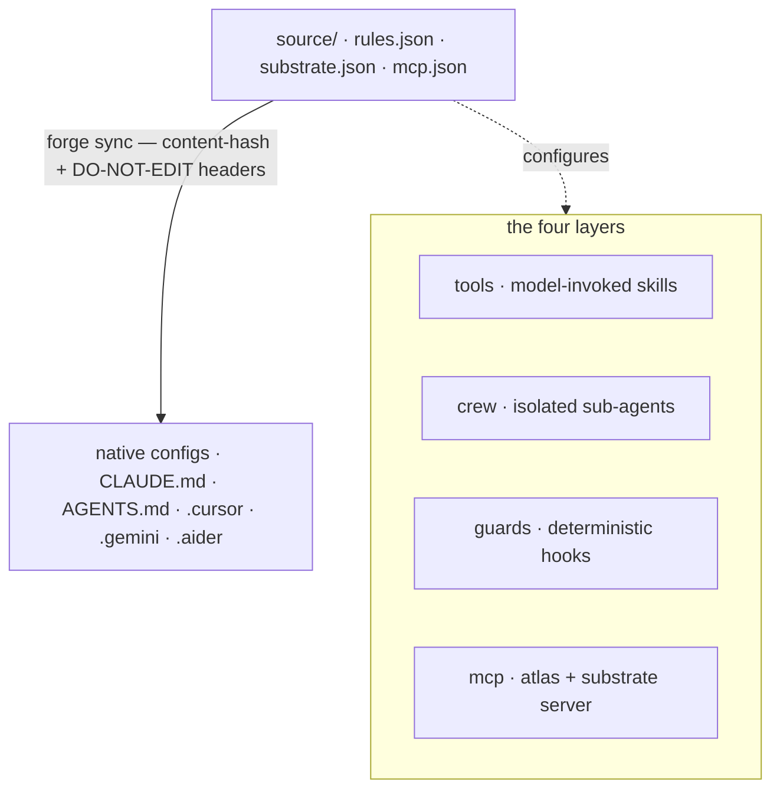

تكتب الركيزة مرة واحدة. يُصرِّف `forge sync` هذا المصدر إلى الإعداد الأصلي لكل أداة.
الطبقات الأربع هي _كيف يُعبَّر عن الدماغ_؛ والمُصرِّف هو _كيف يُوصَل_.

## مصدر واحد، مُصدِرات عديدة

اكتب القواعد **مرة واحدة** (`source/rules.json`)؛ يُصدر مُصرِّف حتمي (`forge sync`)
الصيغة الأصلية لكل أداة بترويسة تجزئة للمحتوى، فيصبح الانحراف قابلًا للكشف وإعادة
التشغيل بلا أثر. لا تُكتب قاعدة مرتين أبدًا. المصدر القانوني ثلاثة ملفات:

| ملف المصدر              | ما يحويه                                                             |
| ----------------------- | -------------------------------------------------------------------- |
| `source/rules.json`     | القواعد الهندسية القانونية (git، الاختبارات، الأمن، الأسلوب).       |
| `source/substrate.json` | الإعدادات الافتراضية للركيزة المعرفية — العتبات، والتوجيه، ومقابض LLM. |
| `source/mcp.json`       | تعريفات خوادم MCP التي تُصدر لكل أداة.                              |

## الطبقات الأربع

كل طبقة لها اسم علامة تجارية وتُصدر عبر الأدوات.

<AccordionGroup>
  <Accordion title="tools — قدرات يستدعيها النموذج" icon="wrench">
    `~/.forge/tools/` → `~/.claude/skills/`. مهارات يستدعيها النموذج، تتبع معيار
    `SKILL.md` (بيانات وصفية `name` + `description`).
  </Accordion>
  <Accordion title="crew — وكلاء فرعيون معزولون" icon="users">
    `~/.forge/crew/` → `~/.claude/agents/`. وكلاء فرعيون معزولون السياق، مثل
    الاستكشاف، والتحقق، والتحقق الأمامي.
  </Accordion>
  <Accordion title="guards — خطّافات حتمية (الطبقة الوحيدة المُنفِّذة)" icon="shield">
    `~/.forge/guards/` → خطّافات `settings.json`. **الطبقة الوحيدة التي _تُنفِّذ_ بدلًا
    من الاقتراح.** الحاجز خطّاف حتمي لا يستطيع النموذج الانحراف عنه. تُعترف القواعد
    النصية في `CLAUDE.md` ثم تُنسى بعد الضغط؛ الحاجز لا يُنسى. كل ثابت قابل للتنفيذ
    ينتمي هنا.
  </Accordion>
  <Accordion title="mcp — طبقة البروتوكول" icon="plug">
    يشحن Forge خادم stdio واحدًا (`src/cortex_mcp.js`) يعرض 19 أداة MCP: فحوصات
    الركيزة (`substrate_check` / `predict_impact` / `assumption_gate` / …)،
    قراءات _وكتابات_ الذاكرة (`forge_remember`، ledger ratify/retract)، والصحة.
  </Accordion>
</AccordionGroup>

تخترق الشواغل العابرة الطبقات الأربع كلها: **atlas** (رسم الشيفرة)، و**lean**
(الحد الأدنى — يُشحن كأداة وكحاجز إيقاف، فيسري سواء استدعاه النموذج أم لا)، و**recall**
(الذاكرة).

## الحاجز فوق النص

القواعد التي يمكن للنموذج الانحراف عنها تعيش في النص؛ والقواعد التي **لا يجوز له**
كسرها تعيش في الحواجز (خطّافات shell حتمية). لا يمكن نسيان الحاجز بعد ضغط السياق.

<Note>
  انقل كل ثابت قابل للتنفيذ من `CLAUDE.md` إلى حاجز؛ واحتفظ بالنص رقيقًا. هذا هو
  أهم انضباط منفرد في تصميم Forge.
</Note>

## مصفوفة الإصدار المتحقق منها عبر الأدوات

يُصدر Forge إعدادات لـ **تسع أدوات**، إضافةً إلى خادم MCP لأدوات Roo Code وVS Code.
كل صف مُوثَّق بالرجوع إلى وثائق المورّد.

| الأداة              | الهدف الأصلي                                                     | كيف يُصدر Forge                                                        |
| ------------------ | ---------------------------------------------------------------- | --------------------------------------------------------------------- |
| **Claude Code**    | `CLAUDE.md` (+ `.claude/rules/*.md`، `settings.json`)            | `CLAUDE.md` رقيق يبدأ سطره الأول بـ `@AGENTS.md`؛ الحواجز → settings   |
| **Codex**          | `AGENTS.md` أصلي (سقف 32 KiB)                                    | `AGENTS.md` القانوني في الجذر **هو** المصدر                             |
| **Cursor**         | `AGENTS.md` + `.cursor/rules/*.mdc`                              | `AGENTS.md` للقواعد المسطحة؛ `.mdc` عند الحاجة إلى نطاق                 |
| **Gemini**         | `GEMINI.md`، أو `AGENTS.md` عبر تفعيل `context.fileName`         | يكتب `.gemini/settings.json` لتفادي نسخة ثانية                          |
| **Aider**          | `CONVENTIONS.md` عبر `read:` في `.aider.conf.yml`                | يُصدر `.aider.conf.yml` مع `read: AGENTS.md`                            |
| **Copilot**        | `AGENTS.md` في الجذر + `.github/copilot-instructions.md`         | يعتمد على `AGENTS.md` في الجذر؛ مؤشر `.github` اختياري                  |
| **Windsurf/Devin** | `AGENTS.md` مكتشَف تلقائيًا (سقف 6k/12k حرفًا)                    | `AGENTS.md` جذري تحت الحد؛ يميز بين `.windsurf` و`.devin`               |
| **Zed**            | أول مطابقة من قائمة أولوية تشمل `AGENTS.md`                       | يُصدر `AGENTS.md`؛ يُشير الطبيب لأي ملف قديم مُظلِّل                     |
| **Continue**       | `.continue/rules/*.md` + `.continue/mcpServers/*.yaml`           | يُصدر ملف قواعد + إعداد خادم Forge MCP                                  |

تتلقّى Roo Code وVS Code خادم Forge MCP عبر `forge init` (`.roo/mcp.json`،
`.vscode/mcp.json`) بدلًا من ملف قواعد.

<Warning>
  **حدود عدد المحارف حقيقية.** يبتر Codex عند 32 KiB، وWindsurf عند 6k/12k. يفرض
  `forge sync` ميزانية حجم للمصدر بحيث لا يُبتر إعداد بصمت.
</Warning>
