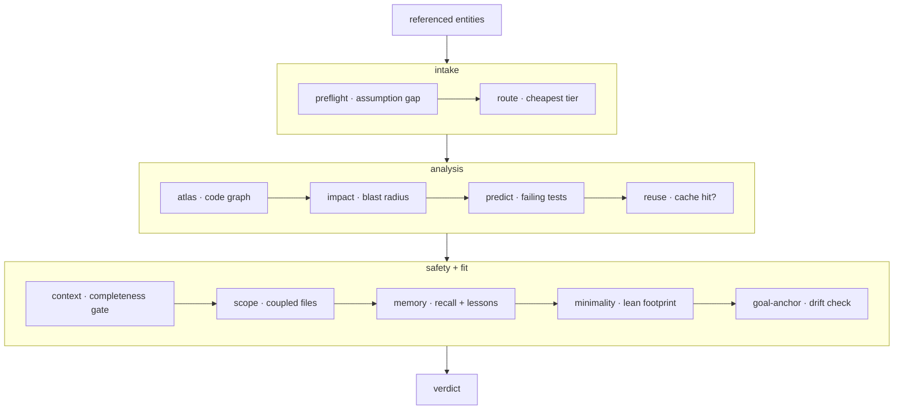

**الركيزة الإدراكية (Cognitive substrate)** — الطبقة التي تعمل _قبل_ أن يعدّل النموذج الشيفرة.
يُشغّل `forge substrate "<task>"` (وأداة MCP المسماة `substrate_check`) تمريرة مرتبة واحدة
من الفحوصات ويعيد حكمًا واحدًا. تُركّب هذه البوابة المراحل القابلة للاستدعاء بشكل مستقل —
`preflight`، `route`، `atlas`، `impact`، `reuse`، `context`، `scope`، `lean`، `anchor`،
`verify` — في عقد واحد لما قبل الإجراء.



## المراحل الثلاث

<Steps>
  <Step title="الاستقبال (Intake)">
    يجد **preflight** فجوة الافتراضات — ما تسميه المهمة ولم يُعرَّف في المستودع.
    يختار **route** أرخص فئة نموذج قادرة.
  </Step>
  <Step title="التحليل (Analysis)">
    يقرأ **atlas** الرسم البياني للشيفرة، ويحسب **impact** نصف قطر الانفجار،
    ويسمّي **predict** الاختبارات المرجّح فشلها، ويتحقق **reuse** من وجود ضربة تخزين مؤقت
    مُتحقَّق منها.
  </Step>
  <Step title="الأمان والملاءمة (Safety and fit)">
    يُشغّل **context** بوابة الاكتمال، ويُظهر **scope** الملفات المقترنة، وتُحقن
    **memory** الاستدعاء + الدروس، ويقيس **minimality** البصمة الرشيقة،
    ويفحص **goal-anchor** الانحراف.
  </Step>
</Steps>

## نصف قطر الانفجار

**نصف قطر الانفجار (Blast radius)** — مجموعة الملفات التي يُتوقع أن يؤثر عليها التعديل،
مقروءةً من الرسم البياني للشيفرة. يحسبه `forge impact`؛ ويكشفه خط الأنابيب قبل أن يمس
النموذج أي شيء.

```bash
forge impact verifyToken       # predicted impacted files for a symbol
forge impact src/auth.js       # …or for a file
```

## استشاري بشكل افتراضي

الحكم **استشاري بشكل افتراضي** — يُبلِّغ ولا يحجب. عيّن `FORGE_ENFORCE=1` لتحويل
أقوى الإشارات إلى حجب صارم:

<CardGroup cols={3}>
  <Card title="موجّه أجوف" icon="circle-question">
    لم يجد preflight نية قابلة للتنفيذ — مهمة غير محددة بشكل كافٍ.
  </Card>
  <Card title="سياق غير قابل للتجميع" icon="layer-group">
    لا تستطيع بوابة الاكتمال تغطية مجموعة التعديلات المتوقعة.
  </Card>
  <Card title="نصف قطر انفجار فوق العتبة" icon="explosion">
    تتجاوز مجموعة الملفات المتأثرة عتبة الافتراضية ~25 ملفًا.
  </Card>
</CardGroup>

كل شيء آخر يظل تحذيرًا يمكن للإنسان تجاوزه.

<Note>
  على Claude Code تعمل البوابة بأكملها **على كل موجّه تلقائيًا** عبر خطاف `UserPromptSubmit` —
  صامتة في المهام النظيفة. يقدم `forge substrate "<task>" --json` الحكم القابل للقراءة آليًا
  لأغراض البرمجة النصية.
</Note>

## كيف تشغّلها

```bash
forge substrate "Change verifyToken in src/auth.js to require length > 20; update tests"
forge substrate "<task>" --json
```

إذا كان الحكم `ASK FIRST`، فاسأل الأسئلة الواردة في `assumption.questions` قبل التعديل —
لا تخمّن مهمة غير محددة بشكل كافٍ. ابدأ من `route.tier` الموصى به ولا تصعّد إلا بعد فشل
مُحقِّق خارجي، لا استباقيًا أبدًا.

<Card title="كيف تُغذي الذاكرة البوابة" icon="arrow-right" href="/ar/concepts/proof-carrying-memory">
  تقرأ مرحلة الذاكرة من السجل الحامل للإثبات.
</Card>
