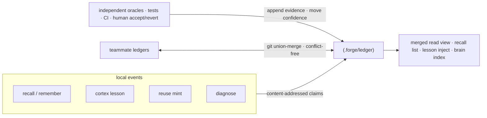
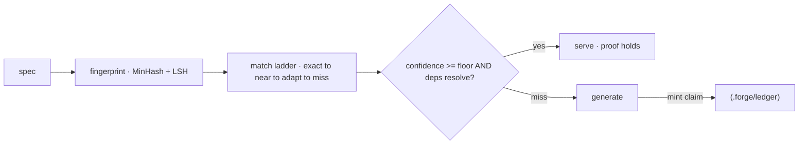

**الذاكرة الحاملة للإثبات (Proof-carrying memory أو PCM)** — كل حقيقة أو درس أو أثر إعادة استخدام
مُخزَّن هو _ادعاء_ يحمل دليله الخاص. ولا يُوثَق به إلا بعد أن ترفع أدوات تحقق مستقلة
(اختبارات، CI، قبول/تراجع بشري) ثقتَه فوق حد أدنى. الدرس الخاطئ يضمحل بدلًا من أن يتحجّر.

<Note>
  "الذاكرة الحاملة للإثبات" هو اسمنا لـ **ذاكرة مرجعية بالأدلة ومُعنونة بالمحتوى** — ادعاء يُعنون
  بتجزئة (hash) محتواه ويُربط بنتائج أدوات التحقق التي تدعمه. "الإثبات" هو مسار الأدلة هذا
  مضافًا إليه قاعدة الثقة، **وليس إثباتًا رسميًا مُتحقَّقًا آليًا**؛ لا يوجد مثبت نظريات في الحلقة.
</Note>

## مخزن واحد، كتّاب متعددون

تلتقي كل أنظمة الذاكرة الفرعية في مخزن واحد. تكتب `recall`، و`remember`/`brain`،
ودروس `cortex`، وآثار `reuse`، ونتائج `diagnose` للحلقة المكسورة جميعها ادعاءات مُعنونة
بالمحتوى في `.forge/ledger/`.



## لماذا يتلاقى دون تعارضات

لأن بايتات الادعاء هي دالة صرفة من `(kind, body, scope)`، فإن كل نسخة تحسب نفس الهوية —
لذا تُطوى سجلات زملاء الفريق معًا فوق git العادي دون أي تعارض.

ميكانيكيًا:

- **الأدلة وشواهد القبور (tombstones) قابلة للإلحاق فقط**، وهي سجلات مُزالة التكرار عبر التجزئة.
- **الثقة (`val`)** هي احتمال بايزي لاحق (Beta posterior) مُتحلِّل، ولا تحرّكه سوى أدوات التحقق.
- **الدمج هو شبكة نصف اتصال (join-semilattice)** — مُختبَرة بخصائص تُثبت أنها تبادلية،
  وتجميعية، وعديمة القوة (idempotent) — فتتلاقى السجلات بأي ترتيب.

<Note>
  يُصدر `forge init` قاعدة `.gitattributes` الخاصة بدمج الاتحاد (union-merge) التي يحتاجها السجل؛
  ويطوي `forge ledger merge <path>` أي شجرة سجل أخرى. القرار الكامل موثق في ADR-0006
  (proof-carrying memory).
</Note>

## أدوات التحقق تحرّك الثقة — ولا شيء آخر

فقط أدوات التحقق المستقلة يمكنها تحريك ثقة الذاكرة:

<CardGroup cols={3}>
  <Card title="الاختبارات" icon="flask">
    اختبار ناجح يمارس الادعاء يرفع ثقته.
  </Card>
  <Card title="CI" icon="circle-check">
    خط أنابيب أخضر هو دليل مستقل على أن الادعاء لا يزال قائمًا.
  </Card>
  <Card title="الإنسان" icon="user-check">
    قبول صريح أو تراجع هو الإشارة الأقوى من الجميع.
  </Card>
</CardGroup>

الأدلة غير القابلة للتحقق يرفضها جدول `ORACLES` مغلق (`src/ledger.js`). المعرفة غير المُراجَعة
تضمحل نحو _عدم اليقين_، وليس الحذف — تُحفظ الادعاءات الخاملة للتدقيق، ولا تُزال بصمت أبدًا.

## واجهة السجل

```bash
forge ledger stats                 # what the repo knows, by kind and trust level
forge ledger verify                # re-check claims are in normal form
forge ledger show <id>             # a claim and its evidence trail
forge ledger blame <id-prefix>     # who minted it, every oracle outcome, per-author trust
forge ledger query "<text>"        # retrieve claims by relevance
forge ledger ratify <id>           # human accept
forge ledger retract <id>          # tombstone a claim
forge ledger merge <path>          # fold a teammate's ledger in, conflict-free
forge ledger import                # bridge legacy stores into the ledger
```

أضف `--personal` للسجل الخاص بكل مستخدم.

## ذاكرة إعادة الاستخدام تحمل الإثبات أيضًا

`forge reuse` هو ذاكرة تخزين مؤقت للشيفرة تحمل الإثبات. لا يُقدَّم أثر مُولَّد مرة أخرى إلا
عندما يظل دليله قائمًا — أي أن الثقة فوق الحد الأدنى **و** لا تزال تبعيات atlas الخاصة به
قابلة للحل. وإلا فإنه يسقط إلى مرحلة التوليد ويسك ادعاءً جديدًا في طريق العودة.



<Warning>
  تطابق MinHash القريب ضعيف على المواصفات القصيرة جدًا. توفر واجهة تضمينات اختيارية
  (`FORGE_EMBED`) حلًا لذلك؛ ويبقى MinHash الافتراضي الخالي من التبعيات.
</Warning>
