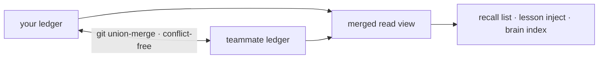

كل ما تتعلمه الركيزة (substrate) — دروس cortex، وحقائق `forge remember`، وآثار إعادة الاستخدام
المُتحقَّق منها — يهبط كادعاءات مُعنونة بالمحتوى في سجل أصلي لـ git (`.forge/ledger/`) مُصمَّم
ليُدمج دون تعارضات. لا خادم ولا خدمة مزامنة؛ إنها مجرد ملفات في git.

## ذاكرة الفريق في ثلاثة أوامر

<Steps>
  <Step title="التهيئة مرة واحدة">
    ```bash
    forge init
    ```
    من بين أشياء أخرى، يُصدر هذا الأمر قاعدة دمج الاتحاد في `.gitattributes` التي يحتاجها السجل.
  </Step>
  <Step title="اعمل كالمعتاد">
    تُلقي دروس cortex وحقائق `forge remember` بظلال ادعاءات في السجل أثناء عملك —
    لا شيء إضافي يجب تشغيله.
  </Step>
  <Step title="اطوِ سجل زميلك في الفريق">
    ```bash
    git pull && forge ledger merge <path-to-their-ledger>
    ```
    بأي ترتيب — الدمج خالٍ من التعارضات.
  </Step>
</Steps>

## لماذا لا يمكن أن يتعارض

بايتات الادعاء هي دالة صرفة من `(kind, body, scope)`، لذا تحسب كل نسخة الهوية نفسها لنفس
المعرفة. الدمج هو شبكة نصف اتصال (join-semilattice) — مُختبَرة بخصائص تُثبت أنها تبادلية،
وتجميعية، وعديمة القوة (idempotent) — لذا تتلاقى سجلات زميلين إلى الحالة نفسها بغض النظر
عمن يزامن أولًا.



<Note>
  المعرفة المتطابقة التي تُسَك بشكل مستقل تتلاقى إلى ادعاء **واحد** مع الحفاظ على كل مؤلف
  في مصدرها (provenance).
</Note>

## الثقة والمصدر

لا تتحرك الثقة إلا بواسطة أدوات تحقق مستقلة — اختبارات، وCI، وقبول/تراجع بشري — لذلك
فإن استيراد سجل زميل لا يثق بملاحظاته على نحوٍ أعمى؛ بل يستورد _أدلته_.

```bash
forge ledger blame <id-prefix>     # who minted a claim, every oracle outcome, per-author trust
forge ledger stats                 # the merged view, by kind and trust level
forge ledger verify                # confirm every claim is in normal form
```

## إعادة الاستخدام عبر الفريق

بمجرد أن تكون شيفرة زميلك المُتحقَّق منها في السجل المدموج، يمكنك إعادة استخدامها مع دليلها:

```bash
forge reuse query "<what you're about to build>"
```

الإصابة تشير إلى شيفرة عاملة ومؤكَّدة بالاختبارات و`forge ledger blame` التي تُثبتها —
أعد استخدامها بدلًا من إعادة توليدها.

<Warning>
  تُحفظ الادعاءات الخاملة للتدقيق ولا تُحذف أبدًا؛ المعرفة غير المُراجَعة تضمحل نحو _عدم اليقين_،
  لا نحو الحذف. السجل مسار أدلة، وليس ذاكرة تخزين مؤقت يمكنك أن تفقدها بصمت.
</Warning>
