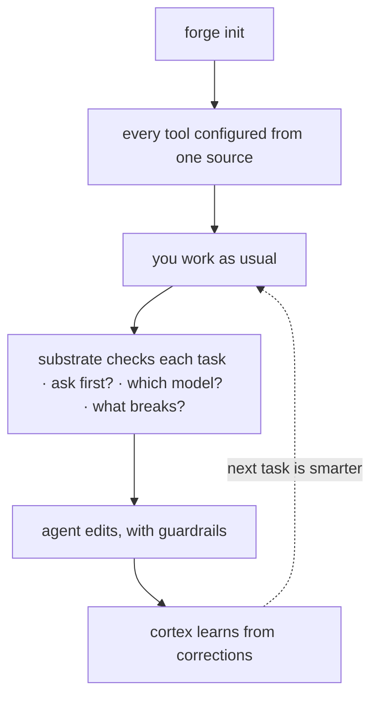

يهدف Forge إلى **إعداد موجَّه بأدنى تهيئة** — عادةً ما يكون المستودع الجديد منتجًا في نحو
خمس دقائق. ثبِّت مرة واحدة، اضبط المستودع مرة، نفّذ مهمة، ثم يبدأ السجل في الإنتاجية من
اليوم الثاني. (إنه بأدنى تهيئة، وليس بلا تهيئة: لا تزال تحتاج إلى تثبيت CLI، وتشغيل
`forge init` في كل مستودع، وبعض المسارات تفترض وجود Bash وGit و`jq`.)



## 1. التثبيت (مرة واحدة)

المسارات الموصى بها لا تحتاج إلى رمز مصادقة ولا إلى استنساخ:

<CodeGroup>

```bash Plugin
/plugin marketplace add CodeWithJuber/forgekit
/plugin install forgekit
```

```bash CLI
npm install -g @codewithjuber/forgekit
```

</CodeGroup>

```bash
forge doctor               # everything green?
```

## 2. اضبط مستودعًا (مرة واحدة لكل مستودع)

```bash
cd ~/your-project
forge init                 # emits AGENTS.md, CLAUDE.md, .gemini/settings.json, .aider.conf.yml …
```

الآن يقرأ Claude Code وCodex وCursor وGemini وAider وCopilot وWindsurf وZed وContinue
**نفس** القواعد — كل واحد منها من ملفه الأصلي. غيّر قاعدة لاحقًا بتحرير `source/rules.json`
(أو بإفلات `.forge/rules.json` خاص بالمستودع)، ثم شغّل `forge sync`.

## 3. استخدم الركيزة الإدراكية

```bash
forge substrate "<task>"      # ask/route/impact/scope/reuse/context/memory/verify in one pass
forge substrate "<task>" --json
forge impact <symbol-or-file> # the blast radius on its own
```

إذا قال `forge substrate` `ASK FIRST`، فاسأل الأسئلة الواردة قبل التعديل.

## 4. استخدم الإضافات

```bash
forge atlas build          # index this repo's symbols → .forge/atlas.json
forge atlas query useAuth  # where is it defined?
forge atlas has useAuth    # does it exist? "not found" = likely hallucinated
forge recall add "db port" "Postgres is on 5433 here, not 5432"
forge catalog              # the Start-Here index of everything
```

## 5. اليوم الثاني: السجل يتعلم

كل ما تعلمته الركيزة في اليوم الأول — دروس cortex، والحقائق المتذكَّرة، والشيفرة المُتحقَّق منها —
هبط كادعاءات في `.forge/ledger/`.

```bash
forge ledger stats                     # what the repo knows, by kind and trust level
forge ledger blame <id-prefix>         # who minted a claim, every oracle outcome
forge reuse query "<what you're about to build>"   # verified code you already have
```

<Card title="شاركه مع فريقك" icon="arrow-right" href="/ar/guides/team-memory">
  التالي: اطوِ سجل زميلك في الفريق دون تعارضات فوق git العادي.
</Card>
