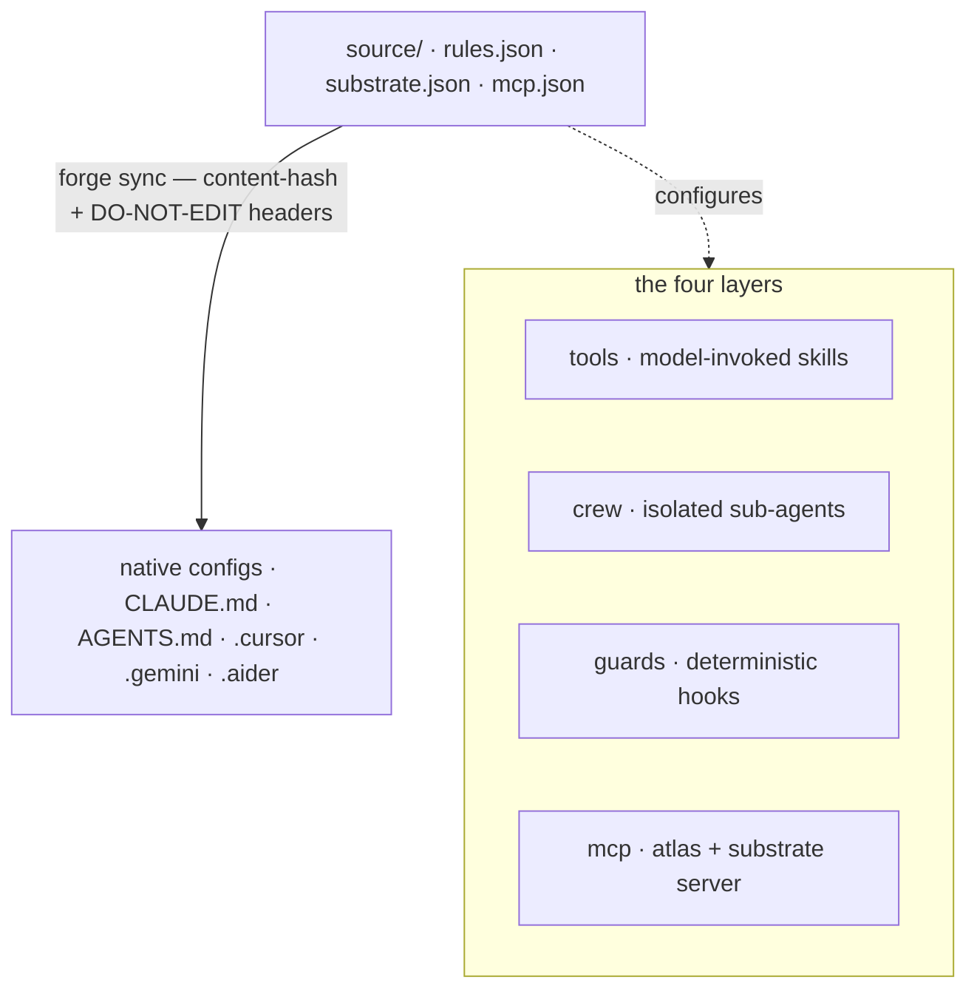

你只写一次基底。`forge sync` 会把这份来源编译成每个工具的原生
配置。四层描述的是 _大脑如何被表达_；编译器描述的是它 _如何被
交付_。

## 一份来源，多个输出

规则只写**一次**（`source/rules.json`）；一个确定性的编译器（`forge sync`）
把它输出成每个工具的原生格式，带一个内容哈希头，所以漂移是可探测的，
再跑一次是幂等的。任何一条规则都不会被写两遍。规范来源由三个
文件组成：

| 来源文件                | 存放什么                                                             |
| ----------------------- | -------------------------------------------------------------------- |
| `source/rules.json`     | 规范的工程规则（git、测试、安全、风格）。                            |
| `source/substrate.json` | 认知基底默认值 —— 阈值、路由、LLM 的调节参数。                        |
| `source/mcp.json`       | 输出到每个工具的 MCP 服务器定义。                                    |

## 四层

每一层都有品牌名，并且跨工具输出。

<AccordionGroup>
  <Accordion title="tools — 模型可调用的能力" icon="wrench">
    `~/.forge/tools/` → `~/.claude/skills/`。模型可调用的 skill，遵循
    `SKILL.md` 标准（frontmatter 里的 `name` + `description`）。
  </Accordion>
  <Accordion title="crew — 隔离的子代理" icon="users">
    `~/.forge/crew/` → `~/.claude/agents/`。上下文隔离的子代理，例如 scout、
    verifier 和 frontend-verifier。
  </Accordion>
  <Accordion title="guards — 确定性钩子（唯一具备强制力的层）" icon="shield">
    `~/.forge/guards/` → `settings.json` hooks。**唯一进行 _强制_ 而不只是
    _建议_ 的层。** 一个 guard 就是一个确定性钩子，模型没法漂离它。
    `CLAUDE.md` 里的自然语言规则会被口头承认，然后在压缩之后被遗忘；一个 guard 
    不会。每一条可强制的不变量都应该落在这里。
  </Accordion>
  <Accordion title="mcp — 协议层" icon="plug">
    Forge 内置一个 stdio 服务器（`src/cortex_mcp.js`），暴露 19 个 MCP 工具：
    基底检查（`substrate_check` / `predict_impact` / `assumption_gate` / …）、
    记忆的读 _和_ 写（`forge_remember`、账本的 ratify/retract），以及运维/健康检查。
  </Accordion>
</AccordionGroup>

有几个横切关注点贯穿四层：**atlas**（代码图）、**lean**
（最小性 —— 既作为一个 tool 又作为一个 Stop-guard 交付，所以不管
模型是否主动调用它都会生效），以及 **recall**（记忆）。

## Guard 胜过自然语言

模型允许漂离的规则活在自然语言里；模型**永远不能**打破的规则
活在 guards 里（确定性 shell 钩子）。一个 guard 在上下文
压缩之后也不会被遗忘。

<Note>
  把每一条可强制的不变量从 `CLAUDE.md` 里挪进一个 guard；让自然语言
  尽量薄。这是 Forge 设计里最重要的一条纪律。
</Note>

## 已验证的跨工具输出矩阵

Forge 为**九个工具**输出配置，加上一个给 Roo Code 和 VS Code 的 MCP 服务器。每
一行都对着厂商文档核对过。

| 工具               | 原生目标                                                          | Forge 如何输出                                                          |
| ------------------ | ---------------------------------------------------------------- | ---------------------------------------------------------------------- |
| **Claude Code**    | `CLAUDE.md`（+ `.claude/rules/*.md`、`settings.json`）           | 一份很薄的 `CLAUDE.md`，第一行是 `@AGENTS.md`；guards → settings         |
| **Codex**          | 原生的 `AGENTS.md`（32 KiB 上限）                                | 根目录下的规范 `AGENTS.md` **就是**那份来源                             |
| **Cursor**         | `AGENTS.md` + `.cursor/rules/*.mdc`                             | 扁平规则用 `AGENTS.md`；需要限定作用域时用 `.mdc`                       |
| **Gemini**         | `GEMINI.md`，或通过 `context.fileName` 选择 `AGENTS.md`         | 写一份 `.gemini/settings.json`，避免出现第二份副本                      |
| **Aider**          | 通过 `.aider.conf.yml` 里的 `read:` 引用 `CONVENTIONS.md`       | 输出一份 `.aider.conf.yml`，里面 `read: AGENTS.md`                      |
| **Copilot**        | 根目录 `AGENTS.md` + `.github/copilot-instructions.md`          | 依赖根目录的 `AGENTS.md`；可选加一个 `.github` 指针                     |
| **Windsurf/Devin** | 自动发现的 `AGENTS.md`（上限 6k/12k 字符）                      | 根目录 `AGENTS.md` 保持在上限之内；识别 `.windsurf` 或 `.devin`         |
| **Zed**            | 一个优先级列表里的第一个匹配，包括 `AGENTS.md`                   | 输出 `AGENTS.md`；doctor 会标出任何遮蔽它的老式文件                     |
| **Continue**       | `.continue/rules/*.md` + `.continue/mcpServers/*.yaml`          | 输出一份 rules 文件，外加 Forge 的 MCP 服务器配置                       |

Roo Code 和 VS Code 通过 `forge init`（`.roo/mcp.json`、
`.vscode/mcp.json`）拿到 Forge 的 MCP 服务器，而不是一份规则文件。

<Warning>
  **字符上限是真的存在。** Codex 在 32 KiB 处截断，Windsurf 在 6k/12k 处截断。
  `forge sync` 会强制一个源大小预算，避免配置被悄悄截断。
</Warning>
