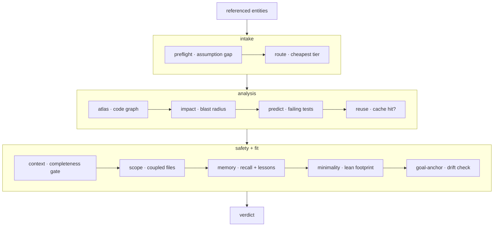

**认知基底** —— 在模型编辑代码之 _前_ 运行的一层。`forge substrate
"<task>"`（以及 MCP 工具 `substrate_check`）跑一次有序的检查，并返回一个统一
裁决。它把可单独调用的阶段 —— `preflight`、`route`、`atlas`、`impact`、
`reuse`、`context`、`scope`、`lean`、`anchor`、`verify` —— 组合成一份动作前
契约。



## 三个阶段

<Steps>
  <Step title="Intake">
    **preflight** 找出假设缺口 —— 任务里点名了但仓库并未
    定义的东西。**route** 挑出最便宜的能胜任的模型层。
  </Step>
  <Step title="Analysis">
    **atlas** 读取代码图，**impact** 计算爆炸半径，**predict**
    点名可能失败的测试，**reuse** 检查是否有已验证的缓存命中。
  </Step>
  <Step title="Safety and fit">
    **context** 跑完备性门，**scope** 揭示耦合文件，**memory**
    注入 recall + 经验，**minimality** 衡量 lean 足迹，
    **goal-anchor** 检查漂移。
  </Step>
</Steps>

## 爆炸半径

**爆炸半径** —— 从代码图中读出的、一次编辑预测会影响的文件集合。
`forge impact` 计算它；管线在模型触碰任何东西之前把它显示
出来。

```bash
forge impact verifyToken       # predicted impacted files for a symbol
forge impact src/auth.js       # …or for a file
```

## 默认建议性

裁决**默认是建议性的** —— 它报告，不阻塞。设置
`FORGE_ENFORCE=1` 就能把最强的信号变成硬阻塞：

<CardGroup cols={3}>
  <Card title="空洞的提示" icon="circle-question">
    preflight 找不到可执行的意图 —— 任务表述不足。
  </Card>
  <Card title="无法拼齐的上下文" icon="layer-group">
    完备性门盖不住预测的编辑集合。
  </Card>
  <Card title="爆炸半径超阈值" icon="explosion">
    受影响集合超过默认约 25 文件的阈值。
  </Card>
</CardGroup>

其他一切都保持为人可以覆盖的警告。

<Note>
  在 Claude Code 上，整个门会通过 `UserPromptSubmit` 钩子在**每次提示上
  自动**运行 —— 对干净的任务保持静默。`forge substrate "<task>" --json`
  给出可用于脚本的机器可读裁决。
</Note>

## 运行它

```bash
forge substrate "Change verifyToken in src/auth.js to require length > 20; update tests"
forge substrate "<task>" --json
```

如果裁决是 `ASK FIRST`，在编辑前先问它返回的 `assumption.questions` —— 
不要对一个表述不足的任务瞎猜。从推荐的 `route.tier` 开始，只在某个
外部验证器失败之后再升级，绝不预防性地升级。

<Card title="记忆是如何喂给这个门的" icon="arrow-right" href="/cn/concepts/proof-carrying-memory">
  记忆阶段从那本携带证据的账本里读取。
</Card>
