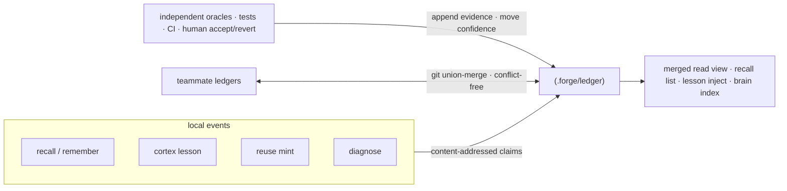
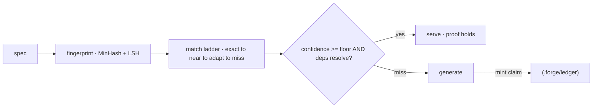

**Proof-carrying memory (PCM)** —— 每一条被存下来的事实、经验或复用产物都是一个
_声明_，自带它的证据。只有当独立裁决者（测试、CI、人的
接受/回退）把它的置信度抬升到底线之上时它才被信任。一条错误的经验会
衰减掉，而不是被固化下来。

<Note>
  "携带证据的记忆"是我们给**以证据为依据、按内容寻址的
  记忆**起的名字 —— 一个由自身内容哈希寻址、并且链接到其
  背后裁决者结果的声明。"proof"（证据）指的是这条证据链加上置信度规则，
  **不是形式化机器可校验的证明**；回路里没有定理证明器。
</Note>

## 一份存储，多个写入者

所有记忆子系统都汇聚到同一份存储。`recall`、`remember`/`brain`、`cortex`
经验、`reuse` 产物和死循环 `diagnose` 结果都会把按内容寻址的
声明写进 `.forge/ledger/`。



## 为什么它无冲突地收敛

因为一个声明的字节内容是 `(kind, body, scope)` 的纯函数，每个副本都
算出同一个身份 —— 所以队友的账本可以走普通 git 无冲突地合到一起。

机制上：

- **证据和 tombstone 是只追加的**、哈希去重的日志。
- **置信度（`val`）** 是一个带衰减的 Beta 后验，只有裁决者才能移动。
- **合并是一个 join-semilattice** —— 已用性质测试证明是可交换、可结合、
  幂等的 —— 所以账本无论以什么顺序都会收敛。

<Note>
  `forge init` 会输出账本所需的 union-merge `.gitattributes` 规则；`forge
  ledger merge <path>` 可以把任何另一个账本树合进来。完整决策记录在
  ADR-0006 (proof-carrying memory) 里。
</Note>

## 只有裁决者才能移动置信度 —— 别的都不行

只有独立的裁决者才能移动一条记忆的置信度：

<CardGroup cols={3}>
  <Card title="测试" icon="flask">
    一个通过的、能行使这条声明的测试，会抬高它的置信度。
  </Card>
  <Card title="CI" icon="circle-check">
    一条绿灯的流水线是这条声明依然成立的独立证据。
  </Card>
  <Card title="人" icon="user-check">
    人显式接受或直接回退是最强的信号。
  </Card>
</CardGroup>

无法验证的证据会被 `ORACLES` 表（`src/ledger.js`）里的封闭清单拒绝。
未经审阅的知识会向 _不确定_ 衰减，而不是被删除 —— 沉睡的声明会
保留下来用于审计，绝不会被悄悄移除。

## 账本表面

```bash
forge ledger stats                 # what the repo knows, by kind and trust level
forge ledger verify                # re-check claims are in normal form
forge ledger show <id>             # a claim and its evidence trail
forge ledger blame <id-prefix>     # who minted it, every oracle outcome, per-author trust
forge ledger query "<text>"        # retrieve claims by relevance
forge ledger ratify <id>           # human accept
forge ledger retract <id>          # tombstone a claim
forge ledger merge <path>          # fold a teammate's ledger in, conflict-free
forge ledger import                # bridge legacy stores into the ledger
```

加 `--personal` 是每用户的账本。

## reuse 缓存也是携带证据的

`forge reuse` 是一份携带证据的代码缓存。一件生成的产物只有当它的
证据还成立时才会被再次交付出来 —— 置信度在底线之上，**且**
它的 atlas 依赖仍然可以解析。否则就会 fall through 到生成，并在
返回的路上再生成一条新的声明。



<Warning>
  MinHash 的近似匹配在非常短的 spec 上比较弱。一个可选的 embeddings 后端
  （`FORGE_EMBED`）可以缓解这一点；MinHash 依然是零依赖的默认方案。
</Warning>
