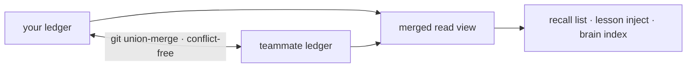

基底学到的一切 —— cortex 经验、`forge remember` 事实、已验证的 reuse
产物 —— 都以按内容寻址的声明形式落到一份 git 原生的账本（`.forge/ledger/`）里，
它被设计成合并时不会有冲突。没有服务器，也没有同步服务；只是 git 里的
文件。

## 团队记忆三条命令

<Steps>
  <Step title="初始化一次">
    ```bash
    forge init
    ```
    这会输出账本所需的 `.gitattributes` union-merge 规则等内容。
  </Step>
  <Step title="正常干活">
    Cortex 经验和 `forge remember` 事实会在你干活时把声明影子写进账本 —— 
    不用额外跑什么。
  </Step>
  <Step title="把队友的账本合进来">
    ```bash
    git pull && forge ledger merge <path-to-their-ledger>
    ```
    任何顺序都行 —— 合并是无冲突的。
  </Step>
</Steps>

## 为什么它不会冲突

一个声明的字节内容是 `(kind, body, scope)` 的纯函数，所以每个副本对
同一份知识都算出同一个身份。合并是一个 join-semilattice —— 已用
性质测试证明是可交换、可结合、幂等的 —— 所以两个队友的
账本无论谁先同步都会收敛到相同的状态。



<Note>
  同一份知识被独立地铸造两次，会收敛到**一个**声明，
  并在它的出处里保留每一位作者。
</Note>

## 信任与出处

置信度只能被独立裁决者移动 —— 测试、CI、人的接受/回退 —— 所以
导入一份队友的账本并不会盲目相信他们的笔记；它导入的是他们的
_证据_。

```bash
forge ledger blame <id-prefix>     # who minted a claim, every oracle outcome, per-author trust
forge ledger stats                 # the merged view, by kind and trust level
forge ledger verify                # confirm every claim is in normal form
```

## 跨团队复用

一旦队友已验证的代码进入了合并后的账本，你就可以带着它的证据来复用它：

```bash
forge reuse query "<what you're about to build>"
```

一次命中指向的是有效、经测试确认过的代码，以及能证明它的
`forge ledger blame` —— 复用它，而不是重新生成。

<Warning>
  沉睡的声明会保留下来用于审计，绝不删除；未经审阅的知识
  会向 _不确定_ 衰减，而不是向删除衰减。账本是一条证据链，
  不是一个可以被悄悄丢失的缓存。
</Warning>
