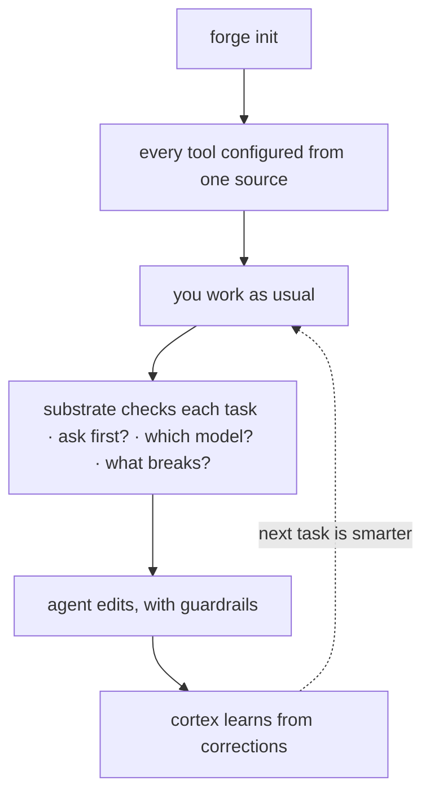

Forge 追求的是**引导式、低配置的上手** —— 一个新仓库通常能在大约五分钟内
进入可干活状态。安装一次，一个仓库配置一次，做一个任务，然后账本从第二天开始
回本。（是低配置，不是零配置：你仍然需要装 CLI，在每个仓库里跑 `forge init`，
一些路径会假设有 Bash、Git 和 `jq`。）



## 1. 安装（一次）

推荐的路径不需要 token 也不需要克隆：

<CodeGroup>

```bash Plugin
/plugin marketplace add CodeWithJuber/forgekit
/plugin install forgekit
```

```bash CLI
npm install -g @codewithjuber/forgekit
```

</CodeGroup>

```bash
forge doctor               # everything green?
```

## 2. 配置一个仓库（每个仓库一次）

```bash
cd ~/your-project
forge init                 # emits AGENTS.md, CLAUDE.md, .gemini/settings.json, .aider.conf.yml …
```

现在 Claude Code、Codex、Cursor、Gemini、Aider、Copilot、Windsurf、Zed 和 Continue
都从各自的原生文件里读**同一份**规则。以后要改规则，就编辑
`source/rules.json`（或者放一份仓库级的 `.forge/rules.json`），然后跑 `forge sync`。

## 3. 使用认知基底

```bash
forge substrate "<task>"      # ask/route/impact/scope/reuse/context/memory/verify in one pass
forge substrate "<task>" --json
forge impact <symbol-or-file> # the blast radius on its own
```

如果 `forge substrate` 返回 `ASK FIRST`，在编辑前先问它返回的问题。

## 4. 使用附加功能

```bash
forge atlas build          # index this repo's symbols → .forge/atlas.json
forge atlas query useAuth  # where is it defined?
forge atlas has useAuth    # does it exist? "not found" = likely hallucinated
forge recall add "db port" "Postgres is on 5433 here, not 5432"
forge catalog              # the Start-Here index of everything
```

## 5. 第二天：账本正在学习

第一天基底学到的一切 —— cortex 经验、被记住的事实、已验证的
代码 —— 都以声明的形式落到了 `.forge/ledger/`。

```bash
forge ledger stats                     # what the repo knows, by kind and trust level
forge ledger blame <id-prefix>         # who minted a claim, every oracle outcome
forge reuse query "<what you're about to build>"   # verified code you already have
```

<Card title="把它分享给你的团队" icon="arrow-right" href="/cn/guides/team-memory">
  接下来：把队友的账本无冲突地合进来，走的是普通的 git。
</Card>
