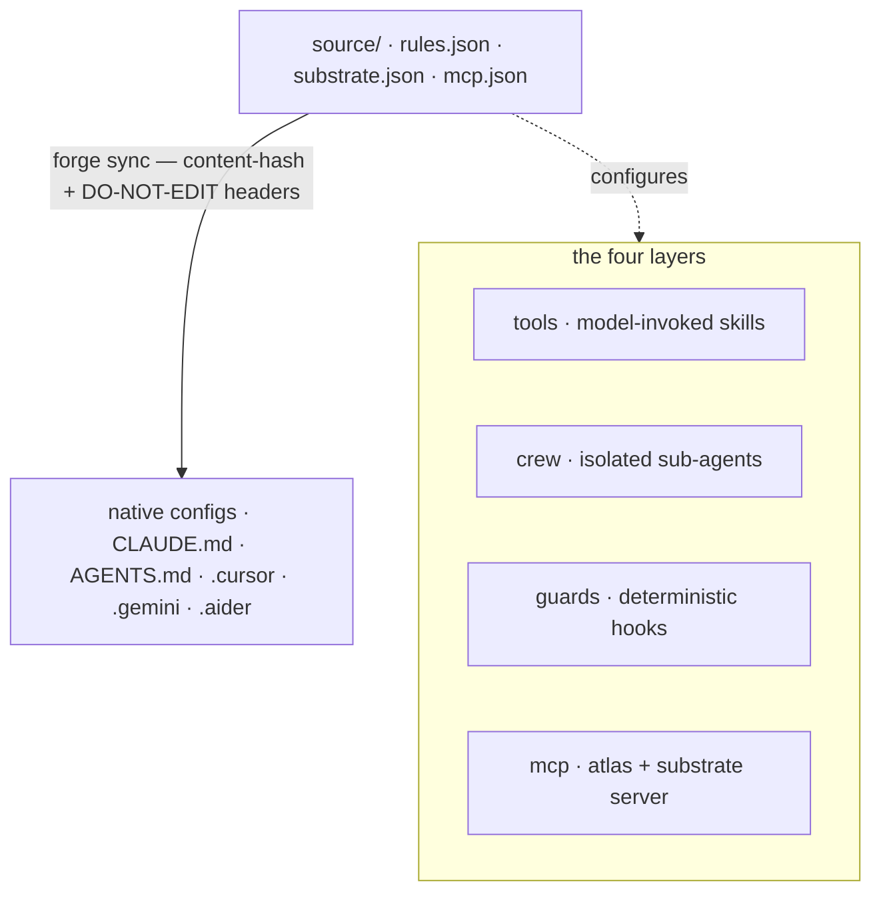

You author the substrate once. `forge sync` compiles that source into each tool's native
config. The four layers are _how the brain is expressed_; the compiler is _how it is
delivered_.

## One source, many emitters

Author rules **once** (`source/rules.json`); a deterministic compiler (`forge sync`)
emits each tool's native format with a content-hash header, so drift is detectable and
re-running is a no-op. No rule is ever written twice. The canonical source is three
files:

| Source file             | What it holds                                                        |
| ----------------------- | -------------------------------------------------------------------- |
| `source/rules.json`     | The canonical engineering rules (git, testing, security, style).     |
| `source/substrate.json` | Cognitive-substrate defaults — thresholds, routing, LLM knobs.       |
| `source/mcp.json`       | MCP server definitions emitted into each tool.                       |

## The four layers

Each layer is brand-named and emitted cross-tool.

<AccordionGroup>
  <Accordion title="tools — model-invoked capabilities" icon="wrench">
    `~/.forge/tools/` → `~/.claude/skills/`. Model-invoked skills, following the
    `SKILL.md` standard (`name` + `description` frontmatter).
  </Accordion>
  <Accordion title="crew — isolated sub-agents" icon="users">
    `~/.forge/crew/` → `~/.claude/agents/`. Isolated-context sub-agents such as scout,
    verifier, and frontend-verifier.
  </Accordion>
  <Accordion title="guards — deterministic hooks (the only enforcing layer)" icon="shield">
    `~/.forge/guards/` → `settings.json` hooks. **The only layer that _enforces_ rather
    than suggests.** A guard is a deterministic hook the model cannot drift from. Prose
    rules in `CLAUDE.md` get acknowledged and then forgotten after compaction; a guard
    does not. Every enforceable invariant belongs here.
  </Accordion>
  <Accordion title="mcp — the protocol layer" icon="plug">
    Forge ships one stdio server (`src/cortex_mcp.js`) exposing 19 MCP tools: the
    substrate checks (`substrate_check` / `predict_impact` / `assumption_gate` / …),
    memory reads _and_ writes (`forge_remember`, ledger ratify/retract), and ops/health.
  </Accordion>
</AccordionGroup>

Cross-cutting concerns thread through all four: **atlas** (the code graph), **lean**
(minimalism — shipped as both a tool and a Stop-guard, so it applies whether or not the
model invokes it), and **recall** (memory).

## Guard over prose

Rules the model can drift from live in prose; rules it must **never** break live in
guards (deterministic shell hooks). A guard can't be forgotten after context
compaction.

<Note>
  Move every enforceable invariant out of `CLAUDE.md` and into a guard; keep the prose
  thin. This is the single most important discipline in Forge's design.
</Note>

## The verified cross-tool emit matrix

Forge emits config for **nine tools**, plus an MCP server for Roo Code and VS Code. Each
row is confirmed against vendor docs.

| Tool               | Native target                                                     | How Forge emits                                                        |
| ------------------ | ---------------------------------------------------------------- | --------------------------------------------------------------------- |
| **Claude Code**    | `CLAUDE.md` (+ `.claude/rules/*.md`, `settings.json`)            | Thin `CLAUDE.md` whose first line is `@AGENTS.md`; guards → settings   |
| **Codex**          | `AGENTS.md` native (32 KiB cap)                                  | Canonical `AGENTS.md` at root **is** the source                       |
| **Cursor**         | `AGENTS.md` + `.cursor/rules/*.mdc`                             | `AGENTS.md` for flat rules; `.mdc` when scoping is needed             |
| **Gemini**         | `GEMINI.md`, or `AGENTS.md` via `context.fileName` opt-in       | Writes `.gemini/settings.json` to avoid a second copy                 |
| **Aider**          | `CONVENTIONS.md` via `read:` in `.aider.conf.yml`              | Emits `.aider.conf.yml` with `read: AGENTS.md`                         |
| **Copilot**        | root `AGENTS.md` + `.github/copilot-instructions.md`            | Relies on root `AGENTS.md`; optional `.github` pointer                |
| **Windsurf/Devin** | `AGENTS.md` auto-discovered (caps 6k/12k chars)                | Root `AGENTS.md` under caps; detects `.windsurf` vs `.devin`          |
| **Zed**            | first match of a precedence list incl. `AGENTS.md`             | Emits `AGENTS.md`; doctor flags any shadowing legacy file             |
| **Continue**       | `.continue/rules/*.md` + `.continue/mcpServers/*.yaml`         | Emits a rules file plus the Forge MCP server config                   |

Roo Code and VS Code receive the Forge MCP server via `forge init` (`.roo/mcp.json`,
`.vscode/mcp.json`) rather than a rules file.

<Warning>
  **Char caps are real.** Codex truncates at 32 KiB, Windsurf at 6k/12k. `forge sync`
  enforces a source size budget so a config never silently truncates.
</Warning>
