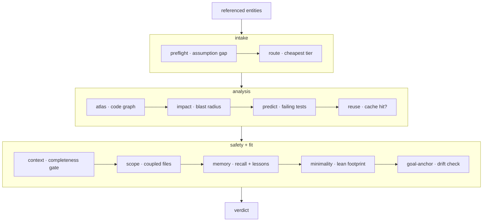

**Cognitive substrate** — the layer that runs _before_ the model edits code. `forge
substrate "<task>"` (and the MCP tool `substrate_check`) runs one ordered pass of checks
and returns a single verdict. It composes the individually-callable stages —
`preflight`, `route`, `atlas`, `impact`, `reuse`, `context`, `scope`, `lean`, `anchor`,
`verify` — into one pre-action contract.



## The three phases

<Steps>
  <Step title="Intake">
    **preflight** finds the assumption gap — what the task names that the repo doesn't
    define. **route** picks the cheapest capable model tier.
  </Step>
  <Step title="Analysis">
    **atlas** reads the code graph, **impact** computes the blast radius, **predict**
    names the tests likely to fail, and **reuse** checks for a verified cache hit.
  </Step>
  <Step title="Safety and fit">
    **context** runs the completeness gate, **scope** surfaces coupled files, **memory**
    injects recall + lessons, **minimality** measures the lean footprint, and
    **goal-anchor** checks for drift.
  </Step>
</Steps>

## Blast radius

**Blast radius** — the set of files an edit is predicted to impact, read from the code
graph. `forge impact` computes it; the pipeline surfaces it before the model touches
anything.

```bash
forge impact verifyToken       # predicted impacted files for a symbol
forge impact src/auth.js       # …or for a file
```

## Advisory by default

The verdict is **advisory by default** — it reports, it does not block. Set
`FORGE_ENFORCE=1` to turn the strongest signals into a hard block:

<CardGroup cols={3}>
  <Card title="Vacuous prompt" icon="circle-question">
    preflight finds no actionable intent — an underspecified task.
  </Card>
  <Card title="Un-assemblable context" icon="layer-group">
    the completeness gate cannot cover the predicted edit set.
  </Card>
  <Card title="Blast radius over threshold" icon="explosion">
    the impacted set exceeds the default ~25-file threshold.
  </Card>
</CardGroup>

Everything else stays a warning the human can override.

<Note>
  On Claude Code the whole gate runs on **every prompt automatically** via a
  `UserPromptSubmit` hook — silent on clean tasks. `forge substrate "<task>" --json`
  gives the machine-readable verdict for scripting.
</Note>

## Running it

```bash
forge substrate "Change verifyToken in src/auth.js to require length > 20; update tests"
forge substrate "<task>" --json
```

If the verdict is `ASK FIRST`, ask the returned `assumption.questions` before editing —
do not guess an under-specified task. Start at the recommended `route.tier` and escalate
only after an external verifier fails, never preemptively.

<Card title="How memory feeds the gate" icon="arrow-right" href="/concepts/proof-carrying-memory">
  The memory stage reads from the proof-carrying ledger.
</Card>
