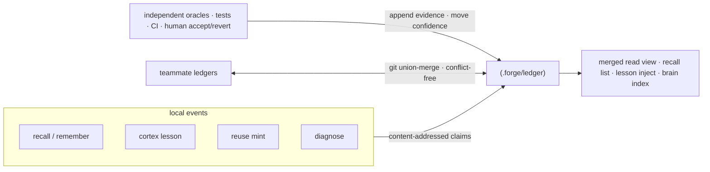
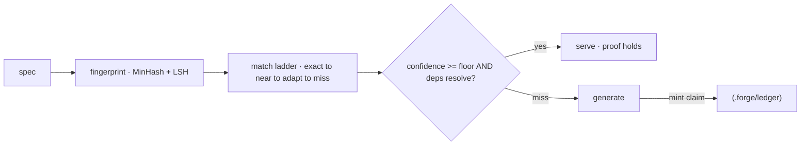

**Proof-carrying memory (PCM)** — every stored fact, lesson, or reuse artifact is a
_claim_ that carries its own evidence. It is trusted only once independent oracles
(tests, CI, a human accept/revert) raise its confidence above a floor. A wrong lesson
decays out instead of ossifying.

<Note>
  "Proof-carrying memory" is our name for **evidence-referenced, content-addressed
  memory** — a claim addressed by the hash of its content and linked to the oracle
  outcomes that back it. The "proof" is that evidence trail plus the confidence rule, **not
  a formal machine-checked proof**; there is no theorem prover in the loop.
</Note>

## One store, many writers

All memory subsystems converge on one store. `recall`, `remember`/`brain`, `cortex`
lessons, `reuse` artifacts, and doom-loop `diagnose` results all write content-addressed
claims into `.forge/ledger/`.



## Why it converges without conflicts

Because a claim's bytes are a pure function of `(kind, body, scope)`, every replica
computes the same identity — so teammate ledgers fold together over plain git with no
conflicts.

Mechanically:

- **Evidence and tombstones are append-only**, hash-deduped logs.
- **Confidence (`val`)** is a decayed Beta posterior, moved only by oracles.
- **Merge is a join-semilattice** — property-tested to be commutative, associative, and
  idempotent — so ledgers converge in any order.

<Note>
  `forge init` emits the union-merge `.gitattributes` rule the ledger needs; `forge
  ledger merge <path>` folds in any other ledger tree. The full decision is recorded in
  ADR-0006 (proof-carrying memory).
</Note>

## Oracles move confidence — nothing else

Only independent oracles can move a memory's confidence:

<CardGroup cols={3}>
  <Card title="Tests" icon="flask">
    A passing test that exercises the claim raises its confidence.
  </Card>
  <Card title="CI" icon="circle-check">
    A green pipeline is independent evidence the claim still holds.
  </Card>
  <Card title="Human" icon="user-check">
    An explicit accept or a revert is the strongest signal of all.
  </Card>
</CardGroup>

Unverifiable evidence is rejected by a closed `ORACLES` table (`src/ledger.js`).
Unreviewed knowledge decays toward _uncertainty_, not deletion — dormant claims are kept
for audit, never silently removed.

## The ledger surface

```bash
forge ledger stats                 # what the repo knows, by kind and trust level
forge ledger verify                # re-check claims are in normal form
forge ledger show <id>             # a claim and its evidence trail
forge ledger blame <id-prefix>     # who minted it, every oracle outcome, per-author trust
forge ledger query "<text>"        # retrieve claims by relevance
forge ledger ratify <id>           # human accept
forge ledger retract <id>          # tombstone a claim
forge ledger merge <path>          # fold a teammate's ledger in, conflict-free
forge ledger import                # bridge legacy stores into the ledger
```

Add `--personal` for the per-user ledger.

## The reuse cache is proof-carrying too

`forge reuse` is a proof-carrying code cache. A generated artifact is only served again
when its evidence still holds — the confidence is above the floor **and** its atlas
dependencies still resolve. Otherwise it falls through to generation and mints a fresh
claim on the way back.



<Warning>
  The MinHash near-match is weak on very short specs. An optional embeddings backend
  (`FORGE_EMBED`) lifts this; MinHash stays the zero-dependency default.
</Warning>
