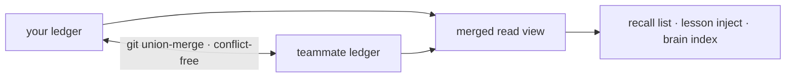

Everything the substrate learns — cortex lessons, `forge remember` facts, verified reuse
artifacts — lands as content-addressed claims in a git-native ledger (`.forge/ledger/`)
built to merge without conflicts. There is no server and no sync service; it is just
files in git.

## Team memory in three commands

<Steps>
  <Step title="Initialize once">
    ```bash
    forge init
    ```
    Among other things this emits the `.gitattributes` union-merge rule the ledger needs.
  </Step>
  <Step title="Work normally">
    Cortex lessons and `forge remember` facts shadow claims into the ledger as you go —
    nothing extra to run.
  </Step>
  <Step title="Fold in a teammate's ledger">
    ```bash
    git pull && forge ledger merge <path-to-their-ledger>
    ```
    Any order — the merge is conflict-free.
  </Step>
</Steps>

## Why it can't conflict

A claim's bytes are a pure function of `(kind, body, scope)`, so every replica computes
the same identity for the same knowledge. The merge is a join-semilattice —
property-tested to be commutative, associative, and idempotent — so two teammates'
ledgers converge to the same state no matter who syncs first.



<Note>
  Identical knowledge minted independently converges to **one** claim with every author
  preserved in its provenance.
</Note>

## Trust and provenance

Confidence is moved only by independent oracles — tests, CI, a human accept/revert — so
importing a teammate's ledger doesn't blindly trust their notes; it imports their
_evidence_.

```bash
forge ledger blame <id-prefix>     # who minted a claim, every oracle outcome, per-author trust
forge ledger stats                 # the merged view, by kind and trust level
forge ledger verify                # confirm every claim is in normal form
```

## Reuse across the team

Once a teammate's verified code is in the merged ledger, you can reuse it with its proof:

```bash
forge reuse query "<what you're about to build>"
```

A hit points at working, test-confirmed code and the `forge ledger blame` that proves it
— reuse it instead of regenerating.

<Warning>
  Dormant claims are kept for audit, never deleted; unreviewed knowledge decays toward
  _uncertainty_, not toward deletion. The ledger is an evidence trail, not a cache you
  can silently lose.
</Warning>
