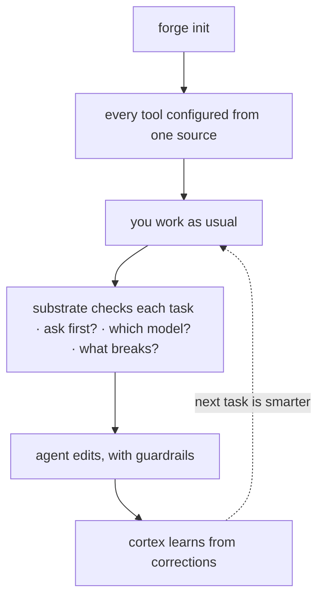

Forge is designed so a new repo is productive in about five minutes. Install once,
configure a repo once, do a task, and the ledger starts paying off on day two.



## 1. Install (once)

The recommended paths need no token and no clone:

<CodeGroup>

```bash Plugin
/plugin marketplace add CodeWithJuber/forgekit
/plugin install forgekit
```

```bash CLI
npm install -g @codewithjuber/forgekit
```

</CodeGroup>

```bash
forge doctor               # everything green?
```

## 2. Configure a repo (once per repo)

```bash
cd ~/your-project
forge init                 # emits AGENTS.md, CLAUDE.md, .gemini/settings.json, .aider.conf.yml …
```

Now Claude Code, Codex, Cursor, Gemini, Aider, Copilot, Windsurf, Zed, and Continue all
read the **same** rules — each from its own native file. Change a rule later by editing
`source/rules.json` (or dropping a per-repo `.forge/rules.json`), then run `forge sync`.

## 3. Use the cognitive substrate

```bash
forge substrate "<task>"      # ask/route/impact/scope/reuse/context/memory/verify in one pass
forge substrate "<task>" --json
forge impact <symbol-or-file> # the blast radius on its own
```

If `forge substrate` says `ASK FIRST`, ask the returned questions before editing.

## 4. Use the extras

```bash
forge atlas build          # index this repo's symbols → .forge/atlas.json
forge atlas query useAuth  # where is it defined?
forge atlas has useAuth    # does it exist? "not found" = likely hallucinated
forge recall add "db port" "Postgres is on 5433 here, not 5432"
forge catalog              # the Start-Here index of everything
```

## 5. Day two: the ledger is learning

Everything the substrate learned on day one — cortex lessons, remembered facts, verified
code — landed as claims in `.forge/ledger/`.

```bash
forge ledger stats                     # what the repo knows, by kind and trust level
forge ledger blame <id-prefix>         # who minted a claim, every oracle outcome
forge reuse query "<what you're about to build>"   # verified code you already have
```

<Card title="Share it with your team" icon="arrow-right" href="/guides/team-memory">
  Next: fold a teammate's ledger in, conflict-free, over plain git.
</Card>
