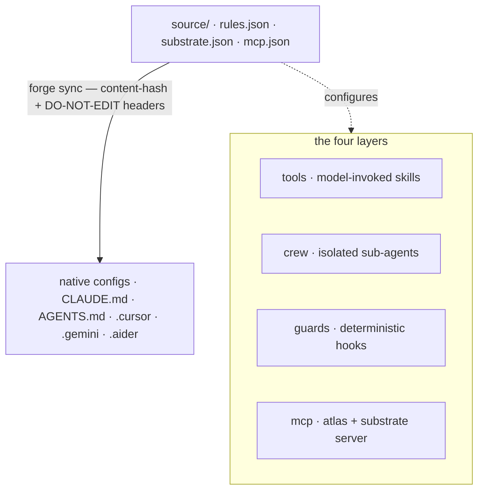

आप सब्सट्रेट को एक बार लिखते हैं। `forge sync` उस स्रोत को प्रत्येक टूल के नेटिव कॉन्फ़िग में
संकलित करता है। चार परतें बताती हैं कि _दिमाग कैसे व्यक्त किया जाता है_; कंपाइलर बताता है
कि _यह कैसे डिलीवर होता है_।

## एक स्रोत, कई एमिटर

नियम **एक बार** लिखें (`source/rules.json`); एक डिटर्मिनिस्टिक कंपाइलर (`forge sync`)
प्रत्येक टूल के नेटिव फ़ॉर्मैट को कंटेंट-हैश हेडर के साथ एमिट करता है, जिससे ड्रिफ़्ट का
पता लगाया जा सकता है और पुनः चलाना no-op बन जाता है। कोई भी नियम कभी दो बार नहीं लिखा
जाता। कैनोनिकल स्रोत तीन फ़ाइलें हैं:

| स्रोत फ़ाइल              | इसमें क्या होता है                                                    |
| ----------------------- | -------------------------------------------------------------------- |
| `source/rules.json`     | कैनोनिकल इंजीनियरिंग नियम (git, testing, security, style)।             |
| `source/substrate.json` | Cognitive-substrate डिफ़ॉल्ट — थ्रेशोल्ड, रूटिंग, LLM नॉब्स।           |
| `source/mcp.json`       | MCP सर्वर परिभाषाएँ जो प्रत्येक टूल में एमिट होती हैं।                    |

## चार परतें

प्रत्येक परत ब्रांड-नामित है और क्रॉस-टूल एमिट होती है।

<AccordionGroup>
  <Accordion title="tools — मॉडल-इनवोक्ड क्षमताएँ" icon="wrench">
    `~/.forge/tools/` → `~/.claude/skills/`। मॉडल-इनवोक्ड स्किल्स, जो `SKILL.md`
    मानक (`name` + `description` frontmatter) का पालन करती हैं।
  </Accordion>
  <Accordion title="crew — पृथक सब-एजेंट" icon="users">
    `~/.forge/crew/` → `~/.claude/agents/`। पृथक-कॉन्टेक्स्ट सब-एजेंट जैसे कि scout,
    verifier, और frontend-verifier।
  </Accordion>
  <Accordion title="guards — डिटर्मिनिस्टिक हुक्स (एकमात्र प्रवर्तक परत)" icon="shield">
    `~/.forge/guards/` → `settings.json` हुक्स। **एकमात्र परत जो सुझाने के बजाय
    _प्रवर्तन_ करती है।** एक guard एक डिटर्मिनिस्टिक हुक है जिससे मॉडल ड्रिफ़्ट नहीं कर
    सकता। `CLAUDE.md` में प्रोज़ नियम स्वीकार किए जाते हैं और फिर कॉम्पैक्शन के बाद
    भूल जाते हैं; एक guard ऐसा नहीं करता। हर प्रवर्तनीय invariant यहीं होना चाहिए।
  </Accordion>
  <Accordion title="mcp — प्रोटोकॉल परत" icon="plug">
    Forge एक stdio सर्वर (`src/cortex_mcp.js`) शिप करता है जो 19 MCP टूल्स एक्सपोज़
    करता है: सब्सट्रेट चेक्स (`substrate_check` / `predict_impact` /
    `assumption_gate` / …), मेमोरी रीड्स _और_ राइट्स (`forge_remember`, ledger
    ratify/retract), और ops/health।
  </Accordion>
</AccordionGroup>

क्रॉस-कटिंग चिंताएँ चारों में से गुज़रती हैं: **atlas** (कोड ग्राफ़), **lean**
(न्यूनतमवाद — एक टूल और एक Stop-guard दोनों के रूप में शिप होता है, ताकि यह लागू हो
चाहे मॉडल इसे इनवोक करे या नहीं), और **recall** (मेमोरी)।

## प्रोज़ के ऊपर Guard

जिन नियमों से मॉडल ड्रिफ़्ट कर सकता है वे प्रोज़ में रहते हैं; जिन्हें उसे **कभी नहीं**
तोड़ना चाहिए वे guards (डिटर्मिनिस्टिक शेल हुक्स) में रहते हैं। एक guard कॉन्टेक्स्ट
कॉम्पैक्शन के बाद भुलाया नहीं जा सकता।

<Note>
  हर प्रवर्तनीय invariant को `CLAUDE.md` से बाहर एक guard में ले जाएँ; प्रोज़ को पतला
  रखें। Forge के डिज़ाइन में यह एकमात्र सबसे महत्वपूर्ण अनुशासन है।
</Note>

## सत्यापित क्रॉस-टूल एमिट मैट्रिक्स

Forge **नौ टूल्स** के लिए कॉन्फ़िग एमिट करता है, साथ ही Roo Code और VS Code के लिए एक
MCP सर्वर। प्रत्येक पंक्ति वेंडर डॉक्स के विरुद्ध पुष्टि की गई है।

| टूल                | नेटिव लक्ष्य                                                       | Forge कैसे एमिट करता है                                                |
| ------------------ | ---------------------------------------------------------------- | --------------------------------------------------------------------- |
| **Claude Code**    | `CLAUDE.md` (+ `.claude/rules/*.md`, `settings.json`)            | पतला `CLAUDE.md` जिसकी पहली पंक्ति `@AGENTS.md` है; guards → settings   |
| **Codex**          | `AGENTS.md` नेटिव (32 KiB cap)                                   | रूट पर कैनोनिकल `AGENTS.md` **ही** स्रोत है                            |
| **Cursor**         | `AGENTS.md` + `.cursor/rules/*.mdc`                             | फ़्लैट नियमों के लिए `AGENTS.md`; स्कोपिंग आवश्यक होने पर `.mdc`         |
| **Gemini**         | `GEMINI.md`, या `context.fileName` opt-in के ज़रिए `AGENTS.md`   | दूसरी कॉपी टालने के लिए `.gemini/settings.json` लिखता है              |
| **Aider**          | `.aider.conf.yml` में `read:` के ज़रिए `CONVENTIONS.md`         | `read: AGENTS.md` के साथ `.aider.conf.yml` एमिट करता है                |
| **Copilot**        | रूट `AGENTS.md` + `.github/copilot-instructions.md`             | रूट `AGENTS.md` पर निर्भर करता है; वैकल्पिक `.github` पॉइंटर           |
| **Windsurf/Devin** | `AGENTS.md` ऑटो-डिस्कवर (caps 6k/12k chars)                     | caps के अंतर्गत रूट `AGENTS.md`; `.windsurf` बनाम `.devin` पहचानता है   |
| **Zed**            | प्रीसिडेंस सूची का पहला मैच जिसमें `AGENTS.md` शामिल है           | `AGENTS.md` एमिट करता है; doctor किसी भी shadowing legacy फ़ाइल को फ़्लैग करता है |
| **Continue**       | `.continue/rules/*.md` + `.continue/mcpServers/*.yaml`         | एक नियम फ़ाइल और Forge MCP सर्वर कॉन्फ़िग एमिट करता है                  |

Roo Code और VS Code को Forge MCP सर्वर `forge init` के ज़रिए मिलता है (`.roo/mcp.json`,
`.vscode/mcp.json`) न कि किसी नियम फ़ाइल के ज़रिए।

<Warning>
  **Char caps वास्तविक हैं।** Codex 32 KiB पर, Windsurf 6k/12k पर ट्रंकेट करता है।
  `forge sync` एक स्रोत आकार बजट लागू करता है ताकि कोई कॉन्फ़िग कभी चुपचाप ट्रंकेट न हो।
</Warning>
