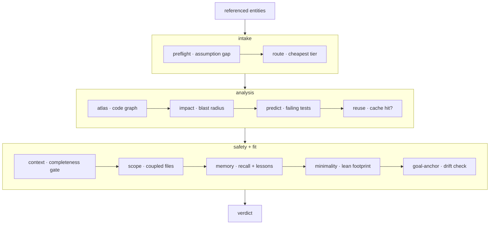

**Cognitive substrate** — वह परत जो मॉडल के कोड संपादित करने से _पहले_ चलती है। `forge
substrate "<task>"` (और MCP टूल `substrate_check`) एक क्रमबद्ध पास चलाता है और एक ही
verdict देता है। यह अलग-अलग कॉल किए जा सकने वाले चरणों — `preflight`, `route`, `atlas`,
`impact`, `reuse`, `context`, `scope`, `lean`, `anchor`, `verify` — को एक pre-action
अनुबंध में मिलाता है।



## तीन चरण

<Steps>
  <Step title="Intake">
    **preflight** assumption gap ढूँढ़ता है — कार्य क्या नाम लेता है जिसे repo परिभाषित
    नहीं करता। **route** सबसे सस्ता सक्षम मॉडल टियर चुनता है।
  </Step>
  <Step title="Analysis">
    **atlas** कोड ग्राफ़ पढ़ता है, **impact** blast radius की गणना करता है, **predict**
    उन tests के नाम बताता है जिनके विफल होने की संभावना है, और **reuse** एक सत्यापित
    cache hit की जाँच करता है।
  </Step>
  <Step title="सुरक्षा और फ़िट">
    **context** completeness gate चलाता है, **scope** coupled फ़ाइलें सामने लाता है,
    **memory** recall + lessons इंजेक्ट करता है, **minimality** lean footprint मापता है,
    और **goal-anchor** drift की जाँच करता है।
  </Step>
</Steps>

## Blast radius

**Blast radius** — फ़ाइलों का वह सेट जिस पर एक edit के प्रभाव की भविष्यवाणी की जाती है,
कोड ग्राफ़ से पढ़ा गया। `forge impact` इसकी गणना करता है; पाइपलाइन मॉडल के कुछ छूने से
पहले इसे सामने लाती है।

```bash
forge impact verifyToken       # predicted impacted files for a symbol
forge impact src/auth.js       # …or for a file
```

## डिफ़ॉल्ट रूप से Advisory

Verdict **डिफ़ॉल्ट रूप से advisory** है — यह रिपोर्ट करता है, ब्लॉक नहीं करता। सबसे मज़बूत
संकेतों को hard block में बदलने के लिए `FORGE_ENFORCE=1` सेट करें:

<CardGroup cols={3}>
  <Card title="Vacuous prompt" icon="circle-question">
    preflight को कोई actionable intent नहीं मिलता — एक underspecified task।
  </Card>
  <Card title="Un-assemblable context" icon="layer-group">
    completeness gate predicted edit set को cover नहीं कर सकता।
  </Card>
  <Card title="Blast radius threshold से अधिक" icon="explosion">
    impacted set डिफ़ॉल्ट ~25-file threshold से अधिक है।
  </Card>
</CardGroup>

बाकी सब कुछ एक warning बनी रहती है जिसे मानव override कर सकता है।

<Note>
  Claude Code पर पूरा गेट **हर prompt पर स्वचालित रूप से** एक `UserPromptSubmit` hook के
  ज़रिए चलता है — clean tasks पर silent। `forge substrate "<task>" --json`
  scripting के लिए machine-readable verdict देता है।
</Note>

## इसे चलाना

```bash
forge substrate "Change verifyToken in src/auth.js to require length > 20; update tests"
forge substrate "<task>" --json
```

यदि verdict `ASK FIRST` है, तो संपादित करने से पहले लौटाए गए `assumption.questions`
पूछें — एक under-specified task का अनुमान न लगाएँ। अनुशंसित `route.tier` पर शुरू करें और
केवल एक बाहरी verifier के विफल होने के बाद escalate करें, कभी preemptively नहीं।

<Card title="मेमोरी गेट को कैसे feed करती है" icon="arrow-right" href="/hi/concepts/proof-carrying-memory">
  मेमोरी stage proof-carrying ledger से पढ़ता है।
</Card>
