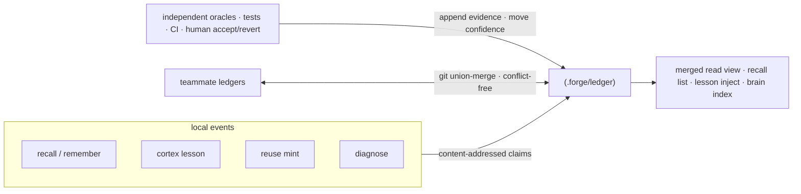
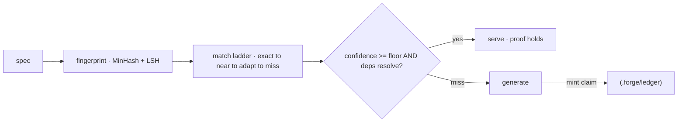

**Proof-carrying memory (PCM)** — प्रत्येक संग्रहीत तथ्य, पाठ, या reuse artifact एक
_claim_ है जो अपने साथ अपना प्रमाण रखता है। इस पर तभी भरोसा किया जाता है जब स्वतंत्र
oracles (tests, CI, एक मानव accept/revert) इसका confidence एक floor से ऊपर उठा दें।
एक ग़लत पाठ ossify होने के बजाय decay होकर बाहर हो जाता है।

<Note>
  "Proof-carrying memory" हमारा नाम है **evidence-referenced, content-addressed
  memory** के लिए — एक claim जिसे उसके content के hash द्वारा address किया जाता है और
  उसे उन oracle outcomes से जोड़ा जाता है जो उसका समर्थन करते हैं। "Proof" वह evidence
  trail और confidence नियम है, **किसी formal machine-checked proof के तौर पर नहीं**; loop
  में कोई theorem prover नहीं है।
</Note>

## एक store, कई writers

सभी memory subsystems एक ही store पर converge होते हैं। `recall`, `remember`/`brain`,
`cortex` lessons, `reuse` artifacts, और doom-loop `diagnose` results सभी
content-addressed claims को `.forge/ledger/` में लिखते हैं।



## यह conflicts के बिना क्यों converge होता है

क्योंकि एक claim के bytes `(kind, body, scope)` का शुद्ध function हैं, हर replica एक ही
identity कंप्यूट करता है — इसलिए teammate ledgers plain git पर बिना conflicts के आपस
में fold हो जाते हैं।

यांत्रिक रूप से:

- **Evidence और tombstones append-only**, hash-deduped logs हैं।
- **Confidence (`val`)** एक decayed Beta posterior है, जिसे केवल oracles ही हिलाते हैं।
- **Merge एक join-semilattice है** — property-tested कि यह commutative, associative,
  और idempotent है — इसलिए ledgers किसी भी क्रम में converge हो जाते हैं।

<Note>
  `forge init` union-merge `.gitattributes` नियम emit करता है जो ledger को चाहिए;
  `forge ledger merge <path>` किसी अन्य ledger tree को fold कर लेता है। पूरा निर्णय
  ADR-0006 (proof-carrying memory) में दर्ज है।
</Note>

## Oracles ही confidence हिलाते हैं — कुछ और नहीं

केवल स्वतंत्र oracles एक memory का confidence हिला सकते हैं:

<CardGroup cols={3}>
  <Card title="Tests" icon="flask">
    एक passing test जो claim को exercise करता है, उसका confidence बढ़ाता है।
  </Card>
  <Card title="CI" icon="circle-check">
    एक green pipeline स्वतंत्र evidence है कि claim अभी भी टिकी हुई है।
  </Card>
  <Card title="मानव" icon="user-check">
    एक explicit accept या एक revert सबसे मज़बूत signal है।
  </Card>
</CardGroup>

Unverifiable evidence को एक closed `ORACLES` table (`src/ledger.js`) द्वारा अस्वीकार
कर दिया जाता है। असमीक्षित knowledge deletion की ओर नहीं, _uncertainty_ की ओर decay
होता है — निष्क्रिय claims audit के लिए रखे जाते हैं, कभी चुपचाप हटाए नहीं जाते।

## Ledger surface

```bash
forge ledger stats                 # what the repo knows, by kind and trust level
forge ledger verify                # re-check claims are in normal form
forge ledger show <id>             # a claim and its evidence trail
forge ledger blame <id-prefix>     # who minted it, every oracle outcome, per-author trust
forge ledger query "<text>"        # retrieve claims by relevance
forge ledger ratify <id>           # human accept
forge ledger retract <id>          # tombstone a claim
forge ledger merge <path>          # fold a teammate's ledger in, conflict-free
forge ledger import                # bridge legacy stores into the ledger
```

Per-user ledger के लिए `--personal` जोड़ें।

## Reuse cache भी proof-carrying है

`forge reuse` एक proof-carrying code cache है। एक generated artifact तभी दोबारा serve
होता है जब उसका evidence अभी भी टिका हो — confidence floor से ऊपर हो **और** उसके atlas
dependencies अभी भी resolve हों। अन्यथा यह generation पर fall through करता है और वापसी
पर एक fresh claim mint करता है।



<Warning>
  MinHash near-match बहुत छोटे specs पर कमज़ोर है। एक वैकल्पिक embeddings backend
  (`FORGE_EMBED`) इसे बेहतर बनाता है; MinHash zero-dependency डिफ़ॉल्ट बना रहता है।
</Warning>
