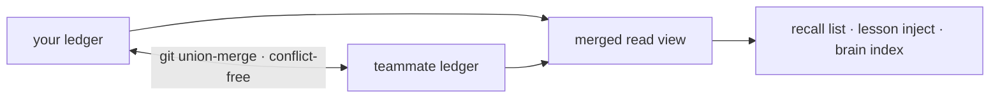

Substrate जो कुछ भी सीखता है — cortex lessons, `forge remember` facts, verified reuse
artifacts — वह content-addressed claims के रूप में एक git-native ledger
(`.forge/ledger/`) में land होता है, जो बिना conflicts के merge करने के लिए बनाया गया
है। कोई server नहीं और कोई sync service नहीं; यह बस git में files हैं।

## तीन commands में team memory

<Steps>
  <Step title="एक बार initialize करें">
    ```bash
    forge init
    ```
    अन्य बातों के साथ यह `.gitattributes` union-merge नियम emit करता है जो ledger को चाहिए।
  </Step>
  <Step title="सामान्य रूप से काम करें">
    Cortex lessons और `forge remember` facts आपके काम करते-करते claims को ledger में
    shadow करते हैं — अलग से कुछ चलाने की ज़रूरत नहीं।
  </Step>
  <Step title="टीममेट के ledger को fold करें">
    ```bash
    git pull && forge ledger merge <path-to-their-ledger>
    ```
    किसी भी क्रम में — merge conflict-free है।
  </Step>
</Steps>

## यह conflict क्यों नहीं कर सकता

एक claim के bytes `(kind, body, scope)` का शुद्ध function हैं, इसलिए हर replica एक ही
knowledge के लिए एक ही identity कंप्यूट करता है। Merge एक join-semilattice है —
property-tested कि यह commutative, associative, और idempotent है — इसलिए दो टीममेट्स
के ledgers उसी state पर converge होते हैं, चाहे पहले कौन sync करे।



<Note>
  स्वतंत्र रूप से mint की गई identical knowledge **एक** claim पर converge होती है, जिसकी
  provenance में हर author संरक्षित रहता है।
</Note>

## Trust और provenance

Confidence केवल स्वतंत्र oracles द्वारा हिलाया जाता है — tests, CI, एक मानव accept/revert —
इसलिए किसी टीममेट के ledger को import करना उनके नोट्स पर आँख मूँदकर भरोसा नहीं करता; यह
उनका _evidence_ import करता है।

```bash
forge ledger blame <id-prefix>     # who minted a claim, every oracle outcome, per-author trust
forge ledger stats                 # the merged view, by kind and trust level
forge ledger verify                # confirm every claim is in normal form
```

## टीम में Reuse

एक बार किसी टीममेट का verified कोड merged ledger में आ जाए, तो आप उसे उसके proof के साथ
reuse कर सकते हैं:

```bash
forge reuse query "<what you're about to build>"
```

एक hit working, test-confirmed कोड की ओर इशारा करता है और `forge ledger blame` जो उसे
साबित करता है — इसे regenerate करने के बजाय reuse करें।

<Warning>
  निष्क्रिय claims audit के लिए रखे जाते हैं, कभी हटाए नहीं जाते; असमीक्षित knowledge
  deletion की ओर नहीं, _uncertainty_ की ओर decay होती है। Ledger एक evidence trail है,
  कोई cache नहीं जिसे आप चुपचाप खो सकें।
</Warning>
