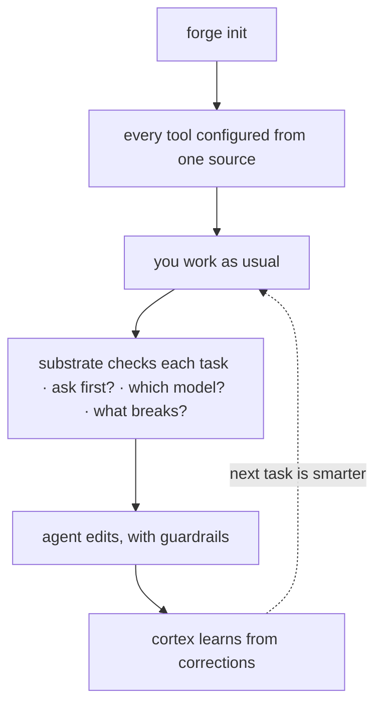

Forge का लक्ष्य है **मार्गदर्शित, कम-कॉन्फ़िगरेशन onboarding** — एक नया repo आमतौर पर लगभग
पाँच मिनट में उत्पादक हो जाता है। एक बार install करें, एक repo को एक बार configure करें,
एक task करें, और दूसरे दिन ledger का फ़ायदा मिलना शुरू हो जाता है। (यह low-configuration
है, zero-configuration नहीं: आप अभी भी CLI install करते हैं, हर repo में `forge init`
चलाते हैं, और कुछ paths Bash, Git, और `jq` मानते हैं।)



## 1. Install (एक बार)

अनुशंसित paths को किसी token या clone की ज़रूरत नहीं:

<CodeGroup>

```bash Plugin
/plugin marketplace add CodeWithJuber/forgekit
/plugin install forgekit
```

```bash CLI
npm install -g @codewithjuber/forgekit
```

</CodeGroup>

```bash
forge doctor               # everything green?
```

## 2. एक repo configure करें (प्रति repo एक बार)

```bash
cd ~/your-project
forge init                 # emits AGENTS.md, CLAUDE.md, .gemini/settings.json, .aider.conf.yml …
```

अब Claude Code, Codex, Cursor, Gemini, Aider, Copilot, Windsurf, Zed, और Continue सभी
**एक ही** नियम पढ़ते हैं — हर एक अपनी native फ़ाइल से। बाद में एक नियम बदलने के लिए
`source/rules.json` संपादित करें (या प्रति-repo `.forge/rules.json` छोड़ें), फिर
`forge sync` चलाएँ।

## 3. Cognitive substrate का उपयोग करें

```bash
forge substrate "<task>"      # ask/route/impact/scope/reuse/context/memory/verify in one pass
forge substrate "<task>" --json
forge impact <symbol-or-file> # the blast radius on its own
```

यदि `forge substrate` कहता है `ASK FIRST`, तो संपादित करने से पहले लौटाए गए प्रश्न पूछें।

## 4. Extras का उपयोग करें

```bash
forge atlas build          # index this repo's symbols → .forge/atlas.json
forge atlas query useAuth  # where is it defined?
forge atlas has useAuth    # does it exist? "not found" = likely hallucinated
forge recall add "db port" "Postgres is on 5433 here, not 5432"
forge catalog              # the Start-Here index of everything
```

## 5. दूसरा दिन: ledger सीख रहा है

पहले दिन substrate ने जो कुछ भी सीखा — cortex lessons, remembered facts, verified
code — वह `.forge/ledger/` में claims के रूप में land हुआ।

```bash
forge ledger stats                     # what the repo knows, by kind and trust level
forge ledger blame <id-prefix>         # who minted a claim, every oracle outcome
forge reuse query "<what you're about to build>"   # verified code you already have
```

<Card title="इसे अपनी टीम के साथ साझा करें" icon="arrow-right" href="/hi/guides/team-memory">
  आगे: किसी टीममेट के ledger को plain git पर, conflict-free, fold करें।
</Card>
