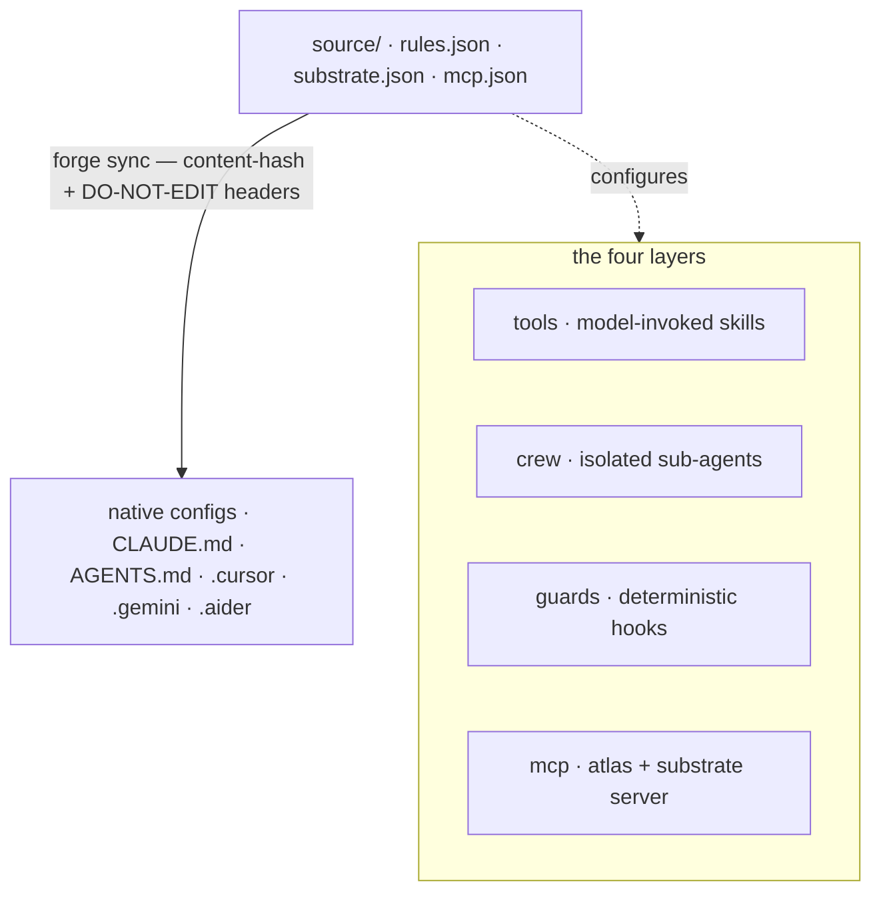

你一次编写基座。`forge sync` 把这个源编译到每个工具的原生配置中。四层是_大脑的表达方式_;编译器是_大脑的交付方式_。

## 一个源,多个发射器

规则**只写一次**(`source/rules.json`);一个确定性编译器 (`forge sync`) 以每个工具的原生格式发射,附带内容哈希头,因此漂移可检测,重复运行是无操作的。没有任何规则被写两次。规范源由三个文件组成:

| 源文件                  | 存放什么                                                             |
| ----------------------- | -------------------------------------------------------------------- |
| `source/rules.json`     | 规范的工程规则(git、测试、安全、风格)。                            |
| `source/substrate.json` | 认知基座默认值 —— 阈值、路由、LLM 旋钮。                             |
| `source/mcp.json`       | 发射到每个工具的 MCP 服务器定义。                                    |

## 四层

每一层都有品牌名,并且跨工具发射。

<AccordionGroup>
  <Accordion title="tools —— 模型可调用的能力" icon="wrench">
    `~/.forge/tools/` → `~/.claude/skills/`。模型可调用的 skill,遵循 `SKILL.md` 标准(`name` + `description` 前置元数据)。
  </Accordion>
  <Accordion title="crew —— 隔离的子代理" icon="users">
    `~/.forge/crew/` → `~/.claude/agents/`。上下文隔离的子代理,例如 scout、verifier 和 frontend-verifier。
  </Accordion>
  <Accordion title="guards —— 确定性钩子(唯一具备强制力的层)" icon="shield">
    `~/.forge/guards/` → `settings.json` 钩子。**唯一_强制_而非建议的层。** 一个 guard 是模型无法漂移的确定性钩子。`CLAUDE.md` 中的散文规则被承认后会在压缩之后被遗忘;guard 不会。任何可强制的不变量都属于这里。
  </Accordion>
  <Accordion title="mcp —— 协议层" icon="plug">
    Forge 提供一个 stdio 服务器 (`src/cortex_mcp.js`),暴露 19 个 MCP 工具:基座检查 (`substrate_check` / `predict_impact` / `assumption_gate` / …)、记忆的读_与_写 (`forge_remember`、ledger ratify/retract),以及运维/健康。
  </Accordion>
</AccordionGroup>

跨越四层的关注点:**atlas**(代码图)、**lean**(极简性 —— 既作为一个工具,也作为一个 Stop 阶段的 guard 出货,所以不管模型是否调用它都会生效)、**recall**(记忆)。

## 用 guard 代替散文

模型可以漂移的规则活在散文里;它**绝对不能**违反的规则活在 guard(确定性 shell 钩子)里。guard 不会在上下文压缩后被遗忘。

<Note>
  把每一条可强制的不变量从 `CLAUDE.md` 中挪到 guard 里,让散文保持精简。这是 Forge 设计中最重要的一条纪律。
</Note>

## 经过验证的跨工具发射矩阵

Forge 为**九个工具**发射配置,加上给 Roo Code 与 VS Code 的 MCP 服务器。每一行都对照过厂商文档。

| 工具                | 原生目标                                                          | Forge 如何发射                                                        |
| ------------------ | ---------------------------------------------------------------- | --------------------------------------------------------------------- |
| **Claude Code**    | `CLAUDE.md`(+ `.claude/rules/*.md`、`settings.json`)             | 首行是 `@AGENTS.md` 的精简 `CLAUDE.md`;guards → settings              |
| **Codex**          | 原生 `AGENTS.md`(32 KiB 上限)                                    | 根目录规范 `AGENTS.md` **就是**源                                     |
| **Cursor**         | `AGENTS.md` + `.cursor/rules/*.mdc`                              | 扁平规则用 `AGENTS.md`;需要作用域时用 `.mdc`                          |
| **Gemini**         | `GEMINI.md`,或通过 `context.fileName` 选用 `AGENTS.md`           | 写 `.gemini/settings.json` 以避免第二份副本                            |
| **Aider**          | 通过 `.aider.conf.yml` 的 `read:` 指向的 `CONVENTIONS.md`         | 生成含 `read: AGENTS.md` 的 `.aider.conf.yml`                          |
| **Copilot**        | 根 `AGENTS.md` + `.github/copilot-instructions.md`               | 依赖根 `AGENTS.md`;可选 `.github` 指针                                 |
| **Windsurf/Devin** | `AGENTS.md` 自动发现(上限 6k/12k 字符)                          | 根 `AGENTS.md` 在上限之内;区分 `.windsurf` 与 `.devin`                |
| **Zed**            | 含 `AGENTS.md` 的优先级列表首匹配                                 | 发射 `AGENTS.md`;doctor 标注任何被遮蔽的遗留文件                       |
| **Continue**       | `.continue/rules/*.md` + `.continue/mcpServers/*.yaml`           | 发射规则文件加上 Forge MCP 服务器配置                                  |

Roo Code 和 VS Code 通过 `forge init` 拿到 Forge MCP 服务器(`.roo/mcp.json`、`.vscode/mcp.json`),而非规则文件。

<Warning>
  **字符上限是真的。** Codex 在 32 KiB 处截断,Windsurf 在 6k/12k 处截断。`forge sync` 会强制一个源大小预算,以防配置被悄悄截断。
</Warning>
