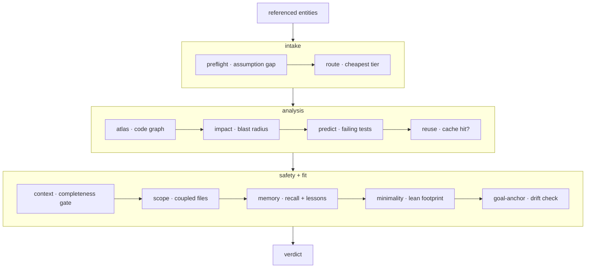

**认知基座** —— 在模型编辑代码_之前_运行的层。`forge substrate "<task>"`(以及 MCP 工具 `substrate_check`)有序地运行一趟检查并返回单一裁决。它把可单独调用的各阶段 —— `preflight`、`route`、`atlas`、`impact`、`reuse`、`context`、`scope`、`lean`、`anchor`、`verify` —— 合成一份预动作契约。



## 三个阶段

<Steps>
  <Step title="Intake">
    **preflight** 找出假设缺口 —— 任务提到、但仓库未定义的东西。**route** 挑出性价比最高、能胜任的模型层级。
  </Step>
  <Step title="Analysis">
    **atlas** 读取代码图,**impact** 计算爆炸半径,**predict** 点名可能失败的测试,**reuse** 检查是否命中已验证缓存。
  </Step>
  <Step title="Safety and fit">
    **context** 运行完整性门,**scope** 浮出耦合文件,**memory** 注入 recall + 经验,**minimality** 衡量 lean 足迹,**goal-anchor** 检查漂移。
  </Step>
</Steps>

## 爆炸半径

**爆炸半径** —— 一次编辑被预测会影响的文件集合,来自代码图。`forge impact` 计算它;流水线在模型触碰任何东西之前把它浮出来。

```bash
forge impact verifyToken       # predicted impacted files for a symbol
forge impact src/auth.js       # …or for a file
```

## 默认建议模式

裁决**默认是建议性**的 —— 它只报告,不阻断。设置 `FORGE_ENFORCE=1` 可以把最强的信号变成硬阻断:

<CardGroup cols={3}>
  <Card title="空洞的 prompt" icon="circle-question">
    preflight 找不到可行的意图 —— 任务规格不足。
  </Card>
  <Card title="无法组装的上下文" icon="layer-group">
    完整性门无法覆盖预测的编辑集合。
  </Card>
  <Card title="爆炸半径超阈值" icon="explosion">
    受影响集合超过默认的约 25 文件阈值。
  </Card>
</CardGroup>

其他一切都留作可以由人覆盖的警告。

<Note>
  在 Claude Code 上,整个门通过 `UserPromptSubmit` 钩子在**每个 prompt 上自动运行** —— 对干净任务保持静默。`forge substrate "<task>" --json` 提供机器可读的裁决用于脚本化。
</Note>

## 运行它

```bash
forge substrate "Change verifyToken in src/auth.js to require length > 20; update tests"
forge substrate "<task>" --json
```

如果裁决为 `ASK FIRST`,在编辑前先提出返回的 `assumption.questions` —— 不要猜规格不足的任务。从推荐的 `route.tier` 开始,只有当外部验证器失败之后再升级,永远不要预防性升级。

<Card title="记忆如何喂给这个门" icon="arrow-right" href="/zh-CN/concepts/proof-carrying-memory">
  记忆阶段从携证账本中读取。
</Card>
