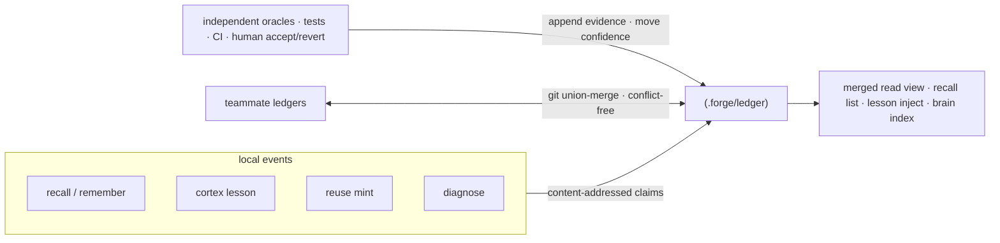
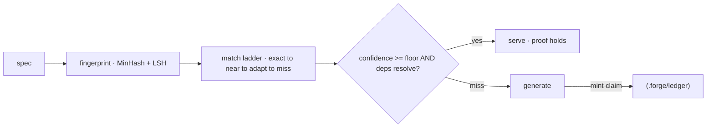

**携证记忆 (PCM)** —— 每一条被存下的事实、经验或复用产物都是一个自带证据的_声明_。只有当独立裁决方(测试、CI、人类的接受/回滚)把它的置信度抬升到阈值之上时,它才会被信任。错误的经验会衰减而不是固化。

<Note>
  "携证记忆"是我们对**有证据引用、以内容寻址的记忆**的称呼 —— 声明由其内容的哈希寻址,并链接到支持它的裁决方结果。"证明"是那条证据链加上置信度规则,**不是**形式化机器验证过的证明;流程中不存在定理证明器。
</Note>

## 一个存储,多个写入者

所有记忆子系统都汇聚到同一个存储。`recall`、`remember`/`brain`、`cortex` 经验、`reuse` 产物、以及死循环的 `diagnose` 结果都会以内容寻址的方式把声明写入 `.forge/ledger/`。



## 为什么它能无冲突地收敛

因为一个声明的字节是 `(kind, body, scope)` 的纯函数,每个副本计算出的身份都一样 —— 所以队友的账本可以通过纯 git 无冲突地合并。

机制上:

- **证据与墓碑都是只追加的**,并做哈希去重。
- **置信度 (`val`)** 是一个带衰减的 Beta 后验,只能由裁决方推动。
- **合并是一个 join-semilattice** —— 已被属性测试验证为可交换、可结合、幂等 —— 因此账本无论以何种顺序合并都能收敛。

<Note>
  `forge init` 会生成账本需要的 union-merge `.gitattributes` 规则;`forge ledger merge <path>` 可以合并任意另一棵账本树。完整决策见 ADR-0006(携证记忆)。
</Note>

## 只有裁决方能移动置信度 —— 其他任何东西都不行

只有独立的裁决方能移动一条记忆的置信度:

<CardGroup cols={3}>
  <Card title="测试" icon="flask">
    一次通过、能演练该声明的测试会提升它的置信度。
  </Card>
  <Card title="CI" icon="circle-check">
    一次绿色的流水线是该声明仍然成立的独立证据。
  </Card>
  <Card title="人工" icon="user-check">
    显式的接受或者回滚是最强的信号。
  </Card>
</CardGroup>

无法验证的证据会被一张封闭的 `ORACLES` 表 (`src/ledger.js`) 拒绝。未经审阅的知识衰减为_不确定_,而不是删除 —— 沉睡的声明保留下来供审计,永远不会被静默移除。

## 账本表面

```bash
forge ledger stats                 # what the repo knows, by kind and trust level
forge ledger verify                # re-check claims are in normal form
forge ledger show <id>             # a claim and its evidence trail
forge ledger blame <id-prefix>     # who minted it, every oracle outcome, per-author trust
forge ledger query "<text>"        # retrieve claims by relevance
forge ledger ratify <id>           # human accept
forge ledger retract <id>          # tombstone a claim
forge ledger merge <path>          # fold a teammate's ledger in, conflict-free
forge ledger import                # bridge legacy stores into the ledger
```

加 `--personal` 使用每用户级别的账本。

## 复用缓存也是携证的

`forge reuse` 是一个携证的代码缓存。一段生成的产物只有在其证据仍然成立时才会被再次服务 —— 置信度在阈值之上**并且**它的 atlas 依赖仍然可解析。否则就会穿透到生成流程,并在返回途中铸一条新声明。



<Warning>
  MinHash 的近似匹配在非常短的 spec 上偏弱。可选的嵌入后端 (`FORGE_EMBED`) 可以提升这一点;MinHash 仍是零依赖的默认。
</Warning>
