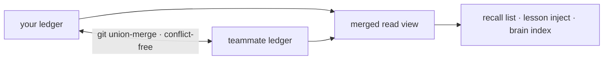

基座学到的一切 —— cortex 经验、`forge remember` 事实、已验证的复用产物 —— 都作为内容寻址的声明落在一个 git 原生的账本 (`.forge/ledger/`) 里,天生按无冲突方式合并。没有服务器,也没有同步服务;只是 git 中的文件。

## 三条命令搞定团队记忆

<Steps>
  <Step title="初始化一次">
    ```bash
    forge init
    ```
    这会生成账本需要的 `.gitattributes` union-merge 规则等内容。
  </Step>
  <Step title="正常工作">
    Cortex 经验和 `forge remember` 事实会在你工作时把声明影子写入账本 —— 没有额外命令要跑。
  </Step>
  <Step title="合并队友的账本">
    ```bash
    git pull && forge ledger merge <path-to-their-ledger>
    ```
    任意顺序 —— 合并是无冲突的。
  </Step>
</Steps>

## 为什么它不会冲突

一条声明的字节是 `(kind, body, scope)` 的纯函数,所以每个副本对同样的知识都会算出同样的身份。合并是一个 join-semilattice —— 已被属性测试验证为可交换、可结合、幂等 —— 所以两个队友的账本无论谁先同步都会收敛到同样的状态。



<Note>
  独立铸出的相同知识会收敛为**一条**声明,并在其溯源中保留每一位作者。
</Note>

## 信任与溯源

置信度只能被独立的裁决方 —— 测试、CI、人类的接受/回滚 —— 移动,所以导入队友的账本并不盲目相信他们的笔记;它导入的是他们的_证据_。

```bash
forge ledger blame <id-prefix>     # who minted a claim, every oracle outcome, per-author trust
forge ledger stats                 # the merged view, by kind and trust level
forge ledger verify                # confirm every claim is in normal form
```

## 团队范围内的复用

一旦队友的已验证代码进入合并后的账本,你就可以带着它的证据复用它:

```bash
forge reuse query "<what you're about to build>"
```

命中会指向可运行、经测试确认的代码,以及能证明它的 `forge ledger blame` —— 复用它,而不是重新生成。

<Warning>
  沉睡的声明保留下来供审计,永远不会被删除;未经审阅的知识衰减为_不确定_,而不是被删除。账本是一条证据链,不是一个可以静默丢失的缓存。
</Warning>
