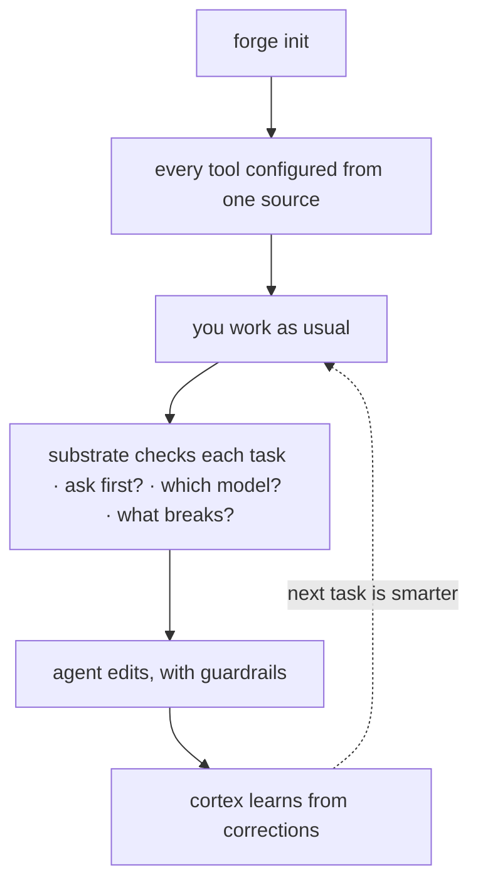

Forge 目标是**引导式、低配置上手** —— 一个新仓库通常在大约五分钟内就能投入使用。安装一次、配置仓库一次、做一个任务,然后账本在第二天开始发挥效益。(是低配置,不是零配置:你仍然要安装 CLI、在每个仓库运行 `forge init`,并且某些路径假定有 Bash、Git 和 `jq`。)



## 1. 安装(一次)

推荐路径不需要令牌也不需要克隆:

<CodeGroup>

```bash Plugin
/plugin marketplace add CodeWithJuber/forgekit
/plugin install forgekit
```

```bash CLI
npm install -g @codewithjuber/forgekit
```

</CodeGroup>

```bash
forge doctor               # everything green?
```

## 2. 配置一个仓库(每个仓库一次)

```bash
cd ~/your-project
forge init                 # emits AGENTS.md, CLAUDE.md, .gemini/settings.json, .aider.conf.yml …
```

现在 Claude Code、Codex、Cursor、Gemini、Aider、Copilot、Windsurf、Zed 和 Continue 都从各自的原生文件读取**同样的**规则。以后修改规则,编辑 `source/rules.json`(或放一个仓库级的 `.forge/rules.json`),然后运行 `forge sync`。

## 3. 使用认知基座

```bash
forge substrate "<task>"      # ask/route/impact/scope/reuse/context/memory/verify in one pass
forge substrate "<task>" --json
forge impact <symbol-or-file> # the blast radius on its own
```

如果 `forge substrate` 返回 `ASK FIRST`,在编辑前先提出返回的问题。

## 4. 使用附加功能

```bash
forge atlas build          # index this repo's symbols → .forge/atlas.json
forge atlas query useAuth  # where is it defined?
forge atlas has useAuth    # does it exist? "not found" = likely hallucinated
forge recall add "db port" "Postgres is on 5433 here, not 5432"
forge catalog              # the Start-Here index of everything
```

## 5. 第二天:账本开始学习

第一天基座学到的一切 —— cortex 经验、被记住的事实、已验证的代码 —— 都作为声明落在 `.forge/ledger/` 中。

```bash
forge ledger stats                     # what the repo knows, by kind and trust level
forge ledger blame <id-prefix>         # who minted a claim, every oracle outcome
forge reuse query "<what you're about to build>"   # verified code you already have
```

<Card title="分享给你的团队" icon="arrow-right" href="/zh-CN/guides/team-memory">
  下一步:通过纯 git 无冲突地合并队友的账本。
</Card>
