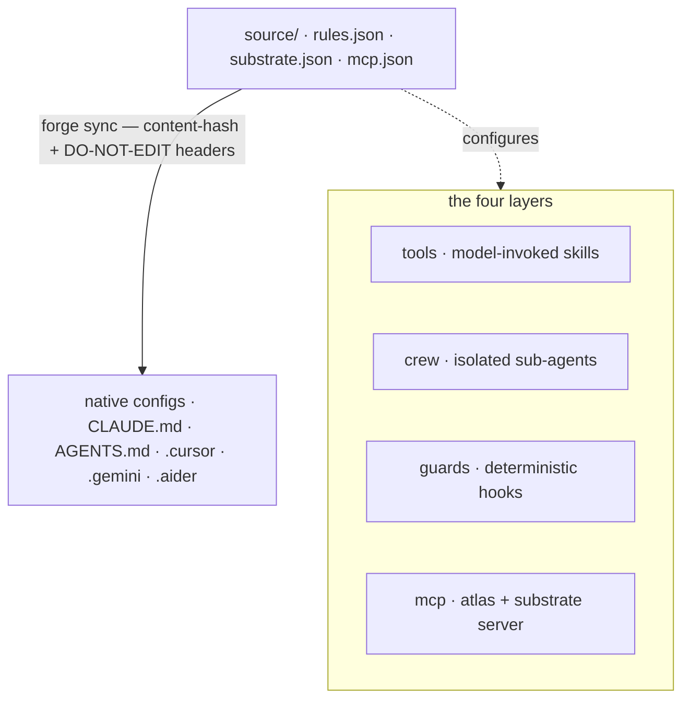

只写一次基座。`forge sync` 会把这份源编译成每个工具的原生配置。四层是 _大脑如何被表达_;编译器是 _它如何被交付_。

## 一份源,多个生成器

规则**只写一次**(`source/rules.json`);一个确定性编译器(`forge sync`)以每个工具的原生格式发出配置,并带内容哈希头,让漂移可检测,重跑是无操作。任何规则都不会被写第二遍。规范源是三个文件:

| 源文件                  | 存放内容                                                             |
| ----------------------- | -------------------------------------------------------------------- |
| `source/rules.json`     | 规范的工程规则(git、测试、安全、风格)。                             |
| `source/substrate.json` | 认知基座的默认值——阈值、路由、LLM 参数。                              |
| `source/mcp.json`       | 生成到各工具中的 MCP 服务器定义。                                     |

## 四层

每一层都有品牌命名,并跨工具发出。

<AccordionGroup>
  <Accordion title="tools — 模型可调用的能力" icon="wrench">
    `~/.forge/tools/` → `~/.claude/skills/`。遵循
    `SKILL.md` 标准(`name` + `description` frontmatter)的模型可调用 skill。
  </Accordion>
  <Accordion title="crew — 隔离的子代理" icon="users">
    `~/.forge/crew/` → `~/.claude/agents/`。上下文隔离的子代理,如 scout、verifier 和 frontend-verifier。
  </Accordion>
  <Accordion title="guards — 确定性钩子(唯一具备强制力的一层)" icon="shield">
    `~/.forge/guards/` → `settings.json` hooks。**唯一 _强制执行_ 而非建议的一层。** 一条 guard 是模型无法漂移出的确定性钩子。`CLAUDE.md` 里的散文规则会被确认,然后在压缩后遗忘;guard 不会。每一条可强制的不变式都应放在这里。
  </Accordion>
  <Accordion title="mcp — 协议层" icon="plug">
    Forge 附带一个 stdio 服务器(`src/cortex_mcp.js`),暴露 19 个 MCP 工具:基座检查
    (`substrate_check` / `predict_impact` / `assumption_gate` / …)、记忆读 _与_ 写(`forge_remember`、ledger ratify/retract)以及运维/健康接口。
  </Accordion>
</AccordionGroup>

横切关注点贯穿四层:**atlas**(代码图)、**lean**
(极简性——同时以工具和 Stop-guard 的形式发布,无论模型是否调用它,都会生效)与 **recall**(记忆)。

## Guard 胜过散文

模型有可能漂移出的规则以散文形式存在;它 **绝不** 能违反的规则以 guards(确定性 shell 钩子)存在。guard 不会在上下文压缩后被遗忘。

<Note>
  把每一条可强制的不变式从 `CLAUDE.md` 迁到 guard;让散文保持稀薄。这是 Forge 设计中最重要的一条纪律。
</Note>

## 已核实的跨工具生成矩阵

Forge 为**九个工具**生成配置,并为 Roo Code 和 VS Code 提供一台 MCP 服务器。每一行都对照厂商文档核实过。

| 工具               | 原生目标                                                          | Forge 如何生成                                                      |
| ------------------ | ---------------------------------------------------------------- | --------------------------------------------------------------------- |
| **Claude Code**    | `CLAUDE.md`(+ `.claude/rules/*.md`、`settings.json`)             | 首行为 `@AGENTS.md` 的薄 `CLAUDE.md`;guards → settings              |
| **Codex**          | 原生 `AGENTS.md`(32 KiB 上限)                                    | 根目录的规范 `AGENTS.md` **就是**源                                   |
| **Cursor**         | `AGENTS.md` + `.cursor/rules/*.mdc`                             | 扁平规则用 `AGENTS.md`;需要作用域时用 `.mdc`                        |
| **Gemini**         | `GEMINI.md`,或通过 `context.fileName` 选用 `AGENTS.md`           | 写入 `.gemini/settings.json` 以避免第二份副本                        |
| **Aider**          | 通过 `.aider.conf.yml` 的 `read:` 读取 `CONVENTIONS.md`         | 生成带 `read: AGENTS.md` 的 `.aider.conf.yml`                        |
| **Copilot**        | 根 `AGENTS.md` + `.github/copilot-instructions.md`              | 依赖根 `AGENTS.md`;可选的 `.github` 指针                              |
| **Windsurf/Devin** | 自动发现的 `AGENTS.md`(上限 6k/12k 字符)                        | 根 `AGENTS.md` 保持在上限之下;区分 `.windsurf` 与 `.devin`         |
| **Zed**            | 包含 `AGENTS.md` 在内的一份优先级列表中的首个匹配                | 生成 `AGENTS.md`;doctor 会标出任何被遮蔽的旧文件                    |
| **Continue**       | `.continue/rules/*.md` + `.continue/mcpServers/*.yaml`         | 生成一份规则文件外加 Forge MCP 服务器配置                             |

Roo Code 与 VS Code 通过 `forge init` 获得 Forge MCP 服务器
(`.roo/mcp.json`、`.vscode/mcp.json`),而不是规则文件。

<Warning>
  **字符上限是真的。** Codex 会在 32 KiB 处截断,Windsurf 在 6k/12k 处截断。`forge sync` 会强制执行一个源大小预算,以免配置被悄悄截断。
</Warning>
