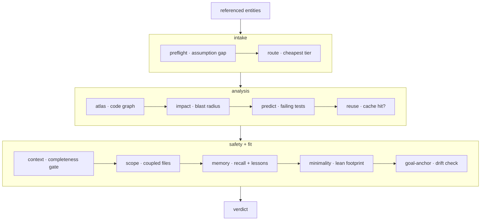

**认知基座**——在模型编辑代码 _之前_ 运行的那一层。`forge
substrate "<task>"`(以及 MCP 工具 `substrate_check`)运行一趟有序的检查,并返回一次裁决。它把各阶段——`preflight`、`route`、`atlas`、`impact`、`reuse`、`context`、`scope`、`lean`、`anchor`、`verify`——合成一份行动前契约,这些阶段也都能单独调用。



## 三个阶段

<Steps>
  <Step title="Intake">
    **preflight** 找出假设缺口——任务点名却在仓库里未定义的东西。**route** 挑出能胜任的最便宜模型 tier。
  </Step>
  <Step title="Analysis">
    **atlas** 读取代码图,**impact** 计算爆炸半径,**predict** 指出可能失败的测试,**reuse** 检查是否命中已验证的缓存。
  </Step>
  <Step title="Safety and fit">
    **context** 运行完整性关卡,**scope** 浮现耦合文件,**memory** 注入 recall + 经验,**minimality** 衡量精简足迹,**goal-anchor** 检查漂移。
  </Step>
</Steps>

## 爆炸半径

**爆炸半径**——一次编辑被预测会影响到的文件集,从代码图中读出。`forge impact` 计算它;管道会在模型触碰任何东西之前把它浮现出来。

```bash
forge impact verifyToken       # 一个符号的预测受影响文件
forge impact src/auth.js       # ……或一个文件的
```

## 默认建议性

裁决**默认是建议性的**——它报告,不阻断。设置
`FORGE_ENFORCE=1` 可把最强信号变成硬阻断:

<CardGroup cols={3}>
  <Card title="空洞提示" icon="circle-question">
    preflight 找不到可执行意图——任务描述不足。
  </Card>
  <Card title="无法装配上下文" icon="layer-group">
    完整性关卡无法覆盖预测的编辑集。
  </Card>
  <Card title="爆炸半径超阈" icon="explosion">
    受影响集超过默认约 25 个文件的阈值。
  </Card>
</CardGroup>

其他一切都保持为可被人工覆写的警告。

<Note>
  在 Claude Code 上,整个关卡通过 `UserPromptSubmit` 钩子在**每次提示自动**运行——对干净任务保持安静。`forge substrate "<task>" --json` 给出可脚本化的机器可读裁决。
</Note>

## 运行它

```bash
forge substrate "Change verifyToken in src/auth.js to require length > 20; update tests"
forge substrate "<task>" --json
```

如果裁决是 `ASK FIRST`,在编辑前先问它返回的 `assumption.questions` ——不要对一个描述不足的任务瞎猜。从推荐的 `route.tier` 开始,只在外部校验者失败后升级,绝不预先升级。

<Card title="记忆如何喂给关卡" icon="arrow-right" href="/zh-Hans/concepts/proof-carrying-memory">
  记忆阶段从携证 ledger 中读取。
</Card>
