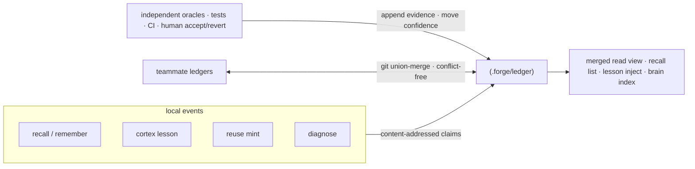
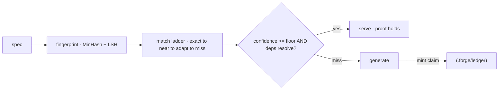

**携证记忆(PCM)**——每一条被存储的事实、经验或复用产物,都是一条自带证据的 _主张_。它只有在独立裁决者(测试、CI、人工接受/回退)把它的置信度抬到某个下限之上时才被信任。错误的经验会衰减出去,而不是固化下来。

<Note>
  “携证记忆” 是我们对 **带证据引用、内容寻址记忆** 的称呼——主张以其内容哈希作为地址,并与背书它的裁决结果相互链接。“证明”指的是这条证据链加上置信度规则,**并不是形式化的、机器可校验的证明**;整条链路里没有定理证明器。
</Note>

## 一个存储,多个写入者

所有记忆子系统都汇聚到同一个存储。`recall`、`remember`/`brain`、`cortex` 经验、`reuse` 产物和死循环 `diagnose` 结果都会把内容寻址的主张写入 `.forge/ledger/`。



## 为什么它能无冲突地收敛

因为一条主张的字节是 `(kind, body, scope)` 的纯函数,每个副本都会计算出相同的身份——因此队友的 ledger 通过纯 git 无冲突地并入。

机制上:

- **证据与墓碑是仅追加的**、按哈希去重的日志。
- **置信度(`val`)** 是衰减的 Beta 后验,只由裁决者推动。
- **合并是 join-semilattice**——经过属性测试为可交换、可结合、幂等——因此 ledger 在任意顺序下都会收敛。

<Note>
  `forge init` 会生成 ledger 所需的 union-merge `.gitattributes` 规则;`forge
  ledger merge <path>` 会并入任意另一棵 ledger 树。完整决策记录在 ADR-0006(携证记忆)。
</Note>

## 只有裁决者能推动置信度——其他任何东西都不行

只有独立裁决者能推动一条记忆的置信度:

<CardGroup cols={3}>
  <Card title="测试" icon="flask">
    覆盖该主张的一个通过测试会提升它的置信度。
  </Card>
  <Card title="CI" icon="circle-check">
    一条绿色流水线是该主张仍然成立的独立证据。
  </Card>
  <Card title="人工" icon="user-check">
    显式接受或一次回退是最强的信号。
  </Card>
</CardGroup>

不可验证的证据会被一个封闭的 `ORACLES` 表(`src/ledger.js`)拒绝。未经复核的知识会衰减向 _不确定_,而不是被删除——休眠主张会被保留以供审计,绝不会被悄无声息地清除。

## Ledger 命令面

```bash
forge ledger stats                 # 本仓库知道什么,按类别与信任等级列出
forge ledger verify                # 重新校验主张处于范式
forge ledger show <id>             # 一条主张及其证据链
forge ledger blame <id-prefix>     # 谁写下的、每一次裁决结果、按作者划分的信任度
forge ledger query "<text>"        # 按相关性检索主张
forge ledger ratify <id>           # 人工接受
forge ledger retract <id>          # 给一条主张打上墓碑
forge ledger merge <path>          # 无冲突并入队友的 ledger
forge ledger import                # 把旧存储桥接到 ledger 中
```

加上 `--personal` 使用每用户的 ledger。

## reuse 缓存也是携证的

`forge reuse` 是一个携证的代码缓存。一个已生成的产物只有在其证据仍然成立时才会被再次提供——置信度在下限之上 **并且** 它在 atlas 中的依赖仍然解析得到。否则它会回退到生成路径,并在返回途中打上一条新的主张。



<Warning>
  MinHash 的近邻匹配在非常短的规约上偏弱。可选的 embeddings 后端
  (`FORGE_EMBED`)能改善这一点;MinHash 依然是零依赖的默认。
</Warning>
