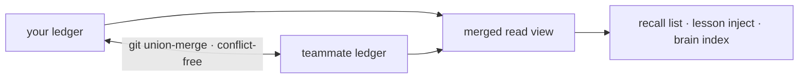

基座学到的一切——cortex 经验、`forge remember` 事实、已验证的复用产物——都作为内容寻址的主张落到一个 git 原生的 ledger(`.forge/ledger/`)里,它天生就为无冲突合并而设计。没有服务器,也没有同步服务;只是 git 里的文件。

## 三条命令搞定团队记忆

<Steps>
  <Step title="初始化一次">
    ```bash
    forge init
    ```
    这会生成 ledger 所需的 `.gitattributes` union-merge 规则,以及其他配置。
  </Step>
  <Step title="正常工作">
    你正常工作时,cortex 经验与 `forge remember` 事实会把主张镜像进 ledger——不需要额外执行任何命令。
  </Step>
  <Step title="并入队友的 ledger">
    ```bash
    git pull && forge ledger merge <path-to-their-ledger>
    ```
    任意顺序——合并是无冲突的。
  </Step>
</Steps>

## 为什么它不会冲突

一条主张的字节是 `(kind, body, scope)` 的纯函数,所以每个副本对相同的知识都会算出相同的身份。合并是一个 join-semilattice——经过属性测试为可交换、可结合、幂等——因此两位队友的 ledger 无论谁先同步都会收敛到相同的状态。



<Note>
  相同的知识在两处独立生成,会收敛为**一条**主张,并在其溯源中保留每一位作者。
</Note>

## 信任与溯源

置信度只由独立裁决者推动——测试、CI、人工接受/回退——所以并入队友的 ledger 并不是盲目相信他们的笔记;而是并入他们的 _证据_。

```bash
forge ledger blame <id-prefix>     # 谁写下的主张、每一次裁决结果、按作者划分的信任度
forge ledger stats                 # 合并后的视图,按类别与信任等级列出
forge ledger verify                # 确认每一条主张处于范式
```

## 全团队的复用

一旦队友已验证的代码进入合并后的 ledger,你就可以带着它的证明来复用:

```bash
forge reuse query "<what you're about to build>"
```

一次命中会指向可运行、有测试确认的代码,以及能证明它的 `forge ledger blame` ——复用它,而不是重新生成。

<Warning>
  休眠主张会被保留以供审计,绝不删除;未复核的知识会衰减向 _不确定_,而不是被删除。ledger 是一条证据链,不是一个能悄悄丢失的缓存。
</Warning>
