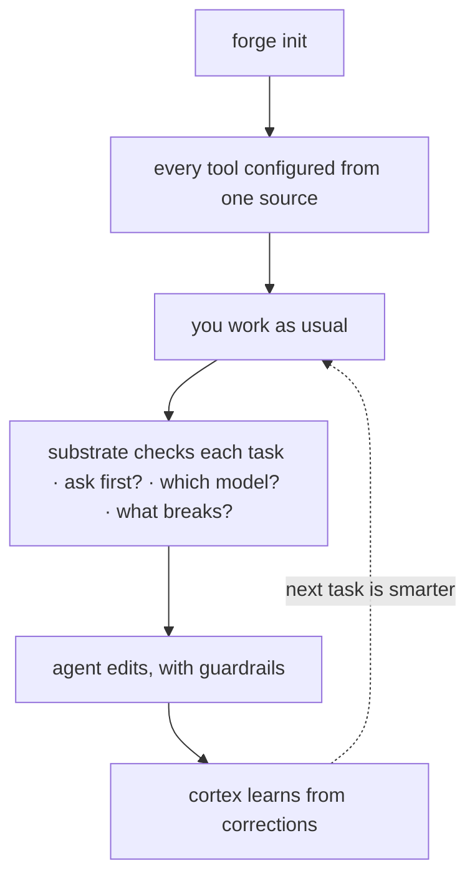

Forge 的目标是**有引导、低配置的接入**——一个新仓库通常在大约五分钟内就能进入可用状态。装一次、每个仓库配一次、做一次任务,ledger 就会在第二天开始带来回报。(它是低配置的,不是零配置:你仍然要安装 CLI、在每个仓库里跑 `forge init`,而且部分路径依赖 Bash、Git 和 `jq`。)



## 1. 安装(一次)

推荐路径不需要 token 也不需要克隆:

<CodeGroup>

```bash Plugin
/plugin marketplace add CodeWithJuber/forgekit
/plugin install forgekit
```

```bash CLI
npm install -g @codewithjuber/forgekit
```

</CodeGroup>

```bash
forge doctor               # 一切都绿了吗?
```

## 2. 配置一个仓库(每个仓库一次)

```bash
cd ~/your-project
forge init                 # 生成 AGENTS.md、CLAUDE.md、.gemini/settings.json、.aider.conf.yml……
```

现在 Claude Code、Codex、Cursor、Gemini、Aider、Copilot、Windsurf、Zed 和 Continue 都从各自的原生文件里读**同一套**规则。之后要改规则,编辑
`source/rules.json`(或在仓库里放一份 `.forge/rules.json`),然后跑 `forge sync`。

## 3. 使用认知基座

```bash
forge substrate "<task>"      # 一次跑完 ask/route/impact/scope/reuse/context/memory/verify
forge substrate "<task>" --json
forge impact <symbol-or-file> # 单独跑爆炸半径
```

如果 `forge substrate` 返回 `ASK FIRST`,在编辑前先问它返回的那些问题。

## 4. 用一下附加功能

```bash
forge atlas build          # 索引本仓库的符号 → .forge/atlas.json
forge atlas query useAuth  # 它在哪里定义?
forge atlas has useAuth    # 它存在吗?“not found” = 很可能是幻觉
forge recall add "db port" "Postgres is on 5433 here, not 5432"
forge catalog              # 一切内容的 Start-Here 索引
```

## 5. 第二天:ledger 开始学习

基座在第一天学到的一切——cortex 经验、被记住的事实、已验证的代码——都以主张形式落到了 `.forge/ledger/`。

```bash
forge ledger stats                     # 本仓库知道什么,按类别与信任等级列出
forge ledger blame <id-prefix>         # 谁写下的主张、每一次裁决结果
forge reuse query "<what you're about to build>"   # 你已经拥有的、已验证的代码
```

<Card title="分享给你的团队" icon="arrow-right" href="/zh-Hans/guides/team-memory">
  下一步:通过纯 git 无冲突地并入队友的 ledger。
</Card>
